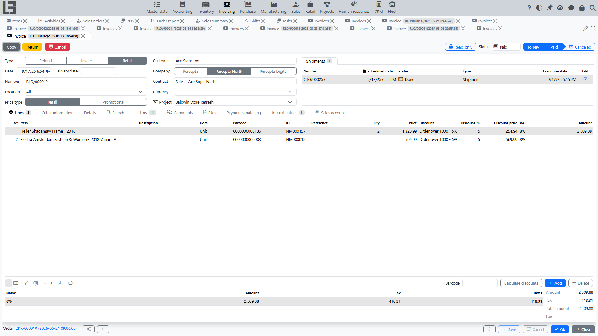

An [invoice](../invoicing/invoices.md) records a sale in accounting terms: revenue, taxes, and totals.

## Where to find

An invoice is created from a sales order: the **“Create Invoice”** button appears on a confirmed order when there is still a quantity left to invoice. The created document is an [Invoicing-module invoice](../invoicing/invoices.md); the order card shows a related **“Invoices”** block.

An invoice can also be created from shipments: the **“Create Invoice”** bulk action on the shipments list creates one invoice from the completed quantities of the selected shipments.

## Relation to an order

An invoice is created from a sales order. Whether its lines reflect the ordered quantities or the actually shipped quantities is determined by the order type’s **“Invoicing policy”** setting, with the values **“Ordered quantity”** or **“Shipped quantity”** (see [Settings](settings.md)) — it is not chosen per document.

When created, the invoice transfers:

- [customer](../masterdata/partners.md) and department;
- delivery address and **“Customer reference”**;
- lines and quantities (ordered or shipped, per the invoicing policy);
- prices, discounts, and taxes;
- payment terms and note.

An invoice goes through the statuses **Draft → To pay → Paid**; an invoice created from an order starts immediately in the **“To pay”** status.

The lines of a confirmed order show the **“Invoiced”** and **“Paid”** columns.

## Typical scenario

1. Make sure the order is confirmed and has a quantity left to invoice.
2. Press **“Create Invoice”** on the order — the invoice is created immediately in the **“To pay”** status.
3. Check amounts and taxes.
4. After payment, the invoice gets the **“Paid”** status.