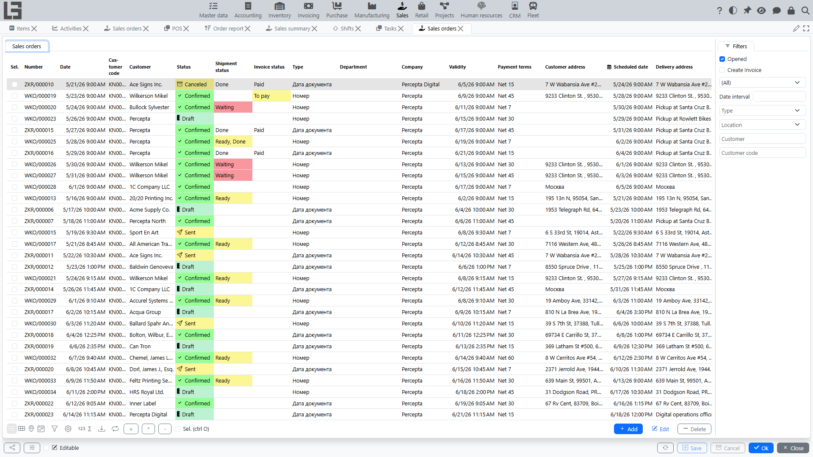
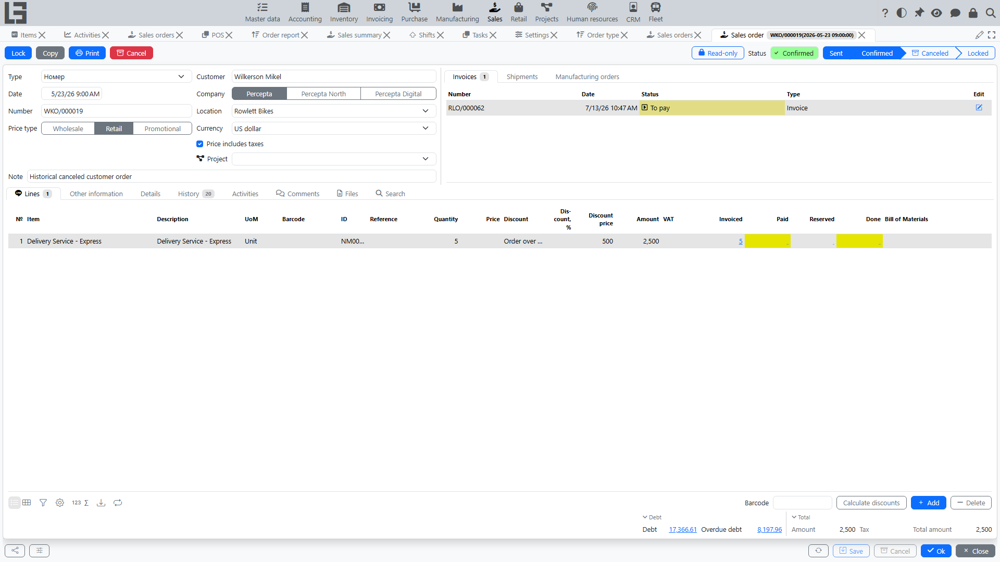

## Where to find

Open **“Sales” → “Operations” → “Sales orders”**.

## Purpose

A sales order records:

- the [customer](../masterdata/partners.md) and sales terms;
- the order contents (lines);
- prices, discounts, and taxes;
- the scheduled date (the planned shipping date);
- links to shipments, invoices, manufacturing orders, and purchase orders (if such scenarios are enabled).

## Sales order list

In the list, you typically see:

- number and date;
- [customer](../masterdata/partners.md);
- status;
- amount;
- scheduled date;
- [location](../inventory/locations.md).

By default, the **“Opened”** filter is enabled — it hides locked orders.

Filters and the set of columns depend on your configuration.

## Sales order card

### Main fields

Typically, the card includes:

- **[Customer](../masterdata/partners.md)**;
- **Date** and **Scheduled date**;
- **[Location](../inventory/locations.md)**;
- **Delivery address** (if used);
- **Type** — the order type; the field is required and is filled in automatically when only one type exists;
- **Our representative** — the company employee responsible for the order; defaults to the current user if they are linked to an employee.

The **“Copy”** action on the card creates a copy of the order. The card footer shows the customer’s **“Debt”** and **“Overdue debt”**; clicking a value opens the debt details.

### Order lines

In lines, you specify:

- [item](../masterdata/items.md);
- quantity;
- price;
- discount (if used);
- line amount.

Recommendation: fill in the customer and location first, then add lines — this helps the system select prices and availability more accurately.

## Confirmation and cancellation

An order moves through the statuses **Draft → Sent → Confirmed → Locked**, and can be **Canceled** from any status except Draft and already canceled orders.

For details on statuses, transitions, and restrictions, see: [Sales order workflow and statuses](workflow-and-statuses.md).

## Related documents

The order card shows related documents as tabs:

- [shipments](shipments.md);
- [invoices](invoices.md);
- manufacturing orders.

Purchase orders are shown not as a tab but as a **“Purchase orders”** link in the card footer.

The available tabs depend on enabled modules.