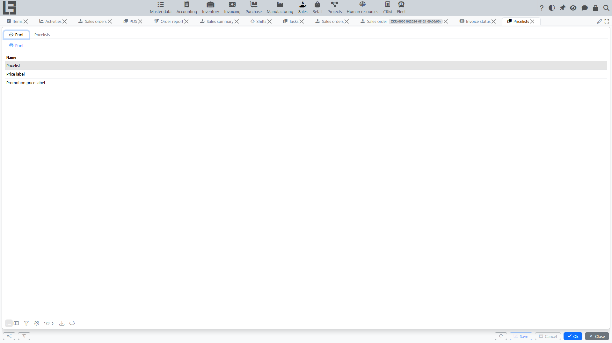

Pricelists are used to store and apply prices in sales orders and invoices.

## Where to find

- **Pricelists** — **“Sales” → “Operations” → “Pricelists”**;
- **Price types** — **“Sales” → “Configuration” → “Price types”**;
- **Pricelist types** — in the **“Sales” → “Configuration” → “Settings”** form.

## Price types

A **price type** is a named price scale. Each price type has a currency and a **“Tax included”** flag (whether its prices include taxes), and can carry default markups per item category. Price types are used as the price columns of a pricelist and to choose which price fills in an order line.

## Pricelist

A pricelist card includes:

- **number** and an optional **note**;
- **pricelist type** — a category that organizes pricelists (for example, “Wholesale”, “Retail”, “Promotional”);
- **validity period** — start and end;
- the **price types** whose columns are editable in this pricelist;
- the list of **items and prices** — one price column per selected price type.

Besides organizing pricelists, the **pricelist type** also configures how its pricelists behave: the numerator used for numbering, which price-type columns are editable, and the flags **“Show cost price”**, **“Show markups”** and **“Show current prices”**. For each price type, the **“Calculate markup from”** field sets the base price type from which the markup is calculated.

## Pricelist statuses

A pricelist usually goes through two statuses:

1. **Draft** — price values can be edited; the pricelist is not yet used as a price source.
2. **Done** — the pricelist is in effect; its values become a price source for its validity period.

The transition to “Done” is performed via the **“Mark as Done”** action on the pricelist card.

## Editing a pricelist

The pricelist card provides tools for filling in many prices at once:

- a **category tree and item search** to add the needed items as lines;
- a **“Change prices”** action that recalculates all editable prices in the pricelist using one of three modes — **“Set markups from previous prices”**, **“Set markups from price types”**, or **“Set prices from previous prices”** (optionally adjusted by a percentage in the **“Change to, %”** field);
- a **“Copy”** action that creates a new pricelist from the current one.

Each price column can also be compared with the item’s currently effective price.

A sales pricelist can also be created from a vendor (purchase) pricelist — via the **“Create Pricelist”** action on the purchase pricelist card; the pricelist type to use is defined by the **“Type of price list for sale”** setting.

Print forms are available: a pricelist can be printed from its card, and current prices can be printed by category and price type.

## Using in an order

When you add an order line, the system fills in the price by **item**, **price type**, and the **order date/time**. The price type itself is derived from the customer or from the order type.

The price is taken from the most recent pricelist in the **“Done”** status whose validity period covers the document date. If no pricelist value is found, the system falls back to the item’s own sales price. Prices are filled in the same way in standalone invoices.

The item card has a **“Prices”** tab showing the price history per price type, together with the pricelists that set each price.
