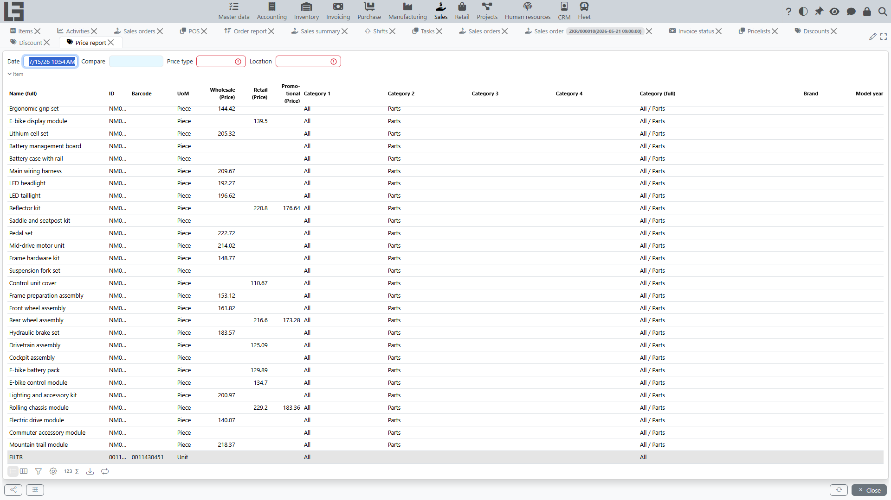
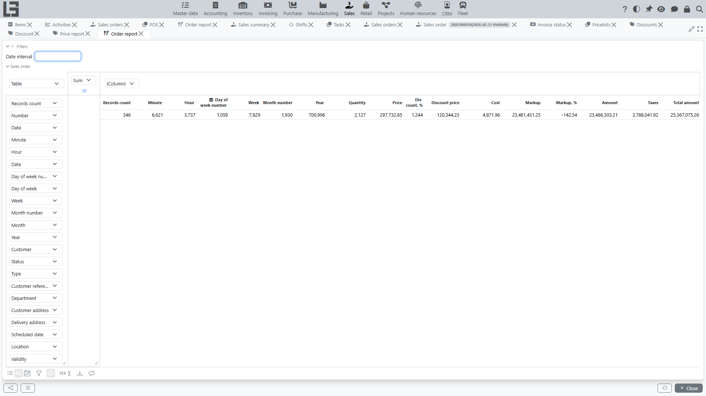
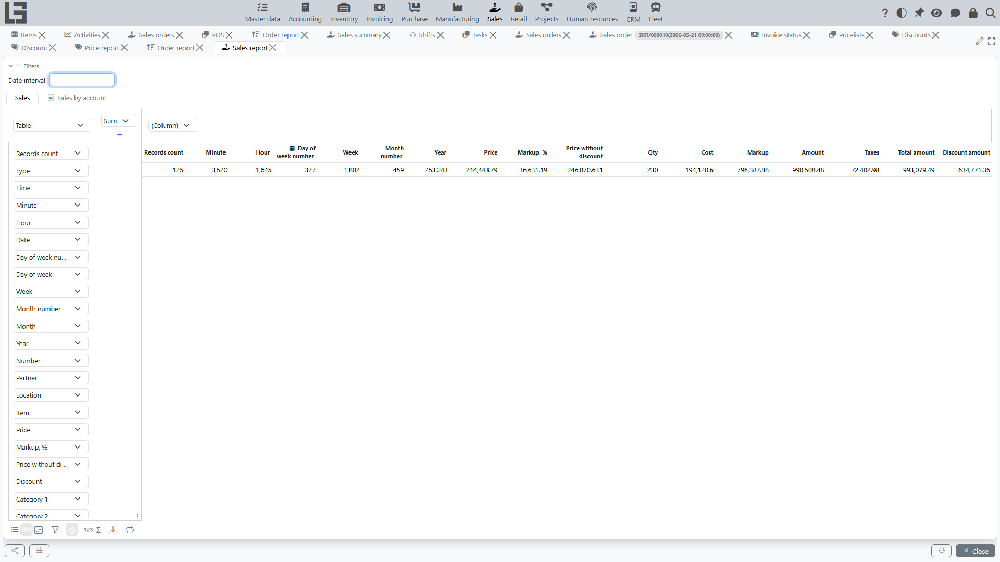
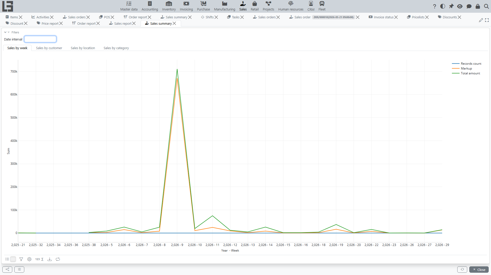

The reporting section is used to analyze:

- sales volume;
- order fulfillment;
- shipments and invoices;
- discounts.

Reports are available in the **Sales** module menu under **Reporting**. Depending on your access rights and enabled features, you may see a different set of reports.

The **Sales** module includes the following reports:

- **Price report** — analyze and compare item prices as of selected dates, with optional stock visibility.
- **Order report** — detailed list of sales orders and order lines with amounts, taxes, and item attributes.
- **Sales report** — detailed sales ledger report with quantities, revenue, cost, and markup.
- **Sales summary** — dashboard with charts for sales trends by week, customer, location, and category.

## Price report

The **Price report** allows you to analyze product prices at specific points in time, compare them between two dates, and view stock levels at selected locations.

### Main Features

- **Price Analysis**: View prices for all or selected price types as of a specific date and time.
- **Price Comparison**: Compare prices between two dates. The report shows the price for both dates and the percentage difference.
- **Visual Indicators**: items whose price at **Date** is higher than at **Compare** are highlighted in **green**, lower — in **red**.
- **Inventory Integration** (available when the Inventory module is enabled): View on-hand stock levels (including sub-locations) for each item at the selected dates and locations.
- **Filtering**:
    - By **Price Type**: Focus on a specific price type or view all.
    - By **Location**: Filter items by their availability at a specific location.
    
### How to use

1. Go to **Sales** -> **Reporting** -> **Price report**.
2. Select the target **Date** (date and time).
3. (Optional) Select a **Compare** date to see price and inventory changes.
4. (Optional) Select a **Price type** to filter the displayed prices.
5. (Optional) Select a **Location** to see stock levels and filter items that are in stock at that location.
6. Review the resulting list and, if needed, adjust parameters to narrow down the scope.

The report displays a list of items with their attributes, barcodes, units of measure, stock levels, and prices for the selected dates.

### Parameters and interpretation

- **Date**: the point in time for which the report takes the price values.
- **Compare**: an additional point in time. When set, the report shows prices for both dates and the **% difference**.
- **Price type**: limits the output to one price type. When not set, the report shows all configured price types.
- **Location**: determines:
  - which on-hand stock value is shown;
  - which items are considered “in stock” for filtering.
  Stock is shown including sub-locations.

The comparison highlights changes:

- the price at **Date** is higher than at **Compare** — shown in **green**;
- the price at **Date** is lower than at **Compare** — shown in **red**.

### Typical use cases

- **Validate a price update**: set **Compare** before and **Date** after a price change to confirm the expected delta.
- **Audit price history**: use different **Date** values to investigate when a price changed.
- **Replenishment planning**: select a **Location** to focus on items that are in stock (or missing stock) at that location.

### Tips

- Use comparable timestamps (for example, end of day vs end of day) to avoid misleading comparisons.
- When analyzing stock-sensitive price changes, always set **Location** so the stock column is meaningful.
- If you maintain multiple price types (e.g., retail/wholesale), filter by **Price type** first to avoid mixing different pricing rules.

### Recommendations

1. Start with a narrow set of parameters (one price type, one location), then expand if necessary.
2. Export or copy the report results when you need to share findings or keep an audit trail.
3. If the numbers look unexpected, double-check that you selected the intended **Date** (including time) and the correct **Location**.

## Order report

The **Order report** provides a detailed view of sales orders and their lines. It is useful for operational analysis (what was ordered, by whom, for which delivery location/date) and for exporting order data to spreadsheets.

### How to use

1. Go to **Sales** -> **Reporting** -> **Order report**.
2. (Optional) In **Filters**, set the **Date interval** to limit orders by order date.
3. Use table filtering/sorting to focus on a customer, status, department, location, item, or other attributes.

### Parameters and interpretation

- **Date interval**: filters orders by `Order date` (inclusive). When not set, the report shows all available orders.

### Output

The report shows order header information and order line information (order header fields are repeated per line):

- **Order**: number, date/time, customer, status, type, customer reference, department, customer address, delivery address, scheduled date/time, location, payment terms, representative, and other header fields.
- **Order lines**: item, description, quantity, unit of measure, price, discount, discount price, taxes, and amounts (**untaxed**, **tax**, **total**).
- **Cost and markup** (when shipment costing is enabled): **Cost**, **Markup**, and **Markup, %** per line.
- **Categories and attributes**: category levels and configured item attributes (as separate columns).
- **Date aggregation**: ready-made columns (day of week, week, month, year, and so on) for grouping in pivot tables.

### Typical use cases

- **Operational export**: download or copy a list of order lines for logistics/warehouse processing.
- **Order auditing**: compare discounts, taxes, and totals across customers or departments.
- **Product analysis**: use category and item attribute columns for segmentation.

### Tips

- Start by setting a **Date interval** to keep the report responsive and focused.
- If you use item attributes heavily, expect the report to be wider; use horizontal scrolling or export.

## Sales report

The **Sales report** is a detailed report based on sales ledger entries. It combines sales quantities with cost and markup metrics, and can be used for profitability analysis.

### How to use

1. Go to **Sales** -> **Reporting** -> **Sales report**.
2. In **Filters**, set the **Date interval** to limit the report period.
3. Use filtering/sorting to focus on a customer, location, item, category, or document number.

### Parameters and interpretation

- **Date interval**: filters ledger entries by date (inclusive).
- **Measures** (typical meaning):
  - **Quantity** — sold quantity in the item’s unit of measure.
  - **Cost** — cost of sold goods.
  - **Markup**, **Markup, %** — markup in absolute and percentage terms.
  - **Amount**, **Taxes**, **Total amount** — revenue: untaxed amount, taxes, and total.

### Output

The report typically includes:

- Document identification: class/type, date/time, number.
- Dimensions: partner, location, item, category levels, item attributes.
- Pricing/markup: price, markup.
- Measures: quantity, cost, markup, amount, taxes, total amount.
- Date aggregation: ready-made columns (day of week, week, month, year, and so on) for grouping in pivot tables.

### Additional columns and sections (if enabled)

Depending on enabled features, the Sales report can include:

- **Discount details**: price without discount, discount, discount amount.
- **Sales by account** tab: pivot table by sales account, showing revenue, cost and markup.

### Typical use cases

- **Profitability analysis**: analyze markup by item/category/location.
- **Customer turnover**: review revenue, taxes and totals by customer.
- **Exception checks**: filter for unusually low/high markup.

### Tips

- Always start with a **Date interval**.
- When comparing locations or categories, export the report and build additional pivots in a spreadsheet.

## Sales summary

The **Sales summary** is a dashboard with a fixed set of charts that provides a high-level overview of sales trends.

### How to use

1. Go to **Sales** -> **Reporting** -> **Sales summary**.
2. In **Filters**, set the **Date interval**.
3. Switch between tabs to analyze sales by week, customer, location and category.

### Parameters and interpretation

- **Date interval**: limits the underlying sales ledger data used to build the charts.

### What you will see

The dashboard has four tabs:

- **Sales by week**: a single line chart with turnover and income trends by week.
- **Sales by customer**: a bar chart ranking sales by customer (turnover and income).
- **Sales by location**: two charts, one above the other — **Turnover** and **Income** — by week, broken down by location.
- **Sales by category**: two pie charts — **Turnover** and **Income** — by category (second hierarchy level).

All charts share the **Date interval** filter and are computed from the sales ledger ([SalesLedger](#sales-report)).

### Typical use cases

- **Management overview**: monitor turnover and income over time.
- **Seasonality analysis**: compare weekly patterns across periods.
- **Structure analysis**: understand which customers/categories drive sales.