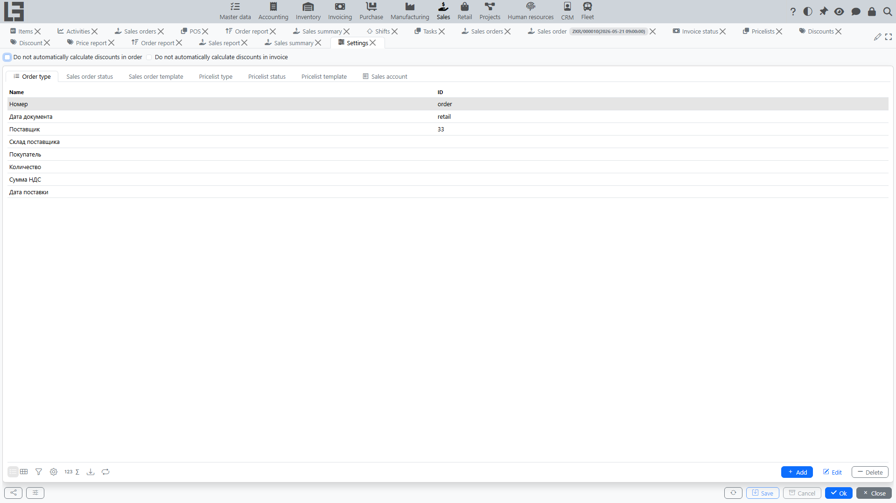

## Where to find

Open **“Sales” → “Configuration” → “Settings”**.

## What is typically configured

### Order types

For each order type you can set:

- **numerator** — number format and counter;
- **default currency** and the “price includes taxes” flag;
- **price type** — the price type used to fill in prices in order lines;
- **shipment type** (if the Inventory module is enabled) — which shipment document is created when the order is confirmed;
- **manufacturing order type** — enables creating manufacturing orders from the sales order;
- **“Automatically create a production order”** (shown when the manufacturing order type is set) — automatically creates a manufacturing order when the sales order is confirmed;
- **invoice type** and **invoicing policy** — the invoice type used by the “Create Invoice” action and whether invoice lines are taken from ordered or shipped quantities;
- **mail template** — default template, topic, body, and copy-to address for the “Send” action (see the [Sent status](workflow-and-statuses.md));
- **Forbid to lock orders with active shipments**, **Forbid to lock orders that are not fully shipped**, and **Forbid to lock orders that are not fully paid** — restrictions on the transition to the “Locked” status.

### Global module settings

The module settings form has top-level toggles:

- **“Do not automatically calculate discounts in order”** — disables automatic discount recalculation on line changes (useful when you manage discounts manually);
- **“Do not automatically calculate discounts in invoice”** — same for invoices.

See also: [Discounts](discounts.md#automatic-discount-recalculation).

### Sales accounts

The **Sales accounts** tab of the Settings form contains the list of custom sales accounts. They are used by the **Sales by account** tab of the [Sales report](reports.md).

### Pricelists

- **Pricelist types** — categories used to organize pricelists (for example, “Standard”, “Promo”);
- **Price types** — used in pricelist and order lines to determine prices; they are maintained in a separate form: **“Sales” → “Configuration” → “Price types”**;
- **Print templates** — for printing pricelists.

### Other

- print parameters (templates for orders and accompanying documents);
- availability of specific actions depending on statuses.

Recommendation: configure order types and numbering first, then price types and pricelists, and discounts last (they rely on price types and categories).