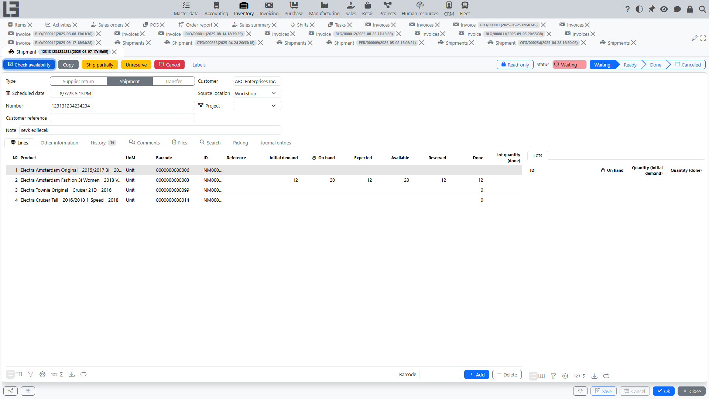

A [shipment](../inventory/shipments.md) records the transfer of goods to a customer and inventory movement.

## Where to find

Shipments belong to the **Inventory** module — the shipments list is in **“Inventory” → “Operations” → “Shipments”**. A shipment linked to a sales order is created automatically from the order (see below).

## Relation to an order

A shipment can be created based on a sales order. In this case:

- the [customer](../masterdata/partners.md) and delivery address are prefilled;
- the [location](../inventory/locations.md) is prefilled;
- shipment lines are formed from the order lines.

## Relation between shipments and sales orders: how it works in the system

Below is the logic of the “sales order ↔ shipments” link.

### Line-level relation

The link between a shipment and an order is stored not only on the “header”, but also **through the lines**:

- each shipment line is linked to a specific order line;
- based on this link, the system calculates:
  - how much is reserved for the order line;
  - how much has already been shipped;
  - how much remains to be shipped.

Practical meaning: one order can be shipped in multiple shipments and in parts.

### Remaining to ship

For an order line, the system shows the columns:

- **“Reserved”** — quantity reserved in active shipments;
- **“Done”** — quantity in completed (not canceled) shipments.

The remaining quantity to ship is calculated as the order line quantity (taking packaging/UoM conversion into account) minus the shipped quantity — it is a computed value, not a separate column.

If more is shipped than ordered, the system will show an error.

The orders list also shows aggregated **“Shipment status”** and **“Invoice status”** columns.

### Shipment statuses and effect on inventory

A shipment goes through the statuses **Draft → Waiting → Ready → Done** (and can be **Canceled**). The auto-created reserve shipment starts in **Waiting**.

- In **Waiting** and **Ready** the shipment only **reserves** stock for the order — the goods are not yet written off.
- Stock is written off the location only when the shipment is marked **Done**.

The actions that advance a shipment are **“Mark as Todo”** (Draft → Waiting), **“Check availability”** (reserves stock; when all lines are fully reserved, the shipment automatically becomes **Ready**), and **“Mark as Done”**. The **“Ship partially”** and **“Unreserve”** actions are also available. The line columns **“On hand”**, **“Expected”**, and **“Available”** help check stock (see [shipments](../inventory/shipments.md)).

### “Reserve” shipment for an order (status `Waiting`)

The system provides a mechanism of an automatic “reserve” shipment that is kept up to date for an order.

Conditions under which it is created/updated:

- the order is in the confirmed status;
- the order type has a shipment type set;
- a location is selected in the order;
- there is something to ship for the order (remaining to ship is greater than zero).

How it looks for the user:

1. You confirm an order.
2. The system creates (or finds) a reserve shipment for this order in status `Waiting`.
3. In this shipment, the system automatically keeps up to date:
   - [customer](../masterdata/partners.md);
   - department (if used);
   - planned date;
   - delivery address;
   - [location](../inventory/locations.md).

### How lines are formed in the reserve shipment

When creating/updating the reserve shipment, the system:

- adds shipment lines for those order lines that have remaining quantity to ship;
- fills in the item (taking item transformation into account, if used);
- stores the **“Initial demand”** of the shipment line equal to the current remaining-to-ship value.

If remaining quantity for an order line becomes zero (everything is shipped), the corresponding shipment line is removed.
If there are no lines left in the reserve shipment, the shipment is deleted.

After forming lines, the system performs a preliminary availability check for the reserve shipment.

### Multiple shipments for one order

One order can be linked to multiple shipments. This happens when a shipment is completed partially (the system creates a new **Waiting** shipment for the remainder) or when the **“Ship partially”** action is used.

The order card shows a list of related shipments.
The footer of the shipment card shows a link to the related order(s) — the clickable order numbers.

The **“Create Invoice”** bulk action on the shipments list creates one invoice from the completed quantities of the selected shipments.

### Restrictions when locking an order

The order type may have additional restrictions enabled:

- forbid locking an order if it has active shipments;
- forbid locking an order if it is not fully shipped.

If restrictions are enabled, the system will not allow locking.

### Cost and markup

When a shipment is linked to a sales order, the order lines also expose the **“Cost”**, **“Markup”**, and **“Markup, %”** columns (the cost comes from the shipment write-off, or from the item’s planned cost). These values feed the sales [order report](reports.md).

## Creating a shipment based on an invoice

The “shipment from invoice” scenario is described on a separate page: [Creating a shipment based on an invoice](../invoicing/shipments-from-invoice.md).

## Typical scenario

1. Confirm a sales order (the order type must have a **“Shipment type”** set) — the reserve shipment is created automatically.
2. Open the shipment from the **“Shipments”** tab of the order.
3. Check quantities in lines.
4. Run **“Check availability”** — when all lines are fully reserved, the shipment becomes **Ready**; then run **“Mark as Done”** to write the goods off stock.