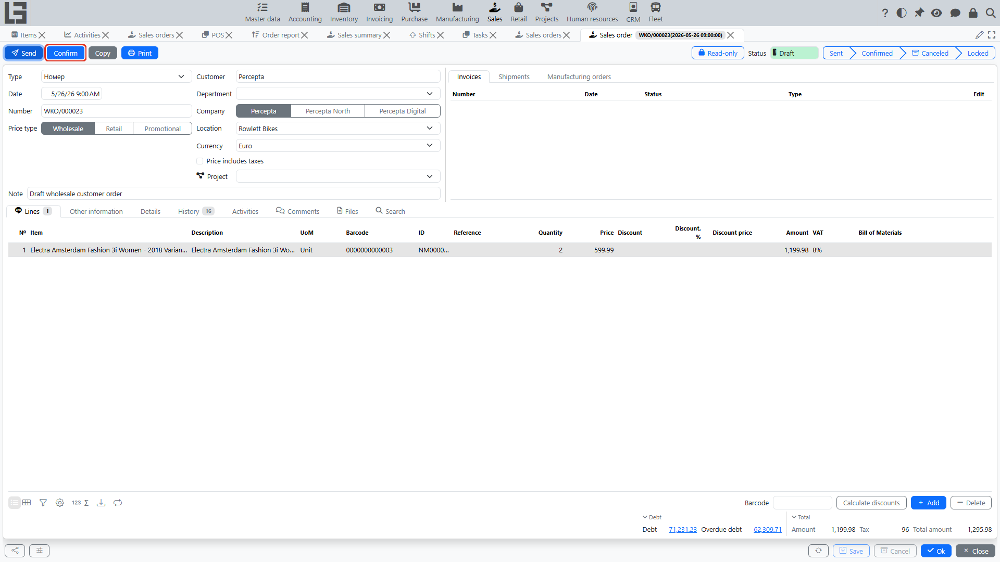

In the **“Sales”** section, a sales order goes through statuses. Statuses define:

- whether an order can be edited;
- whether an order can be Canceled;
- whether related documents can be created (shipments, invoices, manufacturing/purchase orders).

Whether an order is editable in a given status is configured with the **“Read-only”** checkbox in **“Sales” → “Configuration” → “Settings”**. In addition, a single order can be locked for editing with the padlock toggle on its card.

## Typical workflow

1. **Draft**
   - the order can be edited; lines can be added and removed;
   - default status for a new order.
2. **Sent**
   - the order has been sent to the customer via the **“Send”** action;
   - the email is sent only if a **“Default template”** is set in the order type; otherwise the action only changes the status;
   - subject, body, default template (the printable form attached), and copy-to address are configured in the order type; the copy-to address receives a hidden copy (BCC);
   - reachable from “Draft”; from “Sent” you can go directly to “Confirmed”.
3. **Confirmed**
   - the order is considered agreed; reachable from “Draft” or “Sent”;
   - [shipments](shipments.md) and [invoices](invoices.md) can be created for it; while there is uninvoiced quantity, the order shows a **“Create Invoice”** button, and the lines show the **“Invoiced”** and **“Paid”** indicators;
   - if the order type has a **“Shipment type”**, a reserve [shipment](shipments.md) is created automatically on confirmation;
   - if the order type has a **“Manufacturing order type”** and the **“Automatically create a production order”** flag, [manufacturing orders](../manufacturing/workflow.md) are created automatically;
   - [purchase orders](../purchase/purchase.md) are not created automatically — confirmed sales order lines are added manually on the purchase order form.
4. **Locked**
   - the order is closed for further work (e.g. after full fulfillment); locked orders are hidden by the default **“Opened”** filter in the order list;
   - reachable only from “Confirmed”;
   - the order type can enable additional restrictions: **“Forbid to lock orders with active shipments”**, **“Forbid to lock orders that are not fully shipped”**, and **“Forbid to lock orders that are not fully paid”**;
   - if these restrictions are off, locking the order deletes its active reserve shipment.
5. **Canceled**
   - the order is closed and will not be fulfilled;
   - reachable from any status except “Draft” and “Canceled”.

Exact status names and restrictions depend on your configuration.

## Restrictions and checks

Common rules include:

- you cannot delete an order line if a manufacturing order has already been created from it;
- you cannot cancel an order if there are “started” processes for it (for example, active manufacturing orders);
- when locking an order, the system checks the order type’s restrictions (active shipments, incomplete shipping, and/or incomplete payment) and shows a message if locking is forbidden.

## Recommendations

- confirm the order only after verifying prices, location, and delivery terms;
- if you need to close an order without fulfillment, use cancellation instead of deletion.