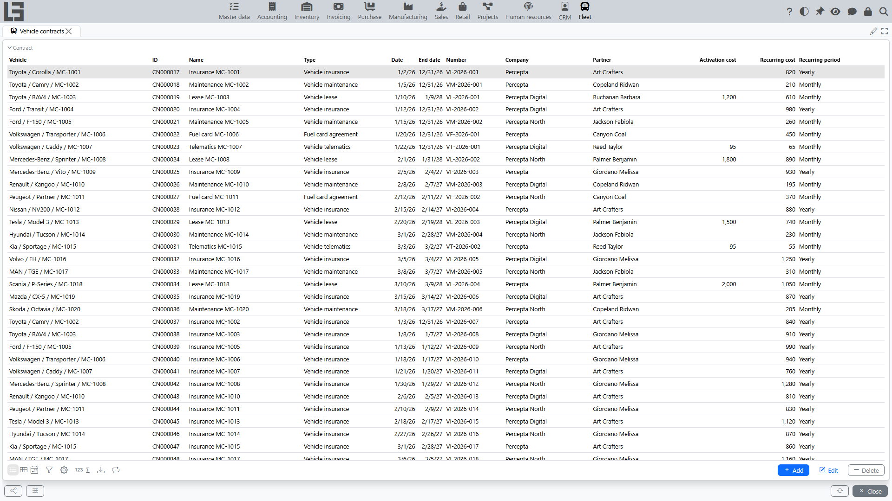

The section is intended for accounting contracts related to vehicles (for example, rent, leasing, insurance — depending on the contract types used in your organization).

A contract can be used as a card for storing conditions: validity dates, partner, amounts (if applicable), and the link to a specific vehicle.

## Where to find it

Open **“Fleet” → “Operations” → “Vehicle contracts”**.

The list shows contracts whose type allows linking a vehicle.

## Creating a contract

You can create a contract:

- from the **“Vehicle contracts”** list (use **Add**);
- from the vehicle card (in the **Contracts** block — use **Add**).

The recommended option for “linking to a specific vehicle” is to create a contract from the vehicle card: then the vehicle field will be filled automatically.

When filling in, specify:

- contract type (if exactly one contract type exists in the system, it is pre-filled automatically; otherwise select the required type);
- **Date** (required) and the end date;
- **Number** (required);
- **Company** and **Partner** (required; the company is pre-filled with the default one);
- amounts (for example, **Activation cost** and **Recurring cost** with the **Recurring period** — if provided by the contract type).

The contract card also has the **Text** tab (for the contract text), the **Files** block (attachments — scans, annexes), and the **Comments** panel.

### Contract type and availability of the “Vehicle” field

In some organizations, not all contract types imply a link to a vehicle. Then:

- the vehicle selection field may be hidden or unavailable;
- when trying to specify a vehicle for an inappropriate contract type, the system may show a message: **“The chosen contract type does not allow to select a vehicle”**.

If you encounter such a restriction, check whether the contract type is selected correctly, or contact the administrator to configure types.

### Validity dates and expiration control

To control active contracts, it is important to fill in the start and end dates. If a contract has ended but the end date is not filled in, it may appear in selections as “active”.

If the contract uses periodic payments (for example, a monthly payment), also fill in the **Recurring period** — this helps interpret the conditions correctly.

## Viewing contracts on the vehicle card

The vehicle card shows a list of related contracts. This is convenient for controlling dates and conditions for a specific vehicle.

From there it is also convenient to:

- quickly open the contract card;
- add a new contract related to the selected vehicle (use **Add**).