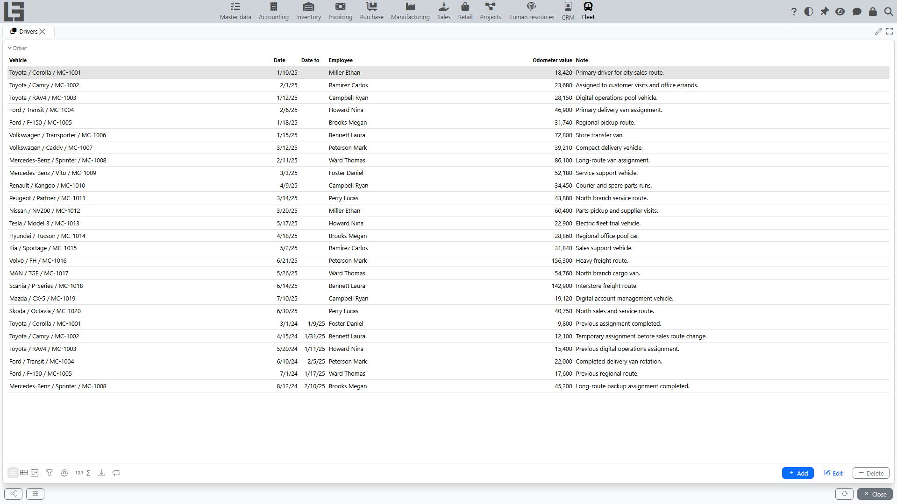

The section is intended for assigning drivers to vehicles and maintaining the assignment history.

A driver assignment is stored as a separate record with a validity period. This makes it possible to see who was assigned to a particular vehicle and when.

## Where to find it

Open **“Fleet” → “Operations” → “Drivers”**.

## Assigning a driver to a vehicle

The assignment is set up as a record with a validity period.

1. Click **Add**.
2. Specify:
   - vehicle;
   - **Date** and, if needed, **Date to**;
   - employee (driver);
   - **[Odometer value](service.md)** (if required);
   - note (if needed).
3. Save the record.

When you select a vehicle, the **Employee** is pre-filled with the vehicle’s previous driver (if there is one) — replace it with the new driver. The **Date** defaults to the current date.

### How to fill the assignment period

- **Date** — the start date of responsibility/vehicle usage.
- **Date to** — the end date of the assignment. The end date is inclusive: on that day the driver is still considered assigned, so it is better to start the next assignment from the following day.

If the driver is assigned for an indefinite period, the end date is usually left empty. When the driver changes, the previous assignment is closed with an end date.

## Driver replacement (typical scenario)

To correctly change the driver and keep the history:

1. Open the assignment list (the **“Drivers”** section or the **Drivers** block in the vehicle card).
2. Find the current assignment and fill in **Date to** (for example, with the vehicle handover date).
3. Create a new assignment with a new **Date** and select a new driver.

It is recommended to avoid overlapping assignment periods for the same vehicle so that the “current driver” is determined unambiguously.

## Controlling the current driver

When viewing the vehicle list, in some cases the current driver (as of the current date) is displayed. If the assignment period is over, the driver is considered not assigned.

If the driver is not displayed in the vehicle list or is displayed incorrectly:

- check the **Date/Date to** dates in assignments;
- make sure there are no overlapping periods;
- make sure the previous assignment is closed with an end date.

## Recommendations for keeping history

- To correctly determine the current driver, close the previous assignment by filling in **Date to**.
- When the driver changes, create a new assignment with a new date.

Additionally:

- If your organization records mileage, it is convenient to enter **[Odometer value](service.md)** when changing drivers — this helps reconcile mileage and service vehicles according to the schedule.