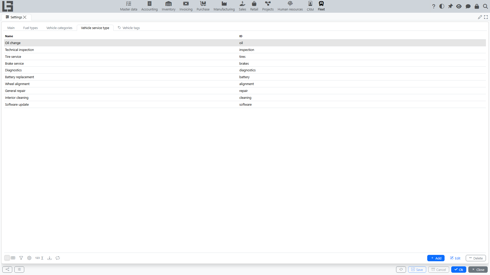

The **“Fleet”** section uses directories that define selection options in vehicle and service cards. Only fleet-specific directories are maintained here; shared directories (contract types, companies, partners) are configured in the common sections of the system.

## Where to find it

The directories are available under **“Fleet” → “Configuration”**. This group contains the **“Settings”** form together with separate items for **“Vehicle models”** and **“Vehicle manufacturers”**.

Access to configuration is typically restricted by administrator permissions or by the person responsible for directories.

## The “Settings” form

The **“Settings”** form is organized into tabs. The **“Main”** tab holds general section parameters (for example, the numerator used to generate vehicle IDs). The other tabs are directories (the set depends on the configuration):

- **Fuel types** — options for the “Fuel type” field in the vehicle card.
- **Vehicle categories** — vehicle classification (for example, passenger cars, trucks, special equipment).
- **Vehicle service type** — service classification (scheduled maintenance, repair, etc.).
- **Vehicle tags** — additional labels for filtering and control.

For directories, the **Add**, **Edit**, **Delete** actions are usually available.

Recommendations for maintaining directories:

- agree on unified naming (without duplicates and different spellings of the same value);
- use clear names so users can quickly select the required option;
- if the directory has an “ID” field, fill it consistently (often used for integrations and data exchange).

## Vehicle manufacturers and models

**“Vehicle manufacturers”** and **“Vehicle models”** are separate items in the **“Configuration”** group (next to **“Settings”**), each opened as its own list.

Recommended filling order:

1. Create manufacturers first.
2. Then add models selecting the manufacturer.

Practical tip: the displayed model name is composed by the system automatically as “Manufacturer / Model”, so select the manufacturer from the directory and enter only the model name — this simplifies search and avoids duplicates.