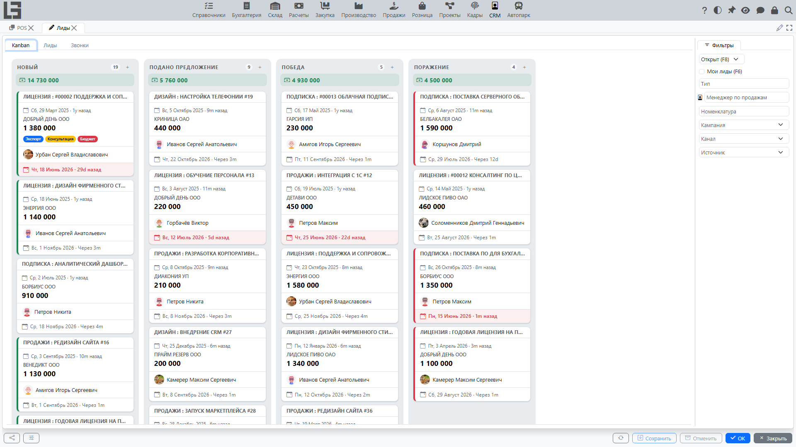

## Где находится

Откройте раздел **«Лиды»** (группа **«Операции»**). Вкладка **«Kanban»** — первая вкладка раздела и открывается по умолчанию.

## Для чего нужна доска

Доска по лидам помогает визуально вести воронку:

- каждая колонка соответствует одному статусу; в заголовке колонки видны название статуса и количество лидов в ней;
- под заголовком колонки показывается суммарная **ожидаемая сумма** по лидам колонки;
- кнопка **«+»** в заголовке колонки создаёт новый лид сразу в этом статусе;
- лиды отображаются карточками;
- лид можно перетащить в другой статус одним действием.

Это удобно для ежедневной работы: быстро увидеть «узкие места», перераспределить задачи, не пропустить лиды без движения.

## Какие статусы показываются

На доске отображаются:

- статусы, которые **не** отмечены как **«закрыта»**;
- статусы, разрешённые для выбранного типа лида (если вы отфильтровали список по типу).

Порядок колонок определяется параметром **«Порядок сортировки»** у статусов.

Если на доске не хватает колонок или, наоборот, показываются лишние — проверьте настройку статусов и типов (см. [Настройки и справочники](settings.md)).

## Что видно на карточке лида

Обычно на карточке есть:

- заголовок вида «тип : имя»;
- дата создания (с относительной длительностью, например «5д назад»);
- **[Покупатель](../masterdata/partners.md)**;
- **Ожидаемая сумма**;
- **Ярлыки лида** (с цветом);
- **Менеджер по продажам** (с аватаром);
- **Ожидаемое закрытие** внизу карточки — подсвечивается красным, если дата уже прошла.

Фон карточки подкрашивается цветом **приоритета лида**.

### Всплывающее окно и быстрые действия

Щелчок по карточке открывает всплывающее окно с деталями лида: статус, приоритет, даты, ожидаемая сумма, ярлыки и описание. В нём можно:

- открыть лид на редактирование (кнопка **«Редактировать»**; двойной щелчок по карточке тоже открывает лид);
- удалить лид (если это разрешено правами);
- переназначить **менеджера по продажам** — щёлкните по аватару другого сотрудника (в списке предлагаются сотрудники, у которых уже есть назначенные открытые лиды).

## Перетаскивание и порядок карточек

### Смена статуса

Чтобы сменить статус, перетащите карточку лида в нужную колонку.

Если лид не удаётся перенести в выбранный статус:

- проверьте **тип лида** (для типа могут быть ограничены допустимые статусы);
- проверьте настройку матрицы «тип ↔ статусы».

### Порядок внутри колонки

Внутри одного статуса карточки можно упорядочить так, как удобно вам. Порядок сохраняется для текущего пользователя, чтобы при следующем открытии доски лиды располагались привычно.

## Типовые ситуации

- **Колонок нет или их мало** — статусы помечены как «закрыта» или не разрешены для выбранного типа.
- **Карточка не перемещается** — статус не разрешён для типа лида или недостаточно прав на изменение.
- **Слишком много карточек** — включите фильтр по менеджеру по продажам или по типу.

## Ежедневная работа на доске

Пример простого регламента (10–15 минут утром):

1. Откройте «Kanban».
2. Проверьте первую колонку (обычно «Новый»):
   - назначьте менеджера по продажам;
   - заполните телефон и электронную почту;
   - зафиксируйте следующий шаг в описании.
3. Проверьте средние колонки (обычно «В работе»):
   - у лидов без ожидаемого закрытия поставьте дату;
   - у лидов без движения уточните у клиента и обновите статус.
4. Если по лиду принято решение:
   - переведите в закрывающий статус;
   - либо закройте через «Поражение» с причиной.

## Как избежать «застревания» лидов

- Всегда заполняйте «Ожидаемое закрытие».
- Используйте ярлыки для приоритизации (например, «срочно»), а приоритет — для визуального выделения.
- Поддерживайте порядок колонок через «Порядок сортировки» в справочнике статусов.