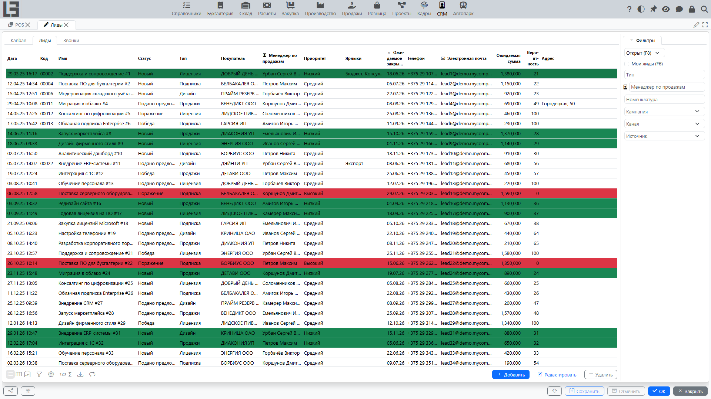
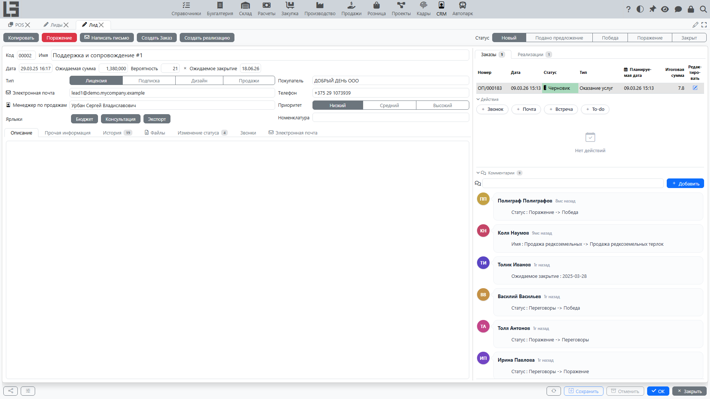

## Где находится

Откройте раздел **«Лиды»** (в дереве навигации он находится в группе **«Операции»**).

В разделе доступны:

- список лидов;
- карточка лида;
- фильтры по состоянию (открытые и закрытые лиды) и «мои лиды»;
- вкладка **[«Kanban»](kanban.md)** (первая вкладка, открывается по умолчанию);
- вкладки с коммуникациями (**«Звонки»** и **«Электронная почта»**);
- блок связанных документов ([заказы](../sales/orders.md), [реализации](../sales/invoices.md)) в карточке лида.

## Список лидов

Список предназначен для ежедневной работы: быстро увидеть, что в работе, кому назначено, что нужно закрыть и где «застряло».

### Какие данные видны в списке

Состав колонок зависит от настройки, но обычно доступны:

- **Код**, **Имя**;
- **Номенклатура**;
- **Статус** (и состояние «открыт/закрыта»);
- **Тип**;
- **[Покупатель](../masterdata/partners.md)**;
- **Менеджер по продажам**;
- **Кампания**, **Канал**, **Источник**;
- **Приоритет** и **Ярлыки**;
- прогноз: **Ожидаемая сумма**, **Вероятность**, **Ожидаемое закрытие**;
- контакты: **Телефон**, **Электронная почта**;
- при необходимости — адресные и контактные поля.

Подсказка: в списке может применяться цветовая индикация по приоритету, чтобы «срочные» лиды были заметнее.

### Фильтры

Справа в панели **«Фильтры»** доступны быстрые переключатели:

- **«Открыт»** — показывает открытые лиды;
- **«Закрыта»** — показывает закрытые лиды;
- **«Мои лиды»** — показывает лиды, где **менеджер по продажам** совпадает с текущим пользователем.

Также доступны выделенные отборы:

- по типу лида;
- по менеджеру по продажам;
- по номенклатуре;
- по кампании, каналу и источнику (если включён модуль маркетинга).

Рекомендация: для ежедневной работы обычно удобно держать включенным фильтр **«Открыт»**, а затем сузить выборку до **«Мои лиды»**.

### Открытие карточки лида

Чтобы открыть карточку:

1. Найдите нужную строку в списке.
2. Откройте лид на редактирование (обычно двойным щелчком по строке или кнопкой редактирования).

## Карточка лида

Карточка предназначена для ведения полной информации по лиду и выполнения действий: смена статуса, фиксация поражения, работа с связанными коммуникациями и документами.

### Структура карточки

Обычно в верхней части карточки отображаются:

- **Код** и **Имя**;
- блок прогноза: **Дата**, **Ожидаемая сумма**, **Вероятность**, **Ожидаемое закрытие**;
- основные параметры: **Тип**, **[Покупатель](../masterdata/partners.md)**, **Номенклатура**, **Электронная почта**, **Телефон**, **Менеджер по продажам**, **Приоритет**, **Ярлыки**.

**Статус** лида показан отдельным переключателем в верхней части карточки.

Ниже находятся вкладки:

- **«Описание»** — текстовое описание обращения, договорённостей, следующего шага;
- **«Прочая информация»** — название организации, сайт, адресные поля, контактное лицо и блок **«Маркетинг»** (**Кампания**, **Канал**, **Источник**);
- **«История»** — история изменений лида;
- **«Файлы»** — файлы, прикреплённые к лиду;
- **«Изменение статуса»** — журнал смен статусов: когда и кем установлен каждый статус и сколько часов лид в нём находился;
- **«Звонки»** и **«Электронная почта»** — коммуникации, связанные с лидом (см. [Коммуникации: звонки и письма](communications.md)).

В правой части карточки расположены блоки связанных документов (**«Заказы»**, **«Реализации»**), панель **«Действия»** и лента **«Комментарии»** (см. ниже).

### Рекомендованный порядок заполнения

1. Выберите **Номенклатуру** (если она определена) — **Имя** лида заполнится автоматически из названия номенклатуры, если оно было пустым.
2. Укажите **Имя** — коротко и понятно (что требуется и от кого), если оно не заполнилось автоматически.
3. Укажите **[Покупателя](../masterdata/partners.md)**, если он известен.
4. Проверьте **Менеджера по продажам** — для нового лида подставляется текущий пользователь; при необходимости измените.
5. Выберите **Тип**.
6. Выберите **Статус**.
7. Добавьте контакты и описание.

### Тип лида и допустимые статусы

Список доступных статусов зависит от выбранного типа лида:

- для каждого типа можно настроить, какие статусы допустимы;
- если для типа не задан список статусов, разрешены все статусы.

Если выбранный статус не допускается для типа, система не позволит сохранить лид. При смене типа статус автоматически сбрасывается, только если текущий статус недопустим для нового типа.

### Контакты и проверки

- Поле **«Электронная почта»** проверяется по формату. Если адрес введён с ошибкой, система сообщит о некорректном значении.
- Поле **«Телефон»** используется, в том числе, для автоматического поиска лида при обработке звонков.

### Закрытие лида через «Поражение»

Если лид ещё не закрыт, в карточке доступно действие **«Поражение»**.

Как это работает:

1. Нажмите **«Поражение»**.
2. Выберите **причину поражения**.
3. Система сохранит выбранную причину и установит лиду статус, который назначен в настройках как «поражение».

После этого в карточке отображается поле **«Причина поражения»**.

### Создание покупателя из лида

Если у лида ещё не указан **Покупатель**, в карточке доступно действие **«Создать Организацию»**. Оно создаёт [организацию](../masterdata/partners.md) по данным лида — название берётся из поля **«Название организации»**, также переносятся телефон, электронная почта, адрес и сайт — и, если заполнено хотя бы имя или фамилия контакта, контактное лицо для неё. Созданная организация назначается лиду как **Покупатель**.

### Копирование лида

Действие **«Копировать»** создаёт новый лид и переносит в него основные поля текущего: наименование, тип, покупателя, менеджера по продажам, описание, приоритет, ярлыки, ожидаемую сумму и вероятность, контакты, адрес, сайт, наименование организации и контактное лицо. Используйте его для похожих повторных обращений.

### История

В карточке доступна вкладка **«История»**:

- показывает, кто и когда менял основные поля лида;
- фиксирует ключевые события (в том числе смены статусов).

История отслеживает отдельные поля и не является полным журналом изменений; история контактов находится во вкладках «Звонки»/«Электронная почта» и в комментариях. Практический смысл истории — быстро понять, почему лид оказался в текущем состоянии.

### Связанные коммуникации

Если в вашей конфигурации включены коммуникации, в карточке лида могут отображаться:

- список звонков, привязанных к лиду;
- список писем, привязанных к лиду.

Подробности см. в документе [Коммуникации: звонки и письма](communications.md).

### Связанные документы: заказы и реализации

Если включено создание документов из лида, в карточке может быть блок связанных документов:

- **«Заказы»** — документы, созданные из лида;
- **«Реализации»** — документы, созданные из лида.

Подробности см. в документе [Заказы и реализации из лида](sales-and-documents.md).

### Действия и комментарии

В правой части карточки также находятся:

- **«Действия»** — запланированные действия по лиду (состав типов действий зависит от настройки): добавьте действие нужного типа, назначьте ответственного, укажите срок и отметьте выполнение (в этот момент можно указать обратную связь; запись о выполненном действии добавится в комментарии лида). Панель отображается, если в системе настроены типы действий.
- **«Комментарии»** — лента комментариев по лиду. В комментариях можно упоминать пользователей через **@**; прикреплённые файлы и ключевые изменения показываются вместе с комментариями. Менеджер лида и упомянутые пользователи могут получать уведомления о новых комментариях по почте (включается в профиле пользователя).

## Создание и удаление лида

### Создание

Обычно новый лид создаётся из списка лидов:

1. Откройте раздел «Лиды».
2. Нажмите «Добавить».
3. Заполните поля — как минимум «Имя», чтобы лид потом было легко найти.
4. Сохраните изменения.

Рекомендация: сразу назначайте «Менеджер по продажам» и ставьте «Ожидаемое закрытие», чтобы лид не потерялся.

### Удаление

Удаляйте лид только если он создан ошибочно или является явным дублем.

Перед удалением проверьте:

- нет ли связанных [заказов](../sales/orders.md) и [реализаций](../sales/invoices.md);
- нет ли связанных звонков и писем.

Если есть связи, чаще правильнее закрыть лид через статус или поражение, чем удалять.

## Практика ведения лида

#### Что писать в «Описание»

Хороший формат описания:

- кратко: что хочет клиент;
- что уже сделано (звонок, письмо, отправлено предложение);
- следующий шаг и дата (например, «перезвонить 20.12», «ожидаем ответ до 25.12»).

#### Как использовать ярлыки

Ярлыки удобны для пометок поперёк статусов, например:

- источник: «выставка», «сайт», «рекомендация» (в качестве альтернативы используйте выделенные маркетинговые поля);
- тип запроса: «доставка», «подбор», «срочно».

Не используйте ярлыки вместо статусов: статус — это этап процесса, ярлык — дополнительный признак.

## Типовые ошибки

- **Не сохраняется лид** — выбран статус, который не разрешён для типа лида.
- **Не получается написать письмо** — не заполнена «Электронная почта» или она введена с ошибкой.
- **Лиды «теряются»** — не указан менеджер по продажам и/или нет ожидаемой даты закрытия.