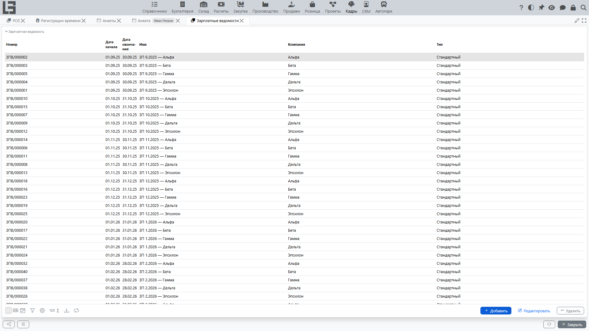
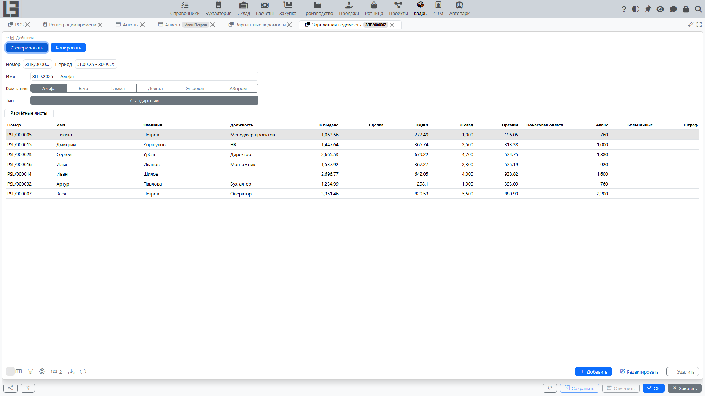

Зарплатная ведомость используется, когда нужно **сформировать расчётные листы сразу по нескольким сотрудникам** за один и тот же период.

Обычно работа строится так:

1. создаётся зарплатная ведомость (компания + период + тип);
2. выполняется действие **«Сгенерировать»**;
3. открываются расчётные листы сотрудников и проверяются строки расчёта и итог **«К выдаче»**;
4. при необходимости регистрируются выплаты.

## Где находится

Откройте **«Кадры» → «Операции» → «Зарплатные ведомости»**.

## Реквизиты ведомости

В ведомости обычно заполняют:

- **Компания** — по какой компании формируется зарплата;
- **Период** — даты, за которые считаются начисления/удержания;
- **Тип** — тип расчетного листа, который будет назначен сгенерированным документам;
- **Имя** (если используется) — произвольное пояснение, например «Зарплата за декабрь».

Если в системе существует только один тип расчетного листа, он подставляется по умолчанию.

## Что внутри ведомости

В ведомости отображается список расчётных листов, связанных с ведомостью. По каждому сотруднику обычно видно:

- номер расчётного листа;
- имя и фамилию сотрудника;
- должность;
- итог **«К выдаче»**;
- итоги по **видам расчёта** (по одной колонке на вид расчёта; порядок колонок задаётся признаком **«Порядок»**).

Итог по виду расчёта можно ввести прямо в таблице, если в настройках вид расчёта помечен как **«Редактируемое»**, — система создаст или обновит отдельную **ручную** строку расчётного листа с введённым значением. Если по тому же виду расчёта есть и автоматически сформированные строки (например, начисления по отметкам времени), в колонке показывается **сумма** всех строк — введённое значение прибавляется к автоматическим, а не заменяет их; не включайте «Редактируемое» для автоматических видов расчёта, если не нужна именно добавочная корректировка. Итоги нередактируемых видов расчёта доступны только для просмотра.

Из ведомости можно открыть расчётный лист и просмотреть его строки расчёта.

## Что делает действие «Сгенерировать»

Действие **«Сгенерировать»** выполняет два ключевых шага:

1. **Создаёт расчётные листы** по сотрудникам компании на выбранный период и тип.
   - Как правило, расчётные листы создаются **по активным сотрудникам** компании.
   - Если по сотруднику уже существует расчётный лист с теми же **периодом + компанией + типом**, система **не создаёт дубликат**.
2. **Заполняет (или обновляет) строки расчёта** в расчётных листах ведомости.
   - Часть строк может рассчитываться автоматически (например, на основании отмеченного времени).
   - После формирования рекомендуется открыть несколько расчётных листов и проверить результат.

Если расчётный лист, уже связанный с ведомостью, относится к сотруднику, не принадлежащему **компании** ведомости, действие **«Сгенерировать»** прерывается с ошибкой и ничего не меняет — исправьте или удалите такой расчётный лист и повторите.

#### Как формируется список сотрудников

Состав сотрудников зависит от выбранной **компании** и от признака активности сотрудника.

Если сотрудник не относится к выбранной компании или не является активным, расчётный лист по нему обычно не будет создан при формировании.

#### Если расчётный лист уже был создан отдельно

Если расчётный лист с теми же периодом, сотрудником, компанией и типом уже существует, ведомость не создаёт его повторно.

При этом в самой ведомости вы обычно видите **только те расчётные листы, которые связаны с этой ведомостью**. Поэтому, если расчётный лист был создан отдельно (не из ведомости), он может не появиться в списке текущей ведомости.

В таком случае рекомендуется выбрать единый рабочий сценарий (формировать расчёт через ведомость) и избегать параллельного создания документов за один и тот же период.

#### Повторный запуск

Формирование можно выполнять повторно, если менялись исходные данные (например, отметки времени, ставка, настройки видов расчёта). Повторный запуск обычно используется для **актуализации** расчёта.

## Если расчётный лист не появился в ведомости

Проверьте типовые причины:

1. Сотрудник **не активен** или не относится к выбранной компании.
2. Для этого сотрудника уже был создан расчётный лист с тем же периодом, компанией и типом.

Отсутствие исходных данных (например, отметок времени с выбранным проектом) **не** мешает созданию самого расчётного листа — не появятся только автоматические строки расчёта. См. [Выплата по отмеченному времени](payroll-time-entries.md).

## Копирование ведомости

Если доступно действие **«Копировать»**, оно помогает создать новую ведомость на основе существующей:

- переносит компанию, тип и имя — **период** в новой ведомости не заполнен, укажите его сначала;
- копирует связанные расчётные листы (с новыми номерами) вместе со строками, введёнными вручную; строки, рассчитанные по отметкам времени, не копируются.

После копирования укажите период, проверьте расчётные листы и выполните **«Сгенерировать»**, чтобы обновить автоматические строки.