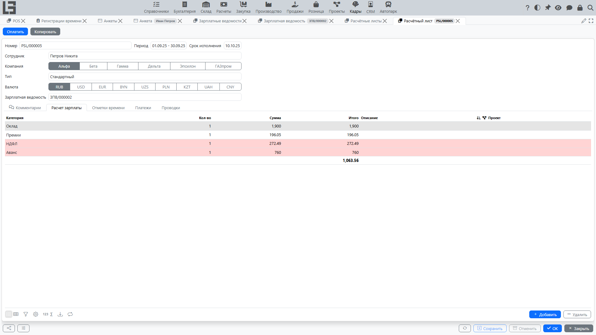

Расчётный лист — это документ расчёта сотрудника за период. В нём собраны:

- строки расчёта (начисления и удержания);
- итог **«К выдаче»**;
- (если используется) детализация исходных данных, например список отметок времени.

## Реквизиты расчётного листа

Перед проверкой расчёта убедитесь, что в расчётном листе верно указаны:

- **Сотрудник**;
- **Организация**;
- **Период**;
- **Тип** (например, Стандартный);
- **Валюта** и **Срок оплаты**.

Если в системе существует только один тип расчётного листа, он подставляется по умолчанию.

## Расчёт зарплаты

Строки расчёта показывают, **из чего сложилась сумма**. Обычно у строки есть:

- **категория** (например, Оклад, Премия, Налог);
- **количество** (например, часы);
- **сумма** (например, ставка);
- **итог** — рассчитывается как `количество × сумма` (итог также можно ввести напрямую — тогда сумма пересчитывается обратно).

Является ли строка **начислением** или **удержанием**, определяется её **категорией**: категория, помеченная как удержание, уменьшает итог «К выдаче».

### Признаки «Пропустить» и «Скрыть»

Эти признаки относятся к **категории**, а не к отдельной строке:

- **«Пропустить»** — строки этой категории не участвуют в расчёте итога «К выдаче».
- **«Скрыть»** — строки этой категории не показываются в таблице, но участвуют в расчёте (если категория не помечена также как «Пропустить»).

Подробное правило расчёта итога см. на странице [Как считается итог «К выдаче»](net-wage.md).

## Копирование расчётного листа

Действие **«Копировать»** создаёт новый расчётный лист на основе текущего, копируя основные реквизиты и строки расчёта, введённые вручную. Начисления, сформированные по отметкам времени из проектов, не копируются — сформируйте их в новом расчётном листе заново. После копирования проверьте период.

## Где проверить данные по отмеченному времени

Если в организации используется расчёт начислений на основании отметок времени из раздела «Проекты», в расчётном листе может быть вкладка **«Отметки времени»**.

В ней удобно проверять:

- какие записи попали в расчёт;
- дату, проект, тип и часы;
- ставку «Зарплата в час» и сумму по записи.

Подробности: [Выплата по отмеченному времени](payroll-time-entries.md).

## Зарегистрировать выплату (если используется)

Если в организации включена регистрация выплат по расчётным листам, в расчётном листе доступно действие **«Оплатить»**.

Рекомендуемый порядок:

1. Откройте расчётный лист и убедитесь, что итог **«К выдаче»** верный.
2. Выполните действие **«Оплатить»**.
3. Проверьте сумму выплаты и при необходимости скорректируйте её в пределах доступного остатка.
4. Сохраните платёж.

Подробнее: [Выплата зарплаты и контроль выплат](payroll-payments.md).