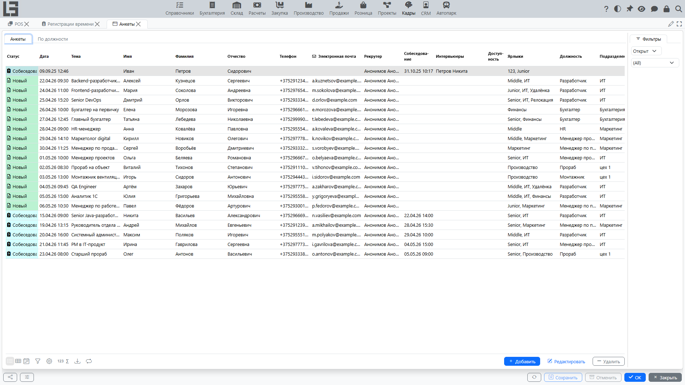
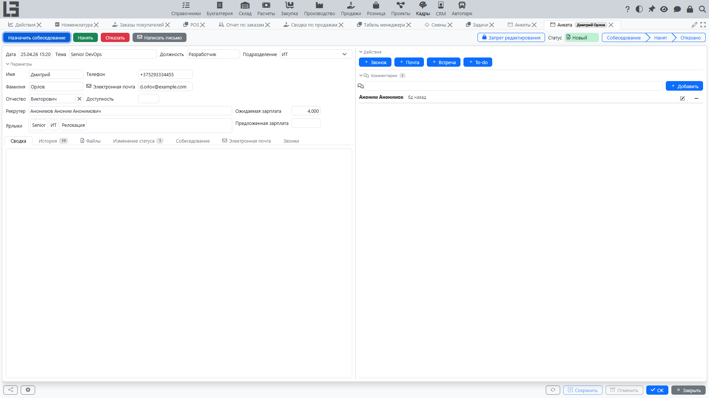

Раздел «Подбор персонала» предназначен для ведения работы с кандидатами: регистрации анкет, хранения файлов (резюме и т. п.), планирования собеседований и фиксации решения по кандидату.

## Основные объекты

### Анкета

В анкете обычно фиксируются:

- дата создания;
- **имя, отчество и фамилия** кандидата и **контактные данные** (эл. почта, телефон);
- **тема** и **описание**;
- **сводка** по анкете;
- должность;
- подразделение;
- рекрутер (ответственный);
- ожидаемая и предложенная зарплата;
- доступность;
- ярлыки (для удобной классификации);
- файлы анкеты.

Анкета проходит четыре фиксированных статуса: **«Новый»**, **«Собеседование»**, **«Нанят»** и **«Отказано»**. Статус меняется автоматически по ходу работы с анкетой — см. сценарии ниже.

### Собеседование

Собеседование используется для фиксации этапа подбора:

- указываются **участники собеседования**;
- заполняется **сводка** по собеседованию.

Назначение собеседования переводит анкету в статус **«Собеседование»**.

## Типовые сценарии

### Создать анкету вручную

1. Откройте **«Кадры» → «Операции» → «Анкеты»**.
2. Создайте анкету.
3. Заполните ключевые реквизиты: должность, подразделение, рекрутер, контактные данные, описание.
4. При необходимости укажите ожидаемую/предложенную зарплату и доступность.
5. Прикрепите файлы кандидата.

### Привязать материалы к анкете

В анкете можно хранить файлы (например, резюме) и комментарии:

1. Откройте анкету кандидата.
2. Добавьте файлы.
3. При необходимости оставьте комментарий с уточнениями по кандидату.

### Назначить собеседование

1. Откройте анкету.
2. Выполните действие **«Назначить собеседование»**.
3. Выберите участников собеседования.
4. По итогам заполните **сводку** (краткое резюме разговора и дальнейшие шаги).

Анкета автоматически переходит в статус **«Собеседование»**.

### Записать звонок

Звонки с кандидатом можно фиксировать в анкете:

1. Откройте анкету.
2. Выполните действие звонка и зафиксируйте звонок на вкладке **«Звонки»**.

### Написать письмо кандидату

Если в системе настроена отправка писем, вы можете написать письмо из анкеты:

1. Откройте анкету.
2. Выполните действие **«Написать письмо»**.
3. При наличии шаблонов выберите подходящий шаблон письма — тема и текст заполнятся автоматически.
4. Отправьте письмо.

### Нанять кандидата

Действие «Нанять» используется, когда принято решение о приёме кандидата:

1. Откройте анкету.
2. Выполните действие **«Нанять»**.
3. Система создаёт **сотрудника**, перенося имя, контакты, должность и подразделение кандидата, и связывает сотрудника с анкетой.
4. Проверьте созданную карточку сотрудника и заполните недостающие данные.

Анкета автоматически переходит в статус **«Нанят»** (и закрывается); для уже закрытой анкеты действие **«Нанять»** недоступно.

### Отказать кандидату

1. Откройте анкету.
2. Выполните действие **«Отказать»**.
3. Выберите **причину отказа**.

Если у выбранной причины задан шаблон письма, система автоматически отправляет кандидату письмо об отказе. Анкета переходит в статус **«Отказано»**.

## Контроль и удобство работы

Для ускорения работы в списке анкет доступны:

- представление **«По должности»** — матрица должностей по статусам анкет;
- фильтры по статусу, ярлыкам и другим реквизитам;
- ярлыки для быстрой классификации;
- история изменений и комментарии.