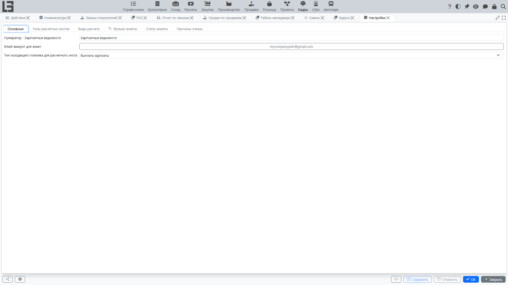

Раздел «Настройка» содержит параметры и справочники, которые определяют работу «Кадров»: справочники и статусы подбора, а также параметры расчёта/выплаты зарплаты.

Набор доступных настроек зависит от конфигурации вашей организации и прав пользователя.

## Подбор персонала

Обычно настраиваются:

- **причины отказа** — у каждой может быть шаблон письма, отправляемого при отказе по этой причине;
- **ярлыки анкет** для классификации анкет;
- почтовый ящик для автоматической обработки входящих сообщений по анкетам (если используется).

**Шаблоны писем** для коммуникации с кандидатом ведутся в настройках раздела «Справочники» (вкладка **«Шаблоны email»**).

Набор статусов анкеты фиксирован («Новый», «Собеседование», «Нанят», «Отказано»); на вкладке **«Статус анкеты»** для статуса можно включить признак **«Запрет редактирования»** — основные поля анкет в этом статусе становятся доступны только для чтения (доступность действий регулируется отдельно). Цвет статуса предопределён и показывается для справки.

## Регистрация времени

Отдельных параметров регистрации времени на форме «Настройки» нет:

- разрешение отмечаться **без геолокации** включается индивидуально — опцией **«Регистрация времени без геолокации»** на карточке сотрудника;
- фотография на киоске снимается автоматически, если у устройства киоска есть камера, — отдельная настройка не требуется;
- бейджи сотрудников печатаются из карточки сотрудника; макеты бейджей ведутся как **шаблоны печати сотрудника** на форме **«Справочники» → «Настройки»**.

## Расчёт и выплата зарплаты

Обычно настраиваются:

- **типы расчётных листов** (например, «Стандартный») и их нумерация;
- **виды расчёта** — категории начислений и удержаний, используемые в строках расчётного листа. Признак **«Редактируемое»** разрешает вводить итог по виду расчёта прямо в таблице зарплатной ведомости, а **«Порядок»** задаёт порядок колонок в ней. В карточке вида расчёта также есть признаки **«Пропустить»** и **«Спрятать»** — см. [Как считается итог «К выдаче»](net-wage.md);
- **тип исходящего платежа**, который используется при регистрации выплат по расчётным листам (если организация фиксирует выплаты в системе). Платежи этого типа всегда учитываются в сумме «Оплачено» списка расчётных листов. Чтобы учитывались и платежи других типов (например, займы, выданные сотрудникам и разнесённые на расчётные листы), включите признак **«Учитывать в долге по зарплате»** в карточке соответствующего типа исходящего платежа — см. [Выплата зарплаты и контроль выплат](payroll-payments.md).