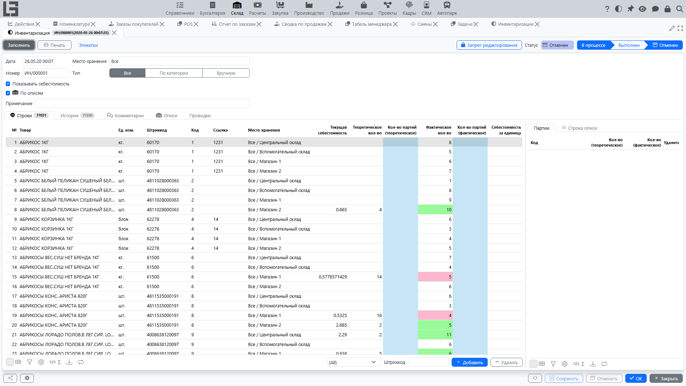

Инвентаризация (пересчёт) используется для сравнения учётного остатка с фактическим количеством в [месте хранения](locations.md).

Инвентаризация проходит статусы **«Черновик»** → **«В процессе»** → **«Выполнена»**, с **«Отменена»** как альтернативным финальным состоянием. Расхождение по каждой строке пересчитывается автоматически, пока документ находится в **«В процессе»** (как «фактическое количество» минус «теоретическое количество»), а соответствующие проводки в регистр остатков делаются при переводе документа в **«Выполнена»**.

## Типовой процесс

Ниже приведён рекомендуемый порядок действий. Он подходит как для полной инвентаризации места хранения, так и для пересчёта зоны/ячейки.

1. **Подготовка**
   - Определите **периметр**: [место хранения](locations.md)/зона/ячейка, группы товаров, необходимость учёта по [партиям/упаковкам](lots-and-packages.md).
   - Зафиксируйте момент «среза»:
     - по возможности завершите незакрытые **[поступления](receipts.md)/[отгрузки](shipments.md)/[перемещения](transfers.md)** по выбранному [месту хранения](locations.md);
     - договоритесь о правилах работы на время пересчёта (например, не проводить документы по этому месту хранения или фиксировать операции отдельно).
2. **Создание документа**
   - Создайте **инвентаризацию** и укажите **[место хранения](locations.md)**.
   - При необходимости укажите дополнительные параметры (например, учитывать партии).
3. **Перевод в статус `В процессе`**
   - Переведите инвентаризацию в состояние **`В процессе`**
   - После этого используйте выбранный способ пересчёта: по спискам (см. ниже) или ввод вручную.
4. **Ввод фактических остатков**
   - Заполните **фактические количества** по товарам.
   - Если включён учёт по партиям/сериям — вводите количество **в разрезе [партий](lots-and-packages.md)**.
   - Если используется адресное хранение — убедитесь, что ввод выполняется по **нужной зоне/ячейке**.
5. **Проверка и сверка**
   - Система непрерывно показывает **расхождение** по каждой строке — фактическое количество минус теоретическое — и предлагает быстрые фильтры **«Излишек»** и **«Недостача»**.
   - Проверьте строки с нулевыми/неожиданными значениями.
   - При больших расхождениях:
     - перепроверьте **единицы измерения**;
     - проверьте, что выбранное **[место хранения](locations.md)** совпадает с фактическим.
   - При необходимости согласуйте расхождения с ответственным лицом.
6. **Завершение (перевод в «Выполнена»)**
   - Переведите инвентаризацию в **«Выполнена»**.
   - В этот момент система проводит расхождения в регистр остатков, чтобы учётные остатки совпали с фактическими (в рамках правил учёта вашей конфигурации).

## Списки инвентаризации

В системе может использоваться отдельный механизм «списки инвентаризации»:

- подготовка перечня товаров для пересчёта;
- фиксация результатов пересчёта;
- перенос результатов в инвентаризацию.

Рекомендуемый подход:

1. Сформируйте список (по месту хранения/зоне/ячейке, при необходимости — с отбором по группе товаров).
2. Распечатайте/передайте список исполнителям и зафиксируйте фактические количества.
3. Загрузите/введите результаты в список.
4. Перенесите результаты в документ инвентаризации и выполните шаги **«Проверка и сверка» → «Завершение (перевод в Выполнена)»**.

## Типовые проблемы

- **Не удаётся завершить** — не заполнены фактические количества или не рассчитаны расхождения.
- **Расхождения слишком большие** — проверьте единицы измерения и [место хранения](locations.md).