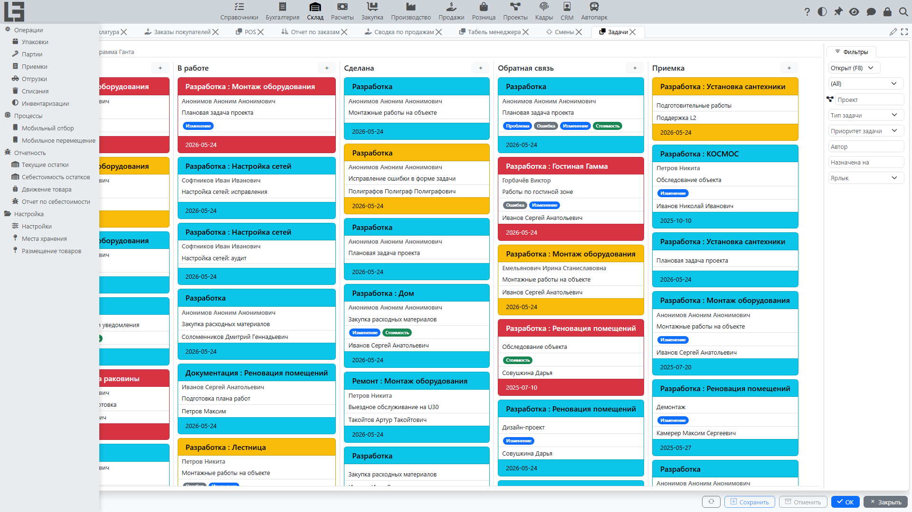

Документация описывает работу раздела **«Склад»**: места хранения, поступления, отгрузки, перемещения, списания, инвентаризации, задания на сборку, партии и упаковки, а также отчёты и регистры.

## Содержание

- [Быстрый старт](#быстрый-старт)
- [Навигация](#навигация)
- [Термины](#термины)

Разделы:

- [Места хранения (склады и зоны)](locations.md)
- [Поступления](receipts.md)
- [Отгрузки](shipments.md)
- [Перемещения](transfers.md)
  - [Массовое создание перемещений](transfer-bulk-create.md)
- [Списания](scrap.md)
- [Инвентаризация](adjustments.md)
- [Задания на сборку](picking.md)
- [Складские единицы учета](product-sku.md)
- [Партии и упаковки](lots-and-packages.md)
- [Отчёты и регистры](reports-and-ledgers.md)
- [Себестоимость товаров](costing.md)
- [Настройки](settings.md)

## Быстрый старт

Ниже — типовой складской цикл.

1. Создайте/проверьте **[места хранения](locations.md)** (склад, зоны, ячейки), если требуется адресное хранение.
2. Оформите **[поступление](receipts.md)**:
   - укажите поставщика (если используется) и [место хранения](locations.md);
   - добавьте строки товаров и количества;
   - переведите поступление в выполнение и завершите.
3. Оформите **[отгрузку](shipments.md)**:
   - укажите покупателя (если используется) и [место хранения](locations.md);
   - добавьте строки товаров и количества;
   - выполните проверку наличия и резервирование (если включено);
   - выполните отбор (если используются [задания на сборку](picking.md)) и завершите отгрузку.
4. При необходимости выполните **[перемещение](transfers.md)** между складами/зонами.
5. Для учёта расхождений используйте **[списание](scrap.md)**.
6. Периодически выполняйте **[инвентаризацию](adjustments.md)** (пересчёт остатков) и закрывайте её.

## Навигация

Раздел «Склад» обычно содержит группы:

- **Операции** — документы ([поступления](receipts.md), [отгрузки и перемещения](shipments.md), [списания](scrap.md), [инвентаризации](adjustments.md)), а также справочники [партий](lots-and-packages.md) и [упаковок](lots-and-packages.md).
- **Процессы** — контрольные представления и мобильные / пакетные сценарии (например, мобильное задание на сборку, мобильное перемещение).
- **Отчётность** — отчёты по остаткам и движениям и просмотр регистров ([отчёты и регистры](reports-and-ledgers.md)).
- **Настройка** — справочники ([места хранения](locations.md), типы документов) и форма **«Настройки»** со сквозными параметрами.

## Термины

#### [Место хранения](locations.md)

Склад, зона или ячейка, где хранятся товары.

#### [Поступление](receipts.md)

Документ прихода товара в [место хранения](locations.md).

#### [Отгрузка](shipments.md)

Документ расхода товара из [места хранения](locations.md).

#### [Перемещение](transfers.md)

Документ переноса товара между [местами хранения](locations.md). Технически это [отгрузка](shipments.md), у типа которой включён флаг **«Перемещение»**; тогда заполняются и «Место хранения (откуда)», и «Место хранения (куда)», а система формирует соответствующие записи в регистре себестоимости на обеих сторонах.

#### [Списание](scrap.md)

Документ списания товара (порча, потери, брак, истечение срока и т. п.).

#### [Инвентаризация](adjustments.md)

Процедура пересчёта остатков с фиксацией расхождений.

#### [Складская единица](product-sku.md)

Базовая номенклатурная позиция, в которой ведется физический учет товара на складе.

#### [Партия](lots-and-packages.md)

Идентификатор партии/серии товара для прослеживаемости.

#### [Упаковка](lots-and-packages.md)

Единица упаковки/тара, в которой учитываются товары.

#### [Кол-во мест](product-sku.md#альтернатива-учет-в-упаковках-местах-в-документах)

Количество товара, выраженное в единицах упаковки (местах), используемое для удобства ввода данных в документах.