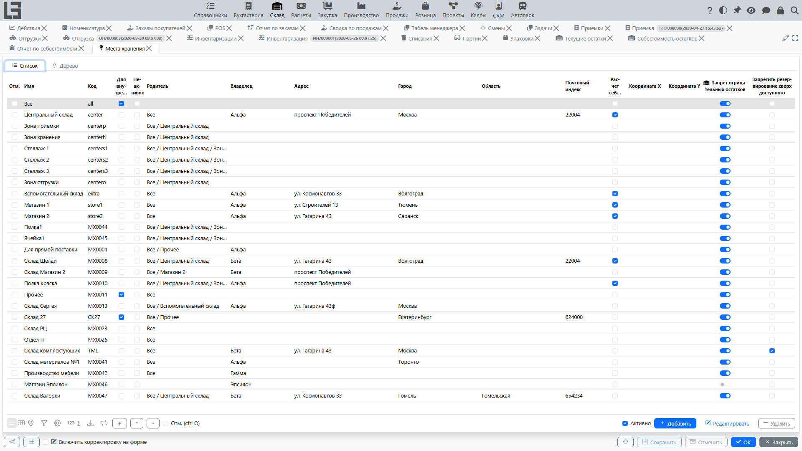

## Назначение

Место хранения — это справочник, который описывает, **где физически лежит товар**. В системе все они хранятся как единая сущность **«Место хранения»**, организованная в дерево «родитель–потомок» произвольной глубины — отдельных классов «склад» / «зона» / «ячейка» нет. Роль конкретного узла определяется тем, как ваша организация решает его использовать; типовая схема:

- узлы верхнего уровня — это склады;
- их потомки — это зоны;
- листья — это ячейки (адресное хранение).

## Где находится

Откройте **«Склад» → «Настройка» → «Места хранения»**.

## Где используется

Места хранения участвуют практически во всех складских документах:

- [приемка](receipts.md) — куда принимаем товар;
- [отгрузка](shipments.md) — откуда отгружаем;
- [перемещение](transfers.md) — откуда и куда переносим;
- [списание](scrap.md) — откуда списываем;
- [инвентаризация](adjustments.md) — где выполняем пересчёт.

## Структура мест хранения

Места хранения организованы иерархически через единственное поле **«Родитель»**, которое ссылается на другое место хранения. У любого узла могут быть потомки, поэтому глубина произвольная; типовая схема — два или три уровня:

- верхний уровень — склад;
- внутри — зоны;
- внутри зон — ячейки.

Рядом со списком доступна вкладка **«Дерево»** — это самый удобный способ навигации по иерархии.

Рекомендации:

1. Если адресное хранение не используется, достаточно создать места хранения уровня «склад».
2. Если адресное хранение используется, создавайте зоны и ячейки так, чтобы пользователю было удобно выбирать их в документах.

Опционально в **«Склад» → «Настройка» → «Настройки»** можно включить признак **«Запретить несколько корневых мест хранений»**. С включённым признаком система не позволяет иметь более одного места хранения без родителя — первое (корневое) место хранения по-прежнему можно создать без родителя, но каждое последующее должно крепиться к существующему дереву.

## Другие поля места хранения

Кроме **«Имя»**, **«Код»** и **«Родитель»**, у места хранения есть:

- **«Для внутреннего использования»** — отмечает чисто внутренние узлы (например, транзитные зоны).
- **«Неактивно»** — скрывает место хранения из основного списка (по умолчанию включён фильтр «Активно»).
- **«Владелец»** (компания) — компания-владелец места хранения.
- **«Адрес» / «Город» / «Область» / «Почтовый индекс»** — адресные поля. Если у дочернего узла они пустые, система берёт значения от ближайшего заполненного родителя (каноническая адресация).
- **«Расчет себестоимости»** — помечает место хранения как место учёта себестоимости (см. [себестоимость товаров](costing.md)). Себестоимость ведётся по ближайшему предку с этим признаком (или по корню дерева, если такого предка нет), поэтому движения между подчинёнными местами одного места учёта себестоимости не создают проводок по себестоимости.

## Ограничения регистров (по месту хранения)

У места хранения можно включить два опциональных ограничения (они наследуются дочерними местами — действует ближайший предок с установленным признаком):

- **«Запрет отрицательных остатков»** — система блокирует операции, которые загоняют физический остаток товара в этом месте хранения в минус.
- **«Запретить резервирование сверх доступного»** — система блокирует операции, из-за которых доступный остаток (*остаток − резерв + ожидается*, см. [отчёты и регистры](reports-and-ledgers.md#регистры)) в этом месте хранения уйдёт в минус.

Если проводка нарушает включённое ограничение, она отклоняется с пояснительным сообщением.

## Координаты

В карточке места хранения есть вкладка **«Координаты»** с полями **«Широта»** и **«Долгота»** и картой. Координаты можно ввести вручную или рассчитать автоматически по адресу (для этого нужен настроенный ключ Google Maps API). Вкладка полезна для распределённых сетей, где места хранения географически разнесены.

## Доступ по сотрудникам

Доступ к местам хранения можно ограничивать по сотрудникам:

- в карточке сотрудника есть вкладка **«Места хранения»**, где дерево мест хранения показывается с признаками доступа;
- ограничение действует на «собственное» место хранения документа (место приемки, место‑источник отгрузки и т. п.): там можно выбрать только доступные места, и списки документов фильтруются соответственно;
- если пользователю доступно ровно одно место хранения, оно подставляется в новые документы автоматически;
- место хранения‑**назначение** [перемещения](transfers.md) не ограничивается — переместить товар в недоступное пользователю место можно, но такое перемещение потребует [подтверждения приёмки в месте назначения](shipments.md#подтверждение-приёмки-в-месте-назначения).

## Размещение товаров

Форма **«Склад» → «Настройка» → «Размещение товаров»** закрепляет за товарами **место хранения** по умолчанию. Выберите место хранения и отметьте товары, которые там хранятся — привязка также видна в карточке номенклатуры (вкладка **«Размещение товаров»**). Она используется как подсказка/значение по умолчанию при добавлении товаров в документы.

## Импорт и экспорт

Для первоначальной настройки и миграции данных места хранения можно выгружать в Excel и загружать из Excel (ID, наименование, родитель, компания-владелец, адресные поля, признак расчёта себестоимости). Эти действия находятся на форме миграции данных, а не в разделе «Склад»; обычно ими пользуются администраторы.

## Типовые правила

- При выборе места хранения в документе проверяйте, что оно соответствует вашему процессу (например, [отгрузка](shipments.md) не должна идти с «зоны приёмки», если это запрещено регламентом).
- Если документ не проводится из‑за отсутствия места хранения, проверьте заполнение места хранения в шапке документа.
- Место хранения нельзя удалить, пока у него есть подчинённые места хранения.
