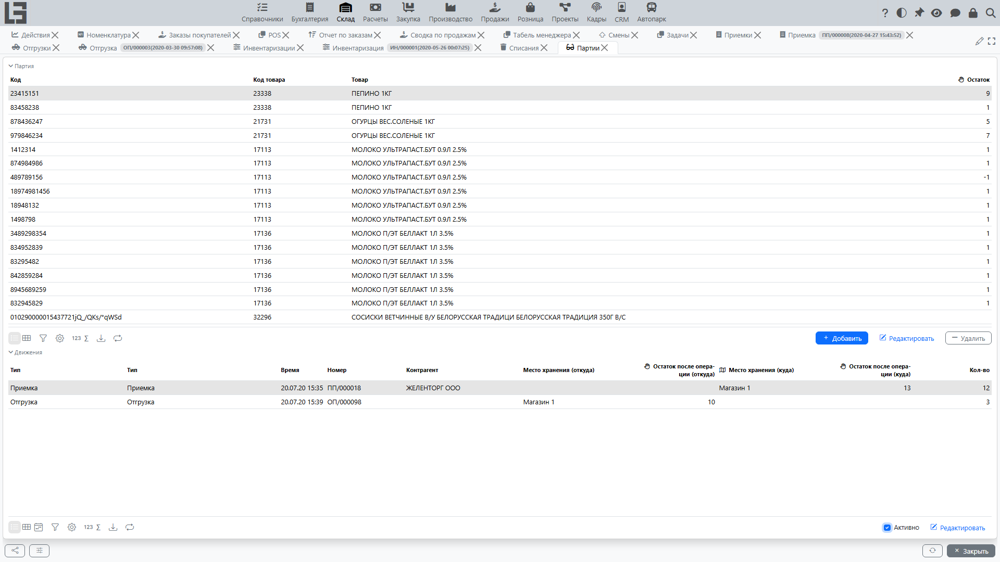
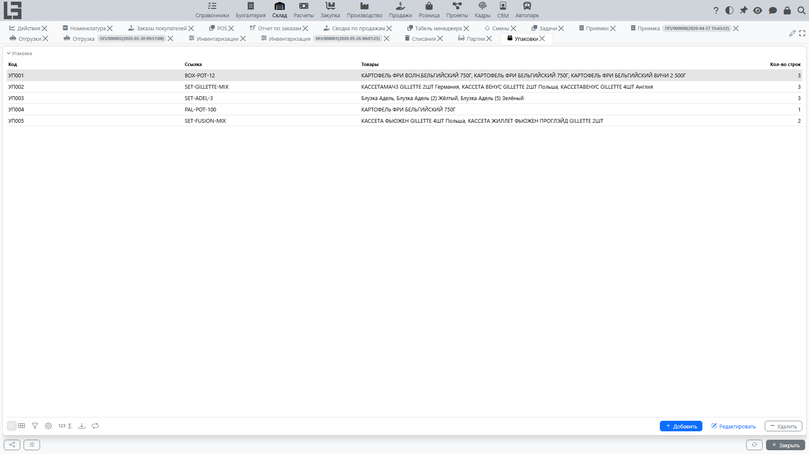

## Партии

Партия (серия) используется для прослеживаемости. Справочник партий доступен в **«Склад» → «Операции» → «Партии»**.

Учёт партий управляется несколькими уровнями настроек:

- **глобальный признак** (**«Партионный учет»**) в **«Склад» → «Настройка» → «Настройки»**, который включает учёт партий в системе в целом;
- на каждой **категории товара** — флаг **«Использовать партии»**, флаг **«Серийные номера»**, **нумератор** и **префикс** для генерации идентификаторов партий. Настройки категории — «Использовать партии» / «Серийные номера» / нумератор / префикс — наследуются дочерними категориями и товарами категории;
- на товаре — переопределение **«Использовать партии»**, которое позволяет **включить** учёт партий для отдельного товара, даже если его категория без партий. Этот признак на товаре **не может выключить** учёт партий для товара, у категории которого партии уже включены — чтобы выключить партии для такого товара, выключите признак на категории.

Сама запись партии минимальна: она содержит **ID** и **Товар**, к которому относится. Срок годности и подобные атрибуты не входят в базовую сущность партии — они могут быть добавлены конфигурацией, расширяющей модель.

### Генерация идентификаторов партий

ID партии можно ввести вручную или сгенерировать автоматически (действие **«Сгенерировать»** в строках [приемки](receipts.md)):

- идентификатор складывается из **префикса** и следующего значения **нумератора**, настроенных на категории товара (например, префикс `LOT-` и значение нумератора `000123` дают `LOT-000123`);
- для товаров с включёнными **«Серийными номерами»** генерируется по одной партии **на каждую единицу** — каждая количеством 1 (режим серийных номеров);
- иначе генерируется одна партия на весь остаток строки (режим партий).

### Где используются партии

Когда учёт партий включён для товара:

- партия может указываться в строках [приемки](receipts.md), [отгрузки](shipments.md), [перемещения](transfers.md) (перемещение — это отгрузка с признаком «Перемещение»), [списания](scrap.md) и [инвентаризации](adjustments.md) — на соответствующих карточках появляется вкладка **«Партии»** с разбивкой по партиям;
- размещение в приемках и отбор в отгрузках можно детализировать по партиям;
- [отчёты по остаткам](reports-and-ledgers.md) можно строить в разрезе партий, а карточка самой партии показывает историю движения и текущий остаток партии по местам хранения;
- в мобильных / сканирующих сценариях система сопоставляет отсканированный штрихкод напрямую с партией; для неизвестного штрихкода партия может создаваться автоматически «на лету».

### Этикетки партий

Штрихкод-этикетки партий можно печатать: действие печати доступно и на карточке партии, и в строках документов (приемки, отгрузки). Форматы вывода: PDF, DOCX, XLSX, RTF, HTML; шаблон этикетки настраивается.

## Упаковки

Упаковка — это контейнер/мультиединица, идентифицируемая **ID** (и опциональной **ссылкой**), у которой есть собственный список строк с товарами и количествами. Справочник упаковок доступен в **«Склад» → «Операции» → «Упаковки»**.

> Работа с упаковками в стандартной конфигурации поддерживается **только в [приемках](receipts.md)**: упаковка может быть привязана к приемке, а строку упаковки можно привязать к партии. В отгрузках, перемещениях, списаниях и инвентаризациях из коробки работа идёт только с партиями — поддержки на уровне упаковок там нет.

Когда упаковки используются в приемке:

- содержимое упаковки (товары и их количества) фиксируется один раз в справочнике упаковок;
- затем упаковка привязывается к приемке (действие **«Добавить»** на вкладке **«Упаковки»**) — её строки отображаются на карточке приемки для справки и прослеживаемости;
- каждую строку упаковки можно привязать к [партии](#партии), если для товара включён учёт партий — колонка **«Партия»** заполняется прямо в карточке упаковки.

> Связывание упаковки с приемкой носит информационный характер: остатки всё равно проводятся из собственных количеств строк приемки (колонка **«Принято»**), поэтому соответствующие строки приемки тоже должны быть заполнены.

> Не путайте это с опцией **«Показывать количество мест»**, которую можно включить на типе документа. Эта опция добавляет в строках документа дополнительные колонки для ввода количества в упаковочных единицах (коробках, паллетах и т. п.) и описана в разделе [Кол-во мест](product-sku.md#альтернатива-учет-в-упаковках-местах-в-документах). Она независима от справочника упаковок, описанного здесь.
