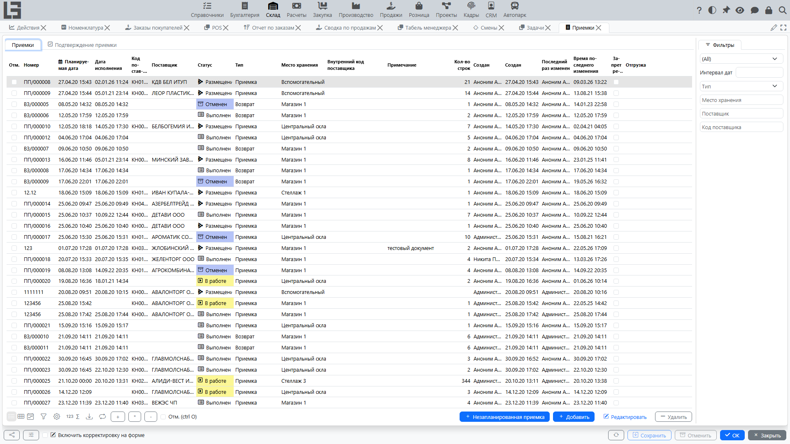
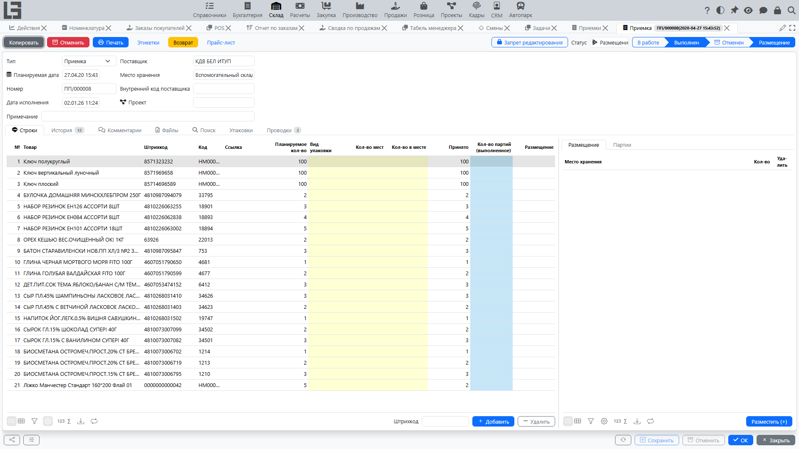

## Где находится

Откройте раздел **«Склад» → «Операции» → «Поступления»**.

## Назначение

Поступление фиксирует приход товара в [место хранения](locations.md).

Документ используется, чтобы:

- зафиксировать планируемое и фактическое количество к приёмке;
- принять товар в конкретное [место хранения](locations.md);
- при необходимости — разнести товар по зонам/ячейкам (адресное хранение);
- сформировать движения в учёте остатков и (при включённом расчёте) себестоимости.

## Список поступлений

В списке обычно видны:

- номер;
- плановая дата и время;
- тип поступления;
- поставщик (если ведётся);
- [место хранения](locations.md);
- примечание;
- количество строк.

Также в списке доступны действия: создать, открыть, удалить (если разрешено статусом и правами).

## Карточка поступления

### Шапка документа

В шапке поступления обычно заполняются:

- **Тип** — влияет на нумерацию, [место хранения](locations.md) по умолчанию и ограничения;
- **Плановая дата** — планируемое время приёмки;
- **Номер** — формируется по нумератору;
- **Поставщик** (если используется);
- **Место хранения** — обязательное поле;
- **Ссылка поставщика** (например, номер накладной поставщика — если используется);
- **Примечание**.

Практический совет: сначала выберите тип и [место хранения](locations.md) — после этого удобнее добавлять строки.

### Строки поступления

В строках указываются товары и количество к поступлению.

В типовом наборе полей строки доступны:

- **Номенклатура** — обязательное поле;
- **Единица измерения** — подставляется из номенклатуры;
- **Штрихкод** (если используется);
- **Внутренний код** (если используется);
- **Ссылка/артикул** (если используется).

#### Поле «Планируемое кол-во»

Для поступлений, которые не выполняются немедленно, в строке используется поле **«Планируемое кол-во»**:

- это планируемое количество к приёмке по строке;
- поле может подсвечиваться в черновике, чтобы обратить внимание на необходимость заполнения.

Ограничение:

- значение должно быть в диапазоне от `0` до **максимального количества**, указанного в типе поступления;
- если превышено, документ не сохранится.

#### Ограничение «одна строка на один товар»

Для некоторых типов поступлений может быть включено правило:

- один и тот же товар нельзя добавить двумя строками;
- при попытке добавить дубль система выдаст ошибку.

## Статусы и этапы

Ниже приведён **точный набор статусов**, который следует из исходного кода.

1. **Черновик** — ввод данных.
2. **В работе** — документ отмечен к выполнению.
3. **Выполнен** — факт приёмки подтверждён, фиксируется дата выполнения.
4. **Размещение** — размещение по дочерним местам хранения.
   - статус доступен **только если** в типе приёмки включён признак размещения;
   - в размещении контролируется, что выбранное [место хранения](locations.md) является дочерним от места хранения, указанного в документе, и что суммарно размещено не больше, чем принято.
5. **Отменен** — документ отменён.

### Действия смены статуса

В карточке поступления доступны действия, переводящие документ между статусами:

- **«Отметить к выполнению»** — перевод из **«Черновик»** в **«В работе»** (доступно также как групповое действие в списке поступлений).
- **«Отметить как выполнено»** — подтверждение факта и перевод в **«Выполнен»**; дата выполнения проставляется автоматически. Доступно из **«Черновик»** или **«В работе»**. В списке доступно одноимённое групповое действие. Вспомогательная команда **«Заполнить выполнение»** одной кнопкой копирует «Планируемое кол-во» в фактически выполненное по всем строкам.
- **«Размещение»** — для типов поступлений, поддерживающих размещение, переводит документ из **«Выполнен»** в **«Размещение»** после того, как заполнены строки размещения.
- **«Отменить»** — перевод документа в **«Отменен»**.
- **«Копировать»** — создаёт новое поступление в статусе «Черновик» с такой же шапкой и строками.

## Размещение (адресное хранение)

Если используется адресное хранение, после приёмки выполняется размещение по ячейкам.

Рекомендация: сначала завершайте приёмку (зафиксируйте факт), затем выполняйте размещение — так проще контролировать расхождения.

## Типовые проблемы

- **Не удаётся сохранить строку** — значение «Планируемое кол-во» выходит за пределы, заданные в типе поступления.
- **Не удаётся добавить товар второй строкой** — для типа поступления включено правило «одна строка на один товар».
- **Не удаётся завершить** — не заполнено [место хранения](locations.md) или есть строки без количества.
- **Не совпадают фактические количества** — проверьте ввод по строкам и единицы измерения.