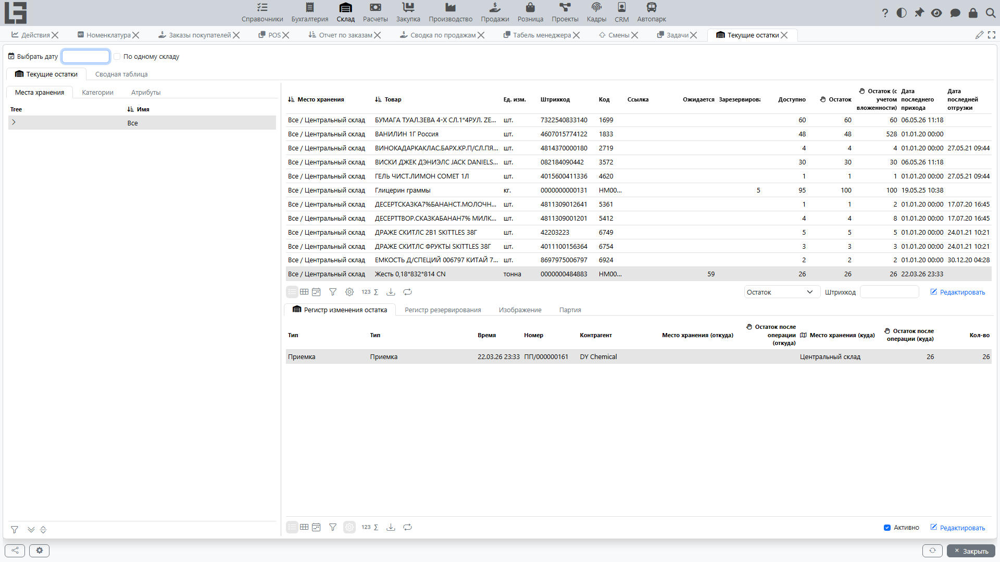

В разделе отчётности склада обычно доступны отчёты и регистры.

## Отчёты

Чаще всего используются:

- **Отчёт по остаткам** — остатки на дату с произвольными фильтрами и разрезами;
- **Оценка запасов** — количество, цена единицы и общая стоимость по товару/месту хранения, включая последнюю цену поступления;
- **Движения товаров** — перемещения товара между местами хранения за период;
- **Отчёт по регистру себестоимости** — записи регистра себестоимости (см. также [себестоимость товаров](costing.md)).

## Регистры

В системе могут быть доступны регистры:

- регистр остатков;
- регистр резервов;
- регистр себестоимости.

Практический смысл регистров:

- объяснить пользователю, откуда взялся остаток;
- показать историю движения;
- помочь найти причину расхождений.

## Рекомендации

1. Всегда задавайте интервал дат при анализе движений.
2. Для проблемных товаров используйте разрез по [месту хранения](locations.md) и [партии](lots-and-packages.md).