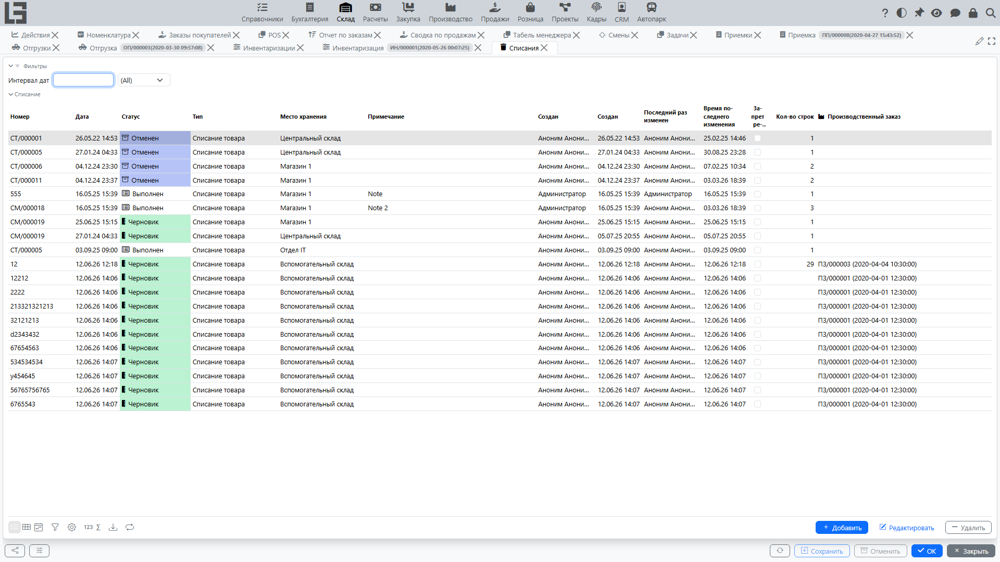

## Где находится

Откройте раздел **«Склад» → «Операции» → «Списания»**.

## Назначение

Списание используется для фиксации уменьшения остатка по причинам, не связанным с продажей:

- порча;
- потери;
- брак;
- истечение срока;
- внутреннее потребление.

Причина списания отражается **типом** документа (справочник типов списаний — например, «Порча», «Потери», «Истечение срока»), а не отдельным полем в строке. Типы списаний настраиваются в **«Склад» → «Настройка» → «Настройки»**; у каждого типа есть собственный **нумератор** и **место хранения** по умолчанию.

Документ списания проходит статусы **«Черновик» → «Выполнен»** с **«Отменен»** как альтернативным финальным состоянием.

## Карточка списания

В шапке заполняются:

- **Тип** — обязательное поле; классифицирует причину списания и определяет нумерацию;
- **Дата**, **Номер**;
- **Место хранения** — обязательное поле; откуда списывается товар;
- **Примечание**.

В строках указываются **товар**, его **единица измерения**, **штрихкод/код/артикул** и **количество** к списанию.

Кнопки действий:

- **«Провести»** — подтверждает списание (показывается в черновике);
- **«Отменить»** — переводит документ в «Отменен»;
- **«Копировать»** — создаёт новый черновик списания с такой же шапкой и строками;
- **«Печать»** — печать документа по настраиваемому шаблону (шаблоны можно назначать на тип списания);
- **«Этикетки»** — печать этикеток товаров.

Как и у других складских документов, на карточке есть вкладки **«Поиск»** (подбор товара по категориям с показом остатков и быстрым вводом, плюс поле штрихкода), **«История»** и **«Комментарии»**.

## Типовой сценарий

1. Создайте документ списания.
2. Выберите **«Тип»** — он классифицирует причину списания.
3. Укажите [место хранения](locations.md).
4. Заполните строки: товар и количество. Если для товара включены [партии](lots-and-packages.md), укажите также партию — вкладка **«Партии»** показывает разбивку по партиям, штрихкоды партий можно сканировать.
5. Переведите документ в **«Выполнен»**.

## Влияние на остатки и себестоимость

При проведении документа:

- в регистр остатков записывается расходная запись — остаток в месте хранения уменьшается;
- в [регистр себестоимости](costing.md) записывается расходная запись — сумма списания рассчитывается автоматически по методу расчёта себестоимости товара (FIFO/средняя/плановая).

## Связь с другими модулями

Списание может создаваться на основании других документов:

- из **[приемки](receipts.md)** — действие **«Списание»** на выполненной приемке открывает новое списание, предзаполненное местом хранения и товарами приемки (удобно для списания товара, повреждённого при перевозке);
- из производственного заказа, если включён соответствующий сценарий.
