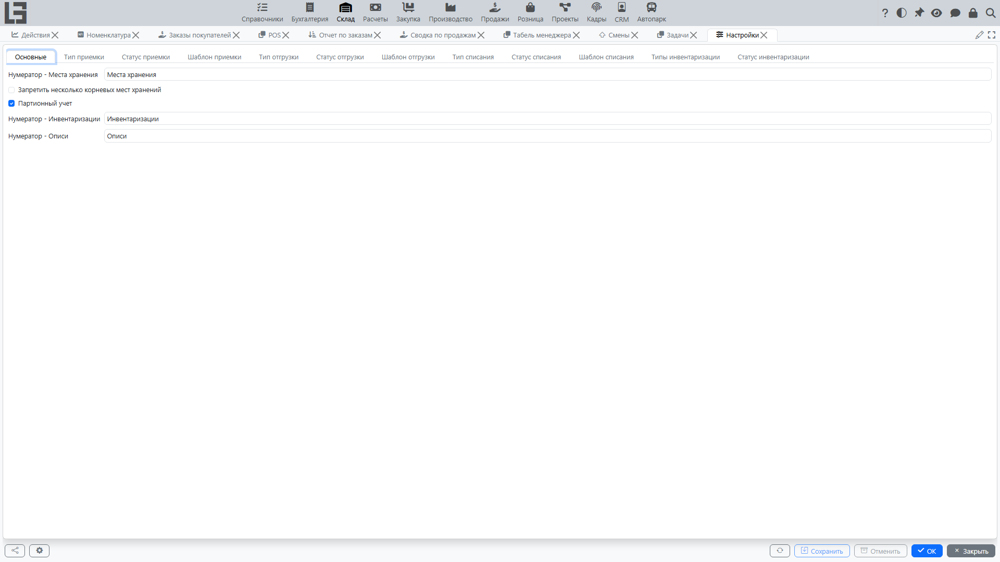

## Где находится

Откройте **«Склад» → «Настройка» → «Настройки»**.

## Что обычно настраивается

- типы [поступлений](receipts.md) и [отгрузок](shipments.md) (их нумерация, места хранения по умолчанию, максимальное количество);
- использование [перемещений](transfers.md) ([отгрузка](shipments.md) с признаком **«Перемещение»**);
- типы [инвентаризации](adjustments.md) и [списания](scrap.md);
- глобальный признак использования **[партий](lots-and-packages.md)**, а также пономенклатурные настройки партии/серийных номеров;
- сквозные признаки, такие как **«Запретить несколько корневых мест хранения»**, и поместные признаки **«Только положительный остаток»** и **«Только положительный доступный остаток»** (см. ниже про регистры).

## Типы поступлений

В настройках ведётся справочник **типов поступлений**. Тип поступления влияет на то, как пользователь работает с документом.

Обычно в типе поступления задаются:

- **Нумератор** — правило формирования номера;
- **Место хранения по умолчанию** — какое [место хранения](locations.md) подставлять в новые документы;
- **Максимальное количество** — верхняя граница для поля «Планируемое кол-во» в строках.

Если в системе создан ровно один тип поступления, он может подставляться автоматически.

## Типы отгрузок

В настройках ведётся справочник **типов отгрузок**.

Обычно в типе отгрузки задаются:

- **Нумератор**;
- **Место хранения‑источник по умолчанию**;
- **Место хранения‑назначение по умолчанию** (актуально для перемещений);
- **Признак «Перемещение»** — включает режим «место хранения‑источник → место хранения‑назначение»;
- **Максимальное количество** — верхняя граница для поля «Планируемое кол-во» в строках.

Проверка:

- для перемещений место хранения‑источник и место хранения‑назначение не могут совпадать.

## Ограничения регистров (по месту хранения)

У каждого [места хранения](locations.md) можно включить два опциональных ограничения:

- **«Только положительный остаток»** — система не разрешит операции, которые загоняют физический остаток товара в этом месте хранения в минус.
- **«Только положительный доступный остаток»** — система не разрешит, чтобы доступный остаток (физический минус резерв) в этом месте хранения ушёл в минус.

Когда признак включён, соответствующие проводки в регистр остатков или регистр резервов блокируются с пояснительным сообщением.

## Рекомендованный порядок настройки

1. Настройте [места хранения](locations.md).
2. Настройте типы документов ([поступления](receipts.md)/[отгрузки](shipments.md)/[перемещения](transfers.md)/[списания](scrap.md)/[инвентаризации](adjustments.md)).
3. При необходимости включите глобально [партии](lots-and-packages.md) и настройте пономенклатурные опции по партиям/серийным номерам.
4. Определитесь с поместными ограничениями регистров (см. выше).
5. Просмотрите [отчёты и регистры](reports-and-ledgers.md) и права доступа.