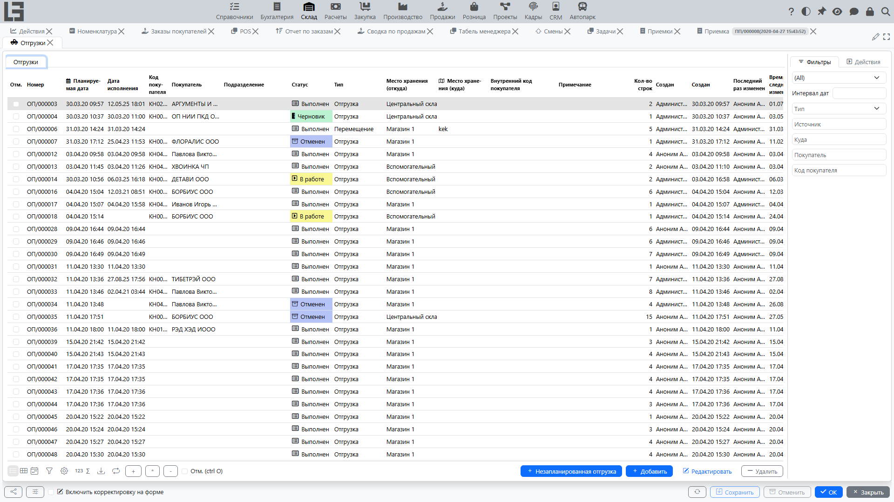
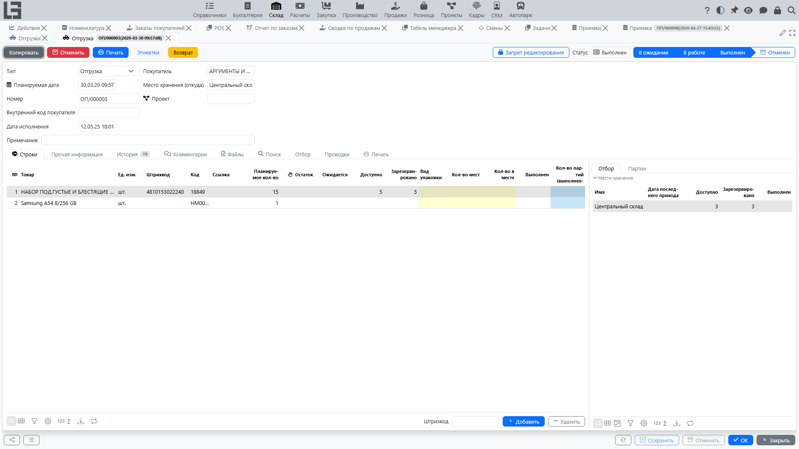

## Где находится

Откройте раздел **«Склад» → «Операции» → «Отгрузки»**.

## Назначение

Документ «Отгрузка» используется для:

- списания товара из [места хранения](locations.md) (обычная отгрузка);
- перемещения товара между [местами хранения](locations.md) (если выбран тип с признаком «перемещение»).

Одна и та же форма используется и для отгрузок, и для перемещений — поведение зависит от выбранного **типа**.

## Список отгрузок

В списке обычно видны:

- номер;
- планируемая дата и время;
- тип;
- контрагент (для обычной отгрузки);
- [место хранения](locations.md)‑источник и (для перемещений) место хранения‑назначение;
- примечание;
- количество строк.

Над списком доступны фильтры по **интервалу дат**, **типу**, **местам хранения** и **контрагенту**.

### Действия в списке

Кроме создания/открытия/удаления, над **отмеченными** документами доступны групповые действия: **«В работу»**, **«Зарезервировать»**, **«Провести»**, **«Принять»** (для перемещений с подтверждением приёмки), **«Копировать»** и **«Удалить»**. Действие **«Создать перемещения»** массово создаёт документы перемещения (см. [Массовое создание перемещений](transfer-bulk-create.md)).

### Вкладка «Итого» в списке

Если в списке **отметить** одну или несколько отгрузок, появляется вкладка **«Итого»**.

Назначение вкладки:

- показать список товаров, которые встречаются в отмеченных отгрузках;
- показать по каждому товару сумму **планируемого количества** по отмеченным документам;
- дать возможность быстро скорректировать планируемое количество сразу по нескольким отгрузкам.

Как устроено редактирование:

- на вкладке отображается таблица, где **строки** — это товары, а **колонки** — отмеченные отгрузки;
- в ячейках можно **редактировать планируемое количество** для соответствующей отгрузки и товара;
- редактирование доступно только для отгрузок в статусах **«Черновик»** или **«В ожидании»**; для остальных статусов значения доступны только для просмотра.

Дополнительно на вкладке показываются подсказки по остаткам в [месте хранения](locations.md)‑источнике и подсветка, если суммарное планируемое количество превышает доступный остаток.

## Карточка отгрузки

### Шапка документа

В шапке отгрузки обычно указываются:

- **Тип** — влияет на нумерацию, [места хранения](locations.md) по умолчанию и ограничения;
- **Планируемая дата**;
- **Номер**;
- **Контрагент** (для обычной отгрузки);
- **[Место хранения](locations.md)‑источник** — обязательное поле;
- **[Место хранения](locations.md)‑назначение** — обязательное поле для перемещения;
- **Адрес доставки** (если используется);
- **Внутренний код покупателя** (если используется);
- **Примечание**.

#### Отгрузка или перемещение

Тип отгрузки может быть отмечен как **«Перемещение»** (то есть у типа включён признак «Перемещение»). В этом случае:

- контрагент может не использоваться;
- становится обязательным заполнение места хранения‑назначения;
- система не позволит выбрать одинаковые место хранения‑источник и место хранения‑назначение.

### Строки отгрузки

В строках фиксируется:

- **Номенклатура**;
- **Единица измерения**;
- **Штрихкод**, **внутренний код**, **ссылка/артикул** (если используются);
- **Планируемое кол-во** (см. ниже);
- колонки упаковок (**«Вид упаковки»**, **«Кол-во мест»**, **«Кол-во в упаковке»**) — показываются, если в типе отгрузки включён признак **«Показывать количество мест»** (см. [Кол-во мест](product-sku.md#альтернатива-учет-в-упаковках-местах-в-документах)).

#### Поле «Планируемое кол-во»

Для отгрузок, которые не выполняются немедленно, в строке используется поле **«Планируемое кол-во»**:

- это планируемое количество к отгрузке по строке;
- поле может подсвечиваться в черновике.

Ограничение:

- значение должно быть в диапазоне от `0` до **максимального количества**, указанного в типе отгрузки;
- если превышено, документ не сохранится.

#### Ограничение «одна строка на один товар»

Для некоторых типов отгрузок может быть включено правило:

- один и тот же товар нельзя добавить двумя строками.

### Вкладка «Поиск» и ввод по штрихкоду

Как и у приемки, на карточке отгрузки есть вкладка **«Поиск»** (подбор товара по категориям/атрибутам с показом остатков и доступного количества, быстрый ввод количества) и поле ввода штрихкода на вкладке строк. Также есть вкладки **«История»**, **«Комментарии»** и **«Файлы»**.

## Статусы (точно по исходному коду)

Ниже приведён **точный набор статусов**, который следует из исходного кода.

1. **Черновик** — ввод данных.
2. **В ожидании** — документ отмечен к обработке (из черновика) и ожидает обеспечения.
3. **В работе** — обеспечено наличие/резервирование по строкам.
4. **Выполнен** — факт отгрузки подтверждён, фиксируется дата выполнения.
5. **Принят** — подтверждение приёмки в месте хранения‑назначении.
   - этот статус используется, когда для перемещения требуется подтверждение приёмки;
   - после статуса «Выполнен» появляется возможность выполнить действие подтверждения приёмки.
6. **Отменен** — документ отменён.

Важно: отдельного статуса «Отбор» в перечислении статусов нет. Отбор реализован как режим работы по местам хранения для типов отгрузки с включённым признаком отбора (см. ниже).

### Действия смены статуса

- **«В работу»** — перевод документа из **«Черновик»** в **«В ожидании»**.
- **«Зарезервировать»** — проверяет/резервирует остатки и переводит документ из **«В ожидании»** в **«В работе»**.
- **«Провести»** — подтверждение отгрузки и перевод в **«Выполнен»**; дата выполнения проставляется автоматически. Вспомогательная команда **«Заполнить кол-ва (выполненные)»** копирует планируемое количество в фактически отгруженное по всем строкам. Если отгруженное количество отличается от планируемого, система предупредит — если только в типе не включён признак **«Не проверять отгруженное количество»**.
- **«Принять»** — для перемещений с подтверждением приёмки переводит документ из **«Выполнен»** в **«Принят»**.
- **«Отменить»** — перевод документа в **«Отменен»**.
- **«Копировать»** — создаёт новый черновик с такой же шапкой и строками.

### Незапланированные отгрузки

Отгрузка с установленным признаком **«Незапланированная»** (например, созданная через [Мобильное перемещение](transfers.md#мобильное-перемещение)) пропускает промежуточные шаги: её можно провести прямо из **«Черновик»**, без проверки наличия.

## Проверка наличия и резервирование

Перед выполнением отгрузки обычно выполняется проверка наличия по строкам.

Если в системе включено резервирование:

- часть количества может быть зарезервирована под отгрузку;
- если товара не хватает, отгрузка остаётся в статусе **«В ожидании»** до пополнения остатка (в **«В работе»** она переходит только после успешного резервирования).

## Подтверждение приёмки в месте назначения

Для [перемещений](transfers.md) система поддерживает двустороннее подтверждение:

- если у текущего пользователя нет доступа к [месту хранения](locations.md)‑назначению, на отгрузке автоматически устанавливается признак **«Подтверждение приемки»** (им можно управлять и вручную);
- после проведения такой отгрузки сотрудникам места‑назначения становится доступно действие **«Принять»**, которое переводит документ в статус **«Принят»**;
- входящие перемещения, ожидающие принятия, видны на вкладке **«Подтверждение приемки»** списка [приемок](receipts.md) в месте‑назначении.

До принятия перемещённое количество не учитывается в остатке места‑назначения.

## Возвраты от покупателя

Если тип отгрузки связан с типом возвратной [приемки](receipts.md) (секция **«Возврат»** в настройках типа), на активных отгрузках доступно действие **«Возврат»**:

- оно открывает новую возвратную приемку, предзаполненную из отгрузки;
- колонка **«Возвращено»** в строках отгрузки показывает уже возвращённое количество, а диалог **«Возвраты»** — связанные возвратные приемки;
- при включённом признаке **«Проверять возвращенное количество»** система запретит вернуть больше, чем отгружено.

## Отбор (сборка)

Если включены задания на отбор:

- отгрузка переводится в этап отбора;
- формируются задания для кладовщика;
- по выполненным заданиям фиксируется факт отобранного количества.

Подробности см. [Задания на отбор](picking.md).

### Отбор по местам хранения (режим типа отгрузки)

В исходном коде предусмотрен признак типа отгрузки, который включает отбор по конкретным местам хранения.

Как это выглядит для пользователя:

- в карточке отгрузки появляется вкладка **«Отбор»**;
- по каждой строке можно видеть доступность и резерв в разрезе мест хранения (включая вложенные места);
- можно указывать, из каких мест хранения фактически отгружается количество;
- при использовании [партий](lots-and-packages.md) отобранное количество внутри места хранения можно детализировать по партиям.

При этом статус документа остаётся одним из перечисленных выше (например, «В ожидании», «В работе», «Выполнен»).

## Печать

Действие **«Печать»** печатает отгрузку по настраиваемому шаблону (шаблоны ведутся в настройках). При использовании партий из строк также можно печатать этикетки партий.

## Создание отгрузок из заказов покупателей

Если используется модуль «Продажи» и тип заказа покупателя связан с типом отгрузки, при проведении заказа создаётся связанная отгрузка со строками заказа. Документы ссылаются друг на друга (в заказе видны его отгрузки, в отгрузке — исходный заказ).

## Типовые проблемы

- **Не удаётся сохранить строку** — значение «Планируемое кол-во» выходит за пределы, заданные в типе отгрузки.
- **Не удаётся добавить товар второй строкой** — для типа отгрузки включено правило «одна строка на один товар».
- **Не удаётся перевести в выполнение** — не хватает доступного остатка или не выполнен отбор.
- **Не удаётся создать перемещение** — выбрано одинаковое место хранения‑источник и место хранения‑назначение.
- **Перемещение проведено, но остаток в месте‑назначении не виден** — документ требует принятия; проверьте вкладку **«Подтверждение приемки»** в месте‑назначении.
