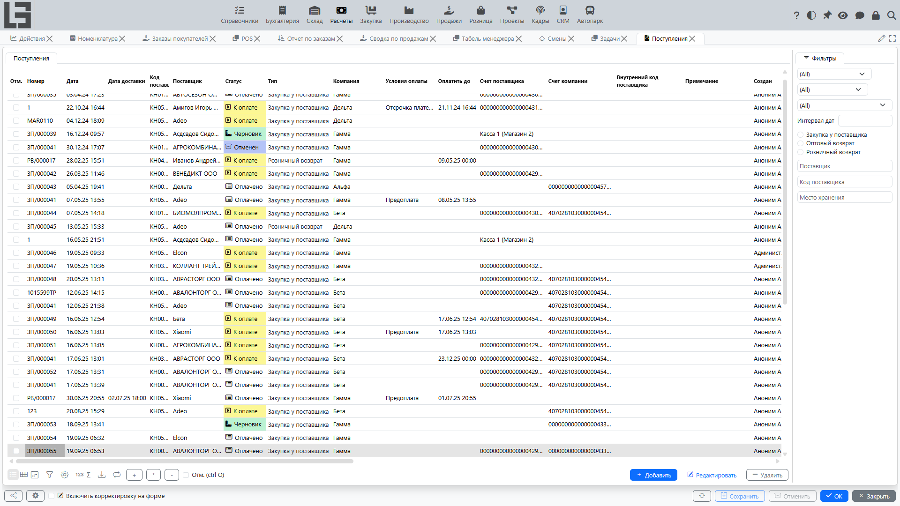
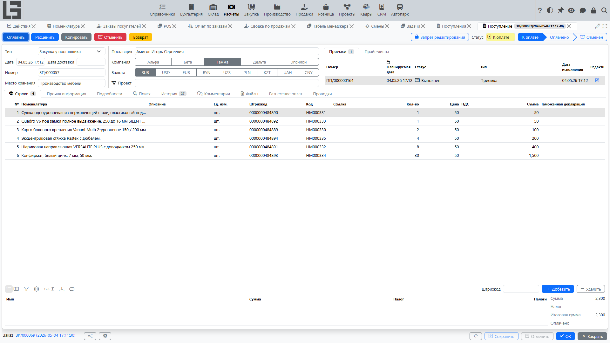

## Где находится

Откройте **«Расчёты» → «Операции» → «Поступления»**.

Для компактного ввода с телефона или планшета см. [Мобильные поступления](mobile-bills.md).

## Назначение

Поступление используется для:

- фиксации поступления товаров/услуг от поставщика;
- расчёта [налога](taxes.md) и итоговой суммы;
- контроля оплаты поставщику и [задолженности](debt-and-calendar.md).

Поступление может использоваться как:

- **основание для планирования [выплат](outgoing-payments.md)** (если используется [календарь платежей](debt-and-calendar.md));
- **точка контроля [задолженности](debt-and-calendar.md) поставщику** (если учет ведется по поступлениям).

## Список поступлений

В списке, среди прочего, отображаются:

- **Номер** и **Дата**;
- **Дата доставки** и **Оплатить до** (срок оплаты);
- **Поставщик** и **Тип** поступления;
- **Компания** и **Условия оплаты**;
- **Счет поставщика** / **Счет компании** (счета, используемые для расчётов);
- **Внутренний код поставщика** (код документа у поставщика);
- **Валюта**;
- **Оплачено** — сумма, уже покрытая разнесёнными платежами;
- **Примечание**.

Список также содержит готовые группы фильтров **Не оплачено** / **Оплачено** / **Частично оплачено** для быстрого поиска документов по состоянию расчётов.

## Карточка поступления

### Основные поля

Как правило, в шапке поступления заполняются:

- **Тип** — [тип поступления](settings.md); он задаёт значения по умолчанию (нумератор, поставщика по умолчанию, валюту, тип платежа, признак «Цена включает налоги»);
- **Дата**, **Номер**;
- **Дата доставки** и **Дата исполнения** (если используются);
- **Поставщик** — [контрагент](../masterdata/partners.md)-поставщик;
- **Договор** (если используется);
- **Счет поставщика** / **Счет компании** — счета для расчётов. Счёт поставщика должен принадлежать выбранному поставщику, счёт компании — компании;
- **Условия оплаты** (если используются);
- **Валюта** — по умолчанию из типа поступления; курс формирует сумму в базовой валюте;
- **Внутренний код поставщика** — код документа у самого поставщика, удобен для поиска;
- **Наш представитель** — по умолчанию текущий пользователь;
- **Примечание** и поле форматированного текста **Подробности**.

В карточке также есть вкладки **Комментарии** и **Файлы** (`Bill file`) для прикрепления исходного документа и его обсуждения.

#### Условия оплаты

**Условия оплаты** содержат количество **Дней**; при их выборе система вычисляет дату **Оплатить до** (`дата + дни`) и сохраняет её в документе. Сохранённая дата затем:

- используется в **календаре платежей**;
- определяет, является ли документ **просроченным**.

Подробнее: [Настройки и справочники](settings.md), [Задолженность и календарь платежей](debt-and-calendar.md).

### Строки поступления

В строках, как правило, задаются:

- [товар](../masterdata/items.md)/услуга;
- количество и цена;
- **Сумма** — база строки (`количество × цена`); если у типа поступления установлен признак **Цена включает налоги**, эта сумма указывается с налогом;
- **Налоги** — [налог](taxes.md), применяемый к строке;
- при необходимости колонки **Ссылка**, **Штрихкод** и **Категория**.

Если налоги настроены, налог подставляется автоматически из товара/услуги (его налоги **закупки**) или из типа документа. См. [Налоги](taxes.md).

Если поставщик измеряется в другой [единице измерения](../masterdata/items.md), отличной от базовой единицы товара, появляются дополнительные колонки **ед. изм. поставщика / количество поставщика / цена поставщика**, чтобы вводить документ в единицах поставщика.

Если используется учёт по **партиям**, каждая строка может нести количества по партиям, а поле **штрихкода** позволяет добавлять строки сканированием.

Если в типе поступления задан **товар по умолчанию**, он автоматически подставляется в новую строку, если товар ещё не указан (аналогично тому, как **поставщик по умолчанию** подставляется в шапку поступления). Это ускоряет ввод для типов, в которых обычно используется один и тот же товар/услуга.

### Импорт из файла (GPT)

Если для выбранного типа поступления настроен промпт, в карточке поступления появляется действие **«Импорт (GPT)»** для импорта данных из файла документа поставщика с помощью OpenAI.

#### Что нужно подготовить

- заполнить API-ключ OpenAI и при необходимости создать конфигурации GPT для модели, рассуждения и дополнительного промпта;
- настроить промпт в типе поступления;
- заранее проверить справочники поставщиков, номенклатуры, валют и налогов.

Подробности по подготовке: [Настройки и справочники](settings.md).

#### Как использовать

1. Откройте поступление, доступное для редактирования.
2. Убедитесь, что текущие изменения в документе корректны. Перед импортом система пытается сохранить документ, и если проверка не проходит, импорт не начнётся.
3. Запустите импорт и выберите файл с документом поставщика. Если настроено несколько конфигураций GPT, выберите нужную. Стандартный сценарий рассчитан на один документ в одном файле.
4. После заполнения проверьте шапку и строки поступления и при необходимости скорректируйте результат вручную.

#### Что обычно заполняется

Из файла система пытается определить:

- в шапке: номер, дату, дату доставки, срок оплаты, поставщика и валюту;
- в строках: описание, товар/услугу, количество, цену, сумму без налога и налоги.

#### Ограничения и особенности

- Новые справочные данные автоматически не создаются. OpenAI подбирает значения только по уже существующим данным системы.
- Для сопоставления номенклатуры используются код, наименование, артикул и штрихкод. Для сопоставления поставщика используются код, наименование и адрес.
- Если значение не удалось распознать или сопоставить, соответствующее поле может остаться пустым.
- При импорте в уже заполненное поступление шапка перезаписывается значениями из файла, а новые строки добавляются к уже существующим. Повторный импорт удобнее выполнять в новое поступление или после ручной очистки строк.
- Если для типа поступления не заполнен промпт, действие импорта не показывается.
- Если не заполнен ключ доступа OpenAI или внешний запрос завершился ошибкой, система покажет сообщение и не выполнит импорт.

### Статусы

Поступление проходит через статусы:

- **«Черновик»**;
- **«К оплате»**;
- **«Оплачено»**;
- **«Отменен»**.

Статусы влияют на доступность редактирования и печати. Под капотом это накопительные (кумулятивные) флаги, а не одно поле, поэтому отображается «наивысший» достигнутый статус.

- в статусе **«Черновик»** можно свободно менять шапку и строки. Действие **«В работу»** (доступно только в черновике) переводит поступление в **«К оплате»**;
- в статусе **«К оплате»** документ подтверждён для дальнейших действий (регистрация оплаты, печать, корректировки). Действие **«Оплачено»** закрывает его;
- в статусе **«Оплачено»** поступление считается закрытым. Этот статус также **устанавливается автоматически**, как только разнесённые платежи полностью покрывают поступление;
- действие **«Отменить»** исключает поступление из учёта и задолженности. Отмена доступна в любом статусе, кроме «Черновик»/«Отменен».

Эти флаги также можно переключать напрямую кнопками в группе статусов, а документ можно заблокировать от редактирования отдельным переключателем блокировки в карточке.

Действие **«Копировать»** создаёт новое поступление в статусе «Черновик» с теми же поставщиком, компанией, типом, примечанием и строками (даты и счета не копируются).

Поступления можно также создавать программно через HTTP-эндпоинт импорта JSON (`importBill`), отдельно от файлового импорта (GPT), описанного выше.

### Оплата и задолженность

Поступление может быть связано с [исходящими платежами](outgoing-payments.md). По разнесённым платежам система рассчитывает:

- оплачено;
- задолженность.

В карточке есть блок **«Разнесение оплат»** с двумя подсписками — **«Разнесенные»** платежи и **«Доступно»**. Двойным кликом по доступному платежу (или действием **«Разнести»**) его можно зачесть против поступления; разнесённая сумма уменьшает остаток задолженности, и, как только поступление полностью покрыто, его статус автоматически переходит в **«Оплачено»**. Разнесение возможно только между документами одного контрагента и компании.

#### Быстрая оплата из документа

В некоторых конфигурациях исходящий платёж можно создать прямо из документа (например, при оплате поставщику).

Как правило, сценарий такой:

1. Переведите документ в статус **«К оплате»**.
2. Нажмите **«Оплатить»**.
3. Проверьте карточку созданного **[исходящего платежа](outgoing-payments.md)** и сохраните.

Обычно система:

- подставляет контрагента, компанию, счета/кассы и тип платежа (в зависимости от настроек);
- устанавливает сумму, равную текущему остатку к оплате;
- сразу выполняет **разнесение оплат** на это поступление, чтобы задолженность уменьшилась.

Подробнее: [Исходящие платежи](outgoing-payments.md).

#### Частичная оплата

Если платёж покрывает поступление не полностью:

- показатель **«Оплачено»** увеличится на разнесённую сумму;
- **задолженность** останется положительной до полного погашения.

#### Переплата / аванс

Если перечислена сумма больше суммы поступления, дальнейшее поведение зависит от правил разнесения платежей:

- переплата может остаться как **не распределенная** часть платежа;
- либо учитываться как **аванс** по [контрагенту](../masterdata/partners.md)/[договору](../masterdata/contracts.md).

Подробнее см. [Платежи](payments.md).

Подробности см. [Задолженность и календарь платежей](debt-and-calendar.md).

## Печать

Если в конфигурации включены печатные формы, поступление можно распечатать из карточки документа. Предопределённый макет называется **«Накладная»**, а каждый тип поступления содержит собственный список **шаблонов поступления**.

Доступность печати чаще всего зависит от:

- статуса (например, печать доступна из «К оплате»);
- наличия хотя бы одного включённого шаблона печати для типа поступления.

Подробнее: [Печать и отчётность](reports-and-printing.md), [Настройки и справочники](settings.md).
