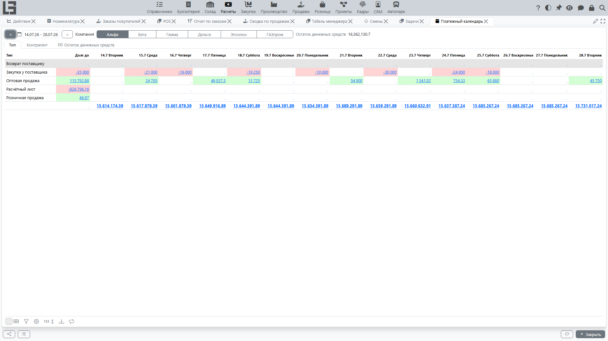

## Задолженность

В разделе «Расчёты» документы и платежи трактуются как **записи задолженности** со знаком: [поступления](bills.md) и входящие платежи создают долг в одну сторону, [реализации](invoices.md) и исходящие платежи — в другую. Различают две величины:

- **Долг по контрагенту / договору** — сумма со знаком всех активных документов [контрагента](../masterdata/partners.md) или [договора](../masterdata/contracts.md). Этот итог существует, как только существует документ; он **не** зависит от разнесения. Суммы приводятся к валюте по умолчанию (если пересчёт не отключён в [настройках](settings.md)).
- **Остаток (Осталось)** — для отдельного документа это его сумма минус **разнесённые** платежи. Именно эта величина уменьшается, когда вы разносите платёж.

Что важно понимать:

- документ в статусе **«Отменен»** исключается из любого расчёта задолженности;
- **Просроченный долг** — это часть долга, у которой дата **«Оплатить до»** уже в прошлом;
- разнесение влияет только на показатели уровня документа — **«Осталось»** / **«Оплачено»**; итог по контрагенту отражает документ с момента его ввода.

Выделенные представления **«Долги по контрагенту»** и **«Долги по договору»** перечисляют каждую запись задолженности (тип, номер, дата, **«Оплатить до»**, компания, сумма, **«Осталось»**, накопительный **«Долг»**) с фильтром **«Просроченные»** и показывают итоги **«Долг»** и **«Просроченный долг»** по контрагенту/договору.

## Как погашается задолженность

1. Создайте [платёж](payments.md).
2. Разнесите платёж на документ (или на несколько документов). Разнесение может произойти и **автоматически**, если **«Ссылка»** платежа содержит номер документа.
3. После разнесения остаток документа (**«Осталось»**) уменьшается; когда он достигает нуля, документ помечается статусом **«Оплачено»**.

Если платёж разнесён на несколько документов, остаток уменьшается по каждому документу на соответствующую сумму.

## Календарь платежей

**«Платежный календарь»** (**«Расчёты» → «Отчётность» → «Платежный календарь»**) показывает остаток задолженности, распределённый по диапазону дат, — чтобы видеть, когда деньги должны прийти и уйти.

Структура формы:

- сверху выбираются **компания** и **интервал дат**; кнопки **\<** / **\>** сдвигают интервал на месяц назад/вперёд. Изначально интервал — *сегодня … сегодня + 14 дней*.
- **«Остаток денежных средств»** показывает текущий остаток по счетам компании.
- **«Долг до»** — остаток задолженности, у которого дата **«Оплатить до»** приходится на период до начала интервала.
- далее идёт **по одной колонке на каждую дату** интервала; в каждой ячейке — чистое изменение долга на этот день. В подвале колонки показан **прогнозный остаток** — накопительный остаток (остаток денежных средств плюс накопленный долг) на эту дату.
- ячейки подсвечиваются зелёным (плюс) или красным (минус).

У календаря две вкладки-разреза — **«Тип»** и **«Контрагент»** — плюс график остатка денежных средств.

 Срок оплаты берётся из сохранённого в каждом документе значения **«Оплатить до»** (вычисляется один раз из условий оплаты при вводе), а не пересчитывается на лету.

Щелчок по ячейке **«Долг до»** или ячейке даты раскрывает соответствующие документы (список долгов, отфильтрованный по компании, типу, контрагенту и сроку оплаты).

### На что смотреть, если календарь «пустой» или даты неверные

Проверьте:

- заполнены ли в документах **условия оплаты / «Оплатить до»**;
- действительно ли выбранный **интервал дат** покрывает сроки оплаты;
- не исключены ли документы статусом (например, «Отменен»).

Подробнее про параметры: [Настройки и справочники](settings.md).