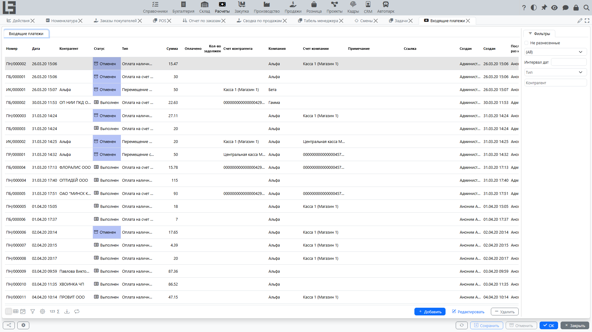

Входящий платёж фиксирует **поступление денег от [контрагента](../masterdata/partners.md)** (например, от покупателя) на **счёт компании** или в **кассу**.

Обычно входящий платёж используют, чтобы:

- зарегистрировать факт поступления средств;
- разнести оплату по документам (закрыть [задолженность](debt-and-calendar.md) по [реализациям](invoices.md));
- увидеть, какие документы оплачены полностью/частично и какая [задолженность](debt-and-calendar.md) осталась.

## Где находится

Откройте: **«Расчёты» → «Операции» → «Входящие платежи»**.

## Создание входящего платежа

1. Откройте список **«Входящие платежи»**.
2. Нажмите **«Создать»**.
3. Заполните обязательные реквизиты (см. ниже).
4. При необходимости выполните **разнесение оплаты** по документам.
5. Сохраните документ.

### Создание входящего платежа из реализации

Если вы фиксируете оплаты по [реализациям](invoices.md), входящий платёж можно создать прямо из документа.

Как правило, это выглядит так:

1. Откройте нужную **[реализацию](invoices.md)**.
2. Переведите документ в статус **«К оплате»** (если он ещё в черновике).
3. Нажмите **«Оплатить»**.
4. Откроется карточка созданного входящего платежа — проверьте реквизиты и сохраните.

Что обычно заполняется автоматически:

- **контрагент** и его счёт/касса;
- **компания** и её счёт/касса;
- **тип** платежа (в зависимости от типа реализации и настроек);
- **валюта** (если используется);
- **сумма** — как правило, равна текущему остатку к оплате по реализации.

Что происходит с разнесением:

- система сразу выполняет **разнесение оплаты** на эту реализацию, чтобы задолженность уменьшилась;
- если вы измените сумму платежа или нужно разнести оплату иначе, корректировку можно сделать в разделе **«Разнесение оплат»**.

Что важно про статусы:

- действие **«Оплатить»** доступно только для документа в статусе **«К оплате»**;
- созданный входящий платёж сразу получает статус **«Выполнен»** (то есть фиксирует факт поступления средств).

Входящий платёж, созданный вручную, начинается со статуса **«Черновик»**; используйте действие **«Провести»**, чтобы провести его. У входящих платежей нет отдельного этапа «К оплате» — жизненный цикл: **«Черновик» → «Выполнен» → «Отменен»**.

## Основные реквизиты

Набор полей может отличаться в зависимости от настроек, но типовая карточка входящего платежа содержит:

- **Тип** — определяет, откуда пришли деньги (банк/касса) и какие счета можно выбрать.
- **Дата и время** — когда зафиксировано поступление.
- **Номер** — внутренний номер документа.
- **Сумма** — сумма поступления.
- **Контрагент** — от кого поступили деньги.
- **Счёт/касса контрагента** (если используется) — реквизиты [контрагента](../masterdata/partners.md).
- **Компания** — организация, в которую поступили деньги.
- **Счёт/касса компании** — куда поступили деньги (банковский счёт или касса).
- **Валюта** — определяется из счёта компании/типа.
- **Статья ДДС** — статья движения денежных средств, допустимая для выбранного типа платежа.
- **Примечание** — произвольный комментарий.
- **Ссылка** — короткая строка-ссылка (например, номер документа плательщика). Если она содержит номер документа, система **автоматически разносит** платёж на эту задолженность (см. ниже).

Встроенные типы платежей покрывают типовые случаи — оплата покупателя (банк/касса), возврат от поставщика (банк/касса), внутренний перевод и начальный остаток. Тип, отмеченный признаком **Внутренний платеж**, требует, чтобы контрагентом была одна из ваших собственных компаний.

### Что важно при выборе счетов/касс

Тип платежа влияет на доступность вариантов:

- для некоторых типов доступны только **банковские счета**;
- для других — только **касса**.

Если выбран счёт/касса, который не соответствует типу платежа, система может не дать сохранить документ.

## Разнесение по документам и закрытие задолженности

Чтобы входящий платёж уменьшил [задолженность](debt-and-calendar.md) по конкретным документам, его нужно **разнести**.

В карточке платежа доступен раздел **«Разнесение оплат»**, где видно:

- **Разнесенные** — суммы, уже привязанные к документам;
- **Доступно** — документы, которые можно оплатить данным платежом (для входящего платежа это [реализации](invoices.md) покупателей);
- действие **«Разнести»** — привязать сумму к выбранному документу.

Разнесение допускается только между документами **одного контрагента и одной компании**.

### Как разнести оплату

1. Откройте входящий платёж.
2. Перейдите в раздел **«Разнесение оплат»**.
3. В списке **«Доступно»** выберите документ, который нужно оплатить.
4. Нажмите **«Разнести»** (или просто дважды кликните по строке).
5. Проверьте, что в списке **«Разнесенные»** появилась строка с суммой разнесения.

Подсказка: если заполнить поле **Ссылка** номером реализации, платёж разносится на эту реализацию автоматически — ручное действие не требуется.

### Частичная оплата

Если сумма платежа меньше суммы документа:

- документ будет оплачен **частично**;
- оставшаяся сумма останется как **[задолженность](debt-and-calendar.md)**;
- вы сможете закрыть остаток следующими платежами.

### Одна оплата на несколько документов

Если [контрагент](../masterdata/partners.md) оплатил сразу несколько документов, разнесите платёж на несколько строк — по каждому документу отдельно.

### Переплата

Если сумма платежа больше разнесённой суммы, остаток остаётся **не разнесенным** и может быть применён к более поздним документам того же [контрагента](../masterdata/partners.md). (Предоплаты, которые нужно зачесть против конкретной будущей продажи, обрабатываются через **авансовые реализации**, а не через сам платёж — см. [Реализации](invoices.md).)

## Связь с исходящим платежом

Если у типа платежа задан связанный исходящий тип, у проведённого входящего платежа появляется действие **«Создать исходящий платеж»** (или он создаётся автоматически, если у типа установлен признак **«Автоматически создавать исходящий платеж»**). Это используется для внутренних переводов между вашими собственными счетами — входящий «перевод на» в паре с исходящим «перевод со».

## Поиск «не разнесенных» платежей

В списке входящих платежей есть фильтр **«Не разнесенные»** — он помогает быстро найти платежи, которые ещё не связаны с документами и потому не закрывают остаток («Осталось») конкретного документа. (Такой платёж всё равно влияет на общий баланс контрагента.)

## Печать

Предопределённая печатная форма называется **«Входящий платеж»**; печать использует **шаблоны входящего платежа**, настроенные для типа платежа.

Подробнее: [Печать и отчётность](reports-and-printing.md).

## Типовые ситуации и решения

### Платёж введён, но задолженность не уменьшилась

Проверьте:

1. Выполнено ли **разнесение оплат** по документам.
2. Выбран ли правильный контрагент и компания.
3. Не отменён ли документ (если в вашей конфигурации используется отмена).

### Не получается выбрать счёт/кассу

Обычно причина — несоответствие типа платежа и вида счёта/кассы. Попробуйте:

- изменить **тип** платежа;
- выбрать другой счёт/кассу компании.

### Не вижу кнопку «Оплатить» в реализации

Обычно это связано с одним из факторов:

- [реализация](invoices.md) не переведена в статус **«К оплате»**;
- для типа реализации не настроен подходящий тип входящего платежа;
- по реализации нет остатка к оплате (уже оплачено или сумма к оплате равна нулю).