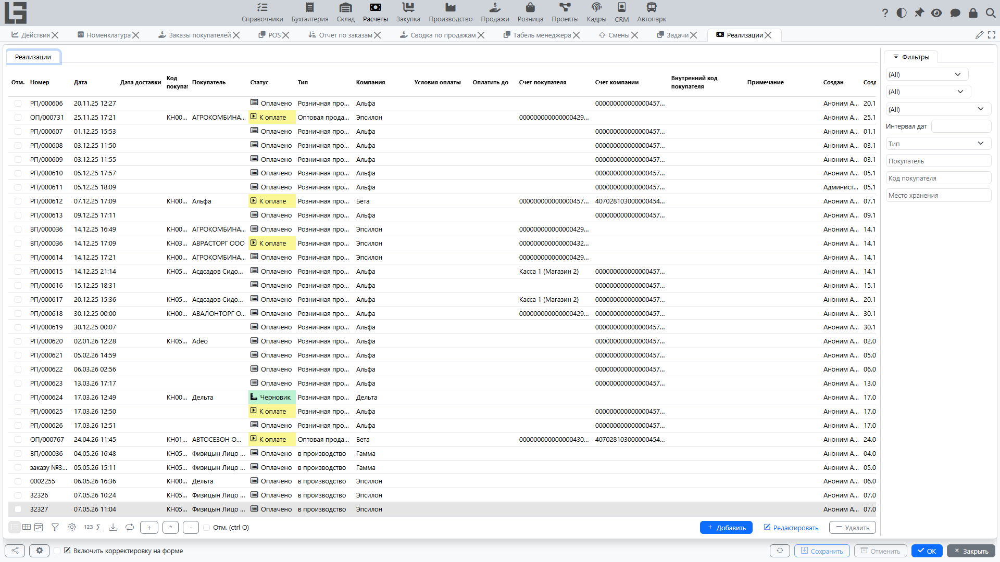
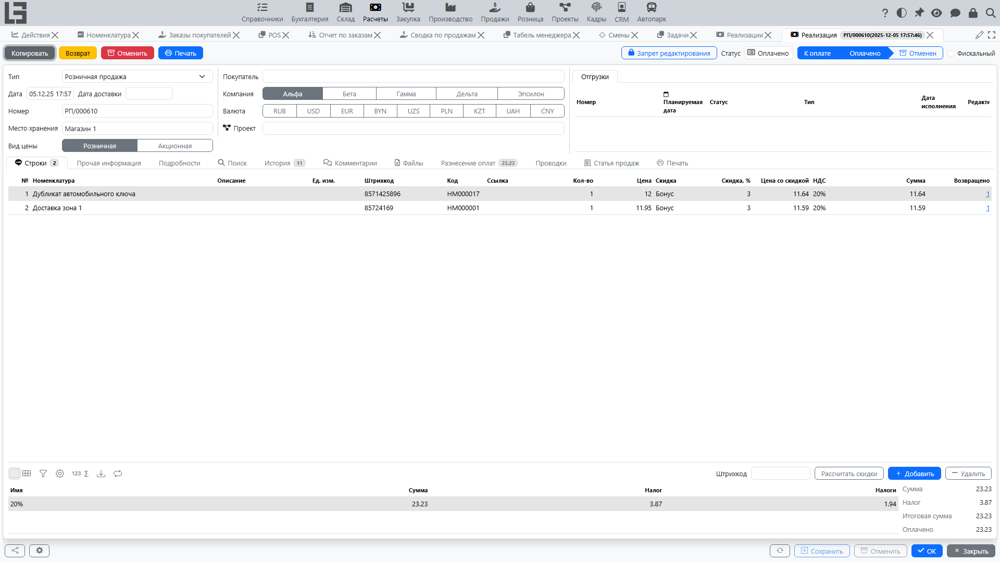

## Где находится

Откройте **«Расчёты» → «Операции» → «Реализации»**.

## Назначение

Реализация фиксирует продажу в учёте:

- суммы по строкам;
- налоги;
- задолженность покупателя;
- при наличии складского контура [Склад](../inventory/inventory.md) — связь с [отгрузками](shipments-from-invoice.md).

В зависимости от настроек реализация может быть:

- документом, по которому контролируется **[задолженность](debt-and-calendar.md)** (если учет ведется по реализациям);
- основанием для формирования **[отгрузки](shipments-from-invoice.md)** (если используется складской контур [Склад](../inventory/inventory.md));
- документом, по которому печатаются первичные формы (если включены шаблоны печати).

## Карточка реализации

### Основные поля

- **Тип** — [тип реализации](settings.md); задаёт нумератор, покупателя по умолчанию, валюту, тип платежа, признак «Цена включает налоги» и поведение отгрузки;
- **Дата** и **Номер**;
- **Дата доставки** и **Дата исполнения** (если используются);
- **Покупатель** — [контрагент](../masterdata/partners.md);
- **Договор** (если используется);
- **Место хранения** / адрес доставки (если используется складской контур [Склад](../inventory/inventory.md));
- **Условия оплаты** и вычисленная дата **Оплатить до**;
- **Валюта** — по умолчанию из типа реализации; курс формирует сумму в базовой валюте;
- **Наш представитель** (по умолчанию текущий пользователь) и **Внутренний код покупателя**;
- **Примечание**.

В карточке также есть вкладки **Комментарии**, **Файлы** (`Invoice file`) и **история статусов** (время, проведённое в каждом статусе).

### Строки

- [товар](../masterdata/items.md)/услуга;
- количество и цена;
- **Скидка, %** / **Цена со скидкой** / **Сумма скидки** (если используются скидки);
- **Налоги** — налоги **продажи** товара подставляются автоматически (см. [Налоги](taxes.md));
- **Сумма** — база строки (с налогом, если у типа установлен признак **Цена включает налоги**).

Если используется складской контур [Склад](../inventory/inventory.md) и настроен тип отгрузки, в строках также отображаются актуальные складские показатели — **Остаток**, **Ожидается**, **Доступно** — с фильтром **Доступно**, чтобы проверять наличие при формировании продажи. Если покупатель использует другую единицу измерения, появляются дополнительные колонки **ед. изм. покупателя / количество / цена**. Учёт по **партиям** и **упаковкам** поддерживается, если включён в типе реализации.

### Авансовые реализации

Тип реализации можно отметить флажком **Аванс**; тогда признак переносится в реализацию. Авансовые реализации используются для получения предоплат и последующего их зачёта против обычных продаж:

- в обычной реализации отображаются показатели **К зачету** / **Зачтено** и вкладка **Разнесение аванса** с **Разнесенными** / **Доступными** авансовыми реализациями;
- используйте там действие **«Разнести»**, чтобы применить аванс к реализации;
- реализацию нельзя зачесть саму против себя, и в качестве авансов можно применять только реализации, отмеченные признаком **Аванс**.

В списке реализаций дополнительно отображаются колонки **Зачтено** и **К выставлению**.

### Статусы

Реализация проходит через статусы **«Черновик» → «К оплате» → «Оплачено»** и может быть **отменена** из «К оплате» или «Оплачено» (реализованы как накопительные флаги, поэтому отображается наивысший достигнутый статус):

- в статусе **«Черновик»** можно менять шапку и строки. Действие **«В работу»** (доступно только в черновике) переводит реализацию в **«К оплате»**;
- в статусе **«К оплате»** документ подтверждён для дальнейших действий — печати, создания отгрузки, регистрации платежей. Только из этого статуса доступно действие **«Оплатить»**;
- в статусе **«Оплачено»** документ считается закрытым. Действие **«Оплачено»** устанавливает его вручную, и он также **устанавливается автоматически**, как только разнесённые платежи полностью покрывают реализацию;
- действие **«Отменить»** исключает документ из процесса и расчётов (доступно в любом статусе, кроме «Черновик»/«Отменен»).

Действия **«В работу»** и **«Отменить»** также доступны как групповые операции в списке реализаций.

Действие **«Копировать»** создаёт новую реализацию в статусе «Черновик» с теми же покупателем, компанией, типом, примечанием и строками.

### Связь с отгрузкой

Если используется складской контур [Склад](../inventory/inventory.md):

- реализация может создавать отгрузку действием **«Создать отгрузку»**, доступным только когда реализация находится в статусе **«К оплате»** или позже (реализация в статусе «Черновик» не может создать отгрузку);
- отгрузка также может создаваться автоматически при переходе реализации в **«К оплате»**, если у типа установлен признак **«Автоматически создавать отгрузку»**.

Подробности см. в разделе: [Создание отгрузки на основании реализации](shipments-from-invoice.md).

Практическая рекомендация: если отгрузка создаётся из реализации автоматически, сначала проверяйте корректность строк (товары, количества, место хранения/адрес), а затем переводите реализацию в статус **«К оплате»**.

## Оплата

Реализация может быть связана с [входящими платежами](incoming-payments.md). На основе разнесённых платежей рассчитывается [задолженность](debt-and-calendar.md).

В карточке есть блок **«Разнесение оплат»** с подсписками **«Разнесенные»** и **«Доступно»**; двойным кликом по доступному платежу (или действием **«Разнести»**) его можно зачесть против реализации. Если сумма платежа меньше суммы реализации — это **частичная оплата**, и задолженность останется до полного погашения; как только реализация полностью покрыта, она автоматически переходит в **«Оплачено»**. В списке реализаций отображается колонка **Оплачено** и фильтры **Не оплачено** / **Оплачено** / **Частично оплачено**.

### Быстрая оплата из реализации

В некоторых конфигурациях входящий платёж можно создать прямо из реализации.

Как правило, сценарий такой:

1. Переведите реализацию в статус **«К оплате»**.
2. Нажмите **«Оплатить»**.
3. Проверьте карточку созданного **входящего платежа** и сохраните.

Обычно система:

- подставляет контрагента, компанию, счета/кассы и тип платежа (в зависимости от настроек);
- устанавливает сумму, равную остатку к оплате;
- сразу выполняет **разнесение оплат** на эту реализацию, чтобы задолженность уменьшилась.

Подробнее: [Входящие платежи](incoming-payments.md).

## Печать

Предопределённая первичная форма называется **«Реализация»**, а каждый тип реализации содержит собственный список **шаблонов реализации**. В зависимости от конфигурации в печатную форму дополнительно могут выводиться договор, место хранения, единицы измерения контрагента, а также оплаченная сумма и остаток. Для печати требуется хотя бы один включённый шаблон для типа реализации; см. [Печать и отчётность](reports-and-printing.md).

См. также: [Платежи](payments.md), [Задолженность и календарь платежей](debt-and-calendar.md).