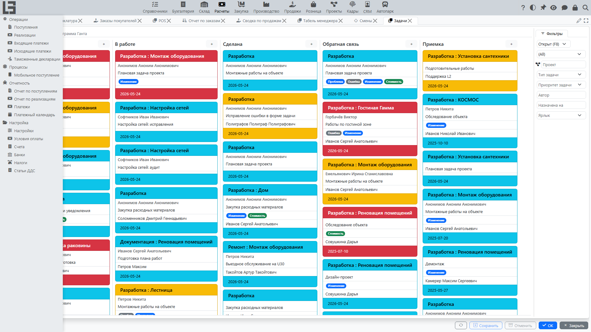

Документация описывает работу раздела **«Расчёты»**: [поступления](bills.md), [реализации](invoices.md), [платежи](payments.md) ([входящие](incoming-payments.md)/[исходящие](outgoing-payments.md)), [задолженность](debt-and-calendar.md) и [календарь платежей](debt-and-calendar.md), [налоги](taxes.md), печать и отчётность.

## Для кого этот раздел

Раздел **«Расчёты»** обычно используют:

- **Менеджер по продажам / аккаунт-менеджер** — оформляет [реализации](invoices.md), контролирует [платежи](payments.md), работает с дебиторской задолженностью по [контрагентам](../masterdata/partners.md) и [договорам](../masterdata/contracts.md).
- **Бухгалтер / финансовый специалист** — регистрирует [платежи](payments.md), распределяет оплаты по документам, контролирует закрытие задолженности, формирует отчеты.
- **Логистика / склад** (если включен складской контур) — создает и обрабатывает [отгрузки на основании реализаций](shipments-from-invoice.md).

Если в вашей конфигурации часть документов или пунктов меню отсутствует — это нормально: набор возможностей зависит от включенных модулей и настроек.

## Содержание

- [Быстрый старт](#быстрый-старт)
- [Навигация](#навигация)
- [Термины](#термины)

Разделы:

- [Поступления](bills.md)
- [Мобильные поступления](mobile-bills.md)
- [Реализации](invoices.md)
- [Отгрузка на основании реализации (если используется складской контур)](shipments-from-invoice.md)
- [Возвраты и корректы](refunds-and-corrections.md)
- [Платежи](payments.md)
  - [Входящие платежи](incoming-payments.md)
  - [Исходящие платежи](outgoing-payments.md)
- [Задолженность и календарь платежей](debt-and-calendar.md)
- [Налоги](taxes.md)
- [Распределение на себестоимость](bill-cost.md)
- [Печать и отчётность](reports-and-printing.md)
- [Настройки и справочники](settings.md)

## Быстрый старт

### Сценарий: оформить реализацию и зарегистрировать оплату

1. Откройте **«Расчёты» → «Операции» → «Реализации»**.
2. Создайте реализацию:
   - выберите [контрагента](../masterdata/partners.md);
   - укажите [договор](../masterdata/contracts.md) (если используется);
   - заполните строки ([товары](../masterdata/items.md)/услуги, количество, цена, [налог](taxes.md)).
3. Переведите реализацию в статус **«К оплате»** (действие **«В работу»** в карточке; этого требует процесс).
4. После поступления оплаты зарегистрируйте **[входящий платёж](incoming-payments.md)** и выполните разнесение по реализации.
5. Контролируйте [задолженность](debt-and-calendar.md) в отчётах и в [календаре платежей](debt-and-calendar.md).

### Сценарий: оформить поступление и зарегистрировать оплату поставщику

1. Откройте **«Расчёты» → «Операции» → «Поступления»**.
2. Создайте поступление и заполните строки.
3. Переведите поступление в статус **«К оплате»** (если требуется).
4. Зарегистрируйте **[исходящий платёж](outgoing-payments.md)** и выполните разнесение по поступлению.

## Сквозной процесс «от суммы к оплате до закрытия задолженности»

Ниже — типовые цепочки документов. В конкретной конфигурации некоторые шаги могут быть отключены или заменены.

### Продажи (покупатель)

1. **[Реализация](invoices.md)** — фиксирует продажу в учёте (выручка/налоги/долг покупателя).
2. **[Отгрузка](shipments-from-invoice.md)** (опционально) — складской документ, который может быть создан из реализации.
3. **[Входящий платёж](incoming-payments.md)** — фиксирует поступление денег и уменьшает задолженность (после разнесения по документам).

### Закупки (поставщик)

1. **[Поступление](bills.md)** — фиксирует покупку в учёте (суммы/налоги/долг компании перед поставщиком).
2. **[Исходящий платёж](outgoing-payments.md)** — фиксирует оплату поставщику и уменьшает задолженность (после разнесения по документам).

Практический ориентир:

- если учёт задолженности ведётся **по [реализациям](invoices.md)** — разносите [входящие платежи](incoming-payments.md) на реализации;
- если учёт задолженности ведётся **по [поступлениям](bills.md)** — разносите [исходящие платежи](outgoing-payments.md) на поступления;
- если используется **[календарь платежей](debt-and-calendar.md)** — проверьте условия оплаты в документах и [настройках](settings.md).

## Навигация

Раздел «Расчёты» содержит группы:

- **«Операции»** — [поступления](bills.md), [реализации](invoices.md), [входящие](incoming-payments.md) и [исходящие](outgoing-payments.md) платежи, а также таможенные декларации.
- **«Процессы»** — [мобильное поступление](mobile-bills.md).
- **«Отчётность»** — [платежный календарь](debt-and-calendar.md), «Платежи», «Отчет по поступлениям», «Отчет по реализациям».
- **«Настройка»** — форма **«Настройки»**, [«Налоги»](taxes.md), «Условия оплаты», «Банки», «Счета» (банк + касса), «Статьи ДДС».

## Термины

#### [Поступление](bills.md)

Документ, фиксирующий поступление товаров/услуг от поставщика и сумму к оплате поставщику.

#### [Реализация](invoices.md)

Документ, фиксирующий факт продажи в учёте (выручка, налоги, задолженность).

#### [Входящий платёж](incoming-payments.md)

Поступление денежных средств (оплата от покупателя).

#### [Исходящий платёж](outgoing-payments.md)

Списание денежных средств (оплата поставщику, возврат, прочие выплаты).

#### [Задолженность](debt-and-calendar.md)

Задолженность по контрагенту или договору — знаковая сумма его активных документов и платежей. Для отдельного документа используется связанный показатель — остаток (**«Осталось»**) = сумма минус разнесённые оплаты.

#### [Корректа](refunds-and-corrections.md)

Отдельный документ, исправляющий или сторнирующий ранее подтверждённое поступление либо реализацию. Корректы поступлений поддерживают два режима — **замещение** и **сторнирование**; корректы реализаций поддерживают только замещение.

#### [Возврат покупателя / Возврат поставщику](refunds-and-corrections.md)

Документы для оформления возвратов:

- **возврат покупателя** — это [поступление](bills.md) специального типа (на типе включён признак **Return**), которое реверсирует продажу со стороны поставщика;
- **возврат поставщику** — это [реализация](invoices.md) специального типа (на типе включён признак **Return**), которая реверсирует закупку со стороны покупателя.

## Статусы и редактирование (общий принцип)

Во многих документах раздела «Расчёты» используется типовой жизненный цикл:

- **«Черновик»** — документ можно свободно редактировать;
- **«К оплате»** — документ подтверждён для дальнейших действий (печать, создание связанных документов, разнесение оплат);
- **«Оплачено»** — документ полностью оплачен; у самих платежей финальный статус называется **«Выполнен»** (подтверждается действием **«Провести»**);
- **«Отменен»** — документ исключён из учёта/процесса (действие **«Отменить»**).

Точное поведение зависит от конфигурации. Как правило, чем «выше» статус — тем больше ограничений на изменения реквизитов и строк.

## Интеграции и зависимые контуры (на уровне пользователя)

- **Банк/касса**: платежи привязаны к счетам/кассам, по ним формируются отчеты по движениям и задолженности.
- **Склад** (если используется): реализации могут создавать отгрузки; часть полей (место хранения, адрес доставки) становится обязательной.
- **Налоги**: налог может задаваться вручную в строках или подставляться автоматически по настройкам.

## Частые вопросы

#### Почему не уменьшается задолженность после ввода платежа?

Обычно нужно:

1. Убедиться, что платёж **разнесён** на документы (поступления/реализации).
2. Проверить статус документа и платежа (не отменены ли они).
3. Проверить валюту и сумму (частичная оплата, переплата).

Подробнее: [Платежи](payments.md), [Входящие платежи](incoming-payments.md), [Исходящие платежи](outgoing-payments.md), [Задолженность и календарь платежей](debt-and-calendar.md).

#### Почему недоступна печать документа?

Чаще всего печать зависит от:

- статуса документа (например, печать доступна только из «к оплате» / «готово»);
- наличия настроенного шаблона печати.

Подробнее: [Печать и отчётность](reports-and-printing.md), [Настройки и справочники](settings.md).