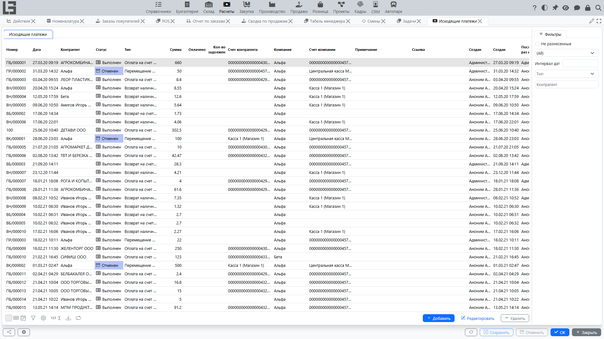

Исходящий платёж фиксирует **списание денег** со счёта компании или из кассы.

Типовые сценарии:

- оплата поставщику;
- возврат денег покупателю;
- прочие выплаты [контрагентам](../masterdata/partners.md).

## Где находится

Откройте: **«Расчёты» → «Операции» → «Исходящие платежи»**.

## Создание исходящего платежа

1. Откройте список **«Исходящие платежи»**.
2. Нажмите **«Создать»**.
3. Заполните реквизиты.
4. При необходимости выполните **разнесение оплаты** по документам.
5. Сохраните документ.

### Создание исходящего платежа из поступления

Если вы фиксируете оплаты поставщикам по документам, исходящий платёж можно создать прямо из [поступления](bills.md).

Как правило, это выглядит так:

1. Откройте нужное **[поступление](bills.md)**.
2. Переведите документ в статус **«К оплате»** (если он ещё в черновике).
3. Нажмите **«Оплатить»**.
4. Откроется карточка созданного исходящего платежа — проверьте реквизиты, при необходимости уточните сумму и сохраните.

Что обычно заполняется автоматически:

- **контрагент** и его счёт/касса;
- **компания** и её счёт/касса;
- **тип** платежа (в зависимости от типа поступления и настроек);
- **валюта** (если используется);
- **сумма** — как правило, равна текущему остатку к оплате по поступлению.

Что происходит с разнесением:

- система сразу выполняет **разнесение оплаты** на это поступление, чтобы [задолженность](debt-and-calendar.md) уменьшилась;
- если требуется другое распределение (частичная оплата, оплата несколькими платежами), корректируйте разнесение в разделе **«Разнесение оплат»**.

Что важно про статусы:

- действие **«Оплатить»** доступно только для поступления в статусе **«К оплате»**;
- созданный исходящий платёж создаётся в статусе **«К оплате»** (то есть подготовлен к подтверждению списания). Фактическое списание подтверждается действием **«Провести»**.

Исходящий платёж, созданный вручную, начинается со статуса **«Черновик»**. Полный маршрут — **«Черновик» → «К оплате» → «Выполнен» → «Отменен»**: действие **«В работу»** переводит из «Черновика» в **«К оплате»**, а **«Провести»** подтверждает списание.

## Основные реквизиты

Как правило, в исходящем платеже доступны:

- **Тип** — определяет, откуда списываются деньги (банк/касса) и какие счета можно выбрать.
- **Дата и время**.
- **Номер**.
- **Сумма**.
- **Контрагент** — кому перечислены деньги.
- **Счёт/касса контрагента** (если используется).
- **Компания**.
- **Счёт/касса компании** — откуда списаны деньги.
- **Валюта** — определяется счётом компании / типом.
- **Статья ДДС** (аналитический счёт) — из числа разрешённых для выбранного типа платежа.
- **Примечание**.
- **Ссылка** — короткая строка; если она содержит номер поступления, платёж **автоматически разносится** на это поступление.

## Разнесение по документам и закрытие задолженности

Если вы ведёте расчёты по документам, исходящий платёж нужно **разнести** — чтобы он закрывал [задолженность](debt-and-calendar.md) по выбранным документам.

В карточке исходящего платежа есть раздел **«Разнесение оплат»**:

- **Разнесенные** — уже привязанные суммы;
- **Доступно** — документы, которые можно оплатить (для исходящего платежа это [поступления](bills.md) поставщиков);
- действие **«Разнести»** (либо двойной щелчок по строке).

Разнесение возможно только между документами **одного контрагента и одной компании**.

### Частичная оплата

Если сумма платежа меньше суммы документа, [задолженность](debt-and-calendar.md) по документу останется частично открытой — её можно закрыть следующими платежами.

### Одна выплата на несколько документов

Исходящий платёж можно разнести на несколько документов (например, оплатить несколько [поступлений](bills.md) одной суммой).

### Переплата

Если перечислено больше, чем разнесено по документам, остаток остаётся **не разнесенным** до тех пор, пока его не отнесут на другой документ того же [контрагента](../masterdata/partners.md).

## Связь с входящим платежом

Если у типа платежа задан связанный входящий тип, у исходящего платежа в статусе **«К оплате»** появляется действие **«Создать входящий платёж»** (либо входящий платёж создаётся автоматически, если у типа установлен флаг **«Автоматически создавать входящий платёж»**). Так оформляются внутренние переводы — «перевод из» в паре с «переводом в».

## Поиск «не разнесенных» платежей

В списке исходящих платежей есть фильтр **«Не разнесенные»** — он помогает найти платежи, которые ещё не связаны с документами (они влияют на общий баланс контрагента, но не закрывают остаток конкретного документа).

## Печать

Предустановленная печатная форма называется **«Исходящий платёж»**; печать использует **шаблоны исходящих платежей**, настроенные для типа платежа.

Подробнее: [Печать и отчётность](reports-and-printing.md).

## Типовые ситуации и решения

### Платёж введён, но задолженность по документам не изменилась

Обычно нужно выполнить **разнесение оплат** по документам.

### Не получается выбрать счёт/кассу

Проверьте соответствие **типа** платежа и выбранного счёта/кассы (банк/касса). При необходимости измените тип.

### Не вижу кнопку «Оплатить» в поступлении

Обычно это связано с одним из факторов:

- [поступление](bills.md) не переведено в статус **«К оплате»**;
- для типа поступления не настроен подходящий тип исходящего платежа;
- по поступлению нет остатка к оплате (уже оплачено или сумма к оплате равна нулю).