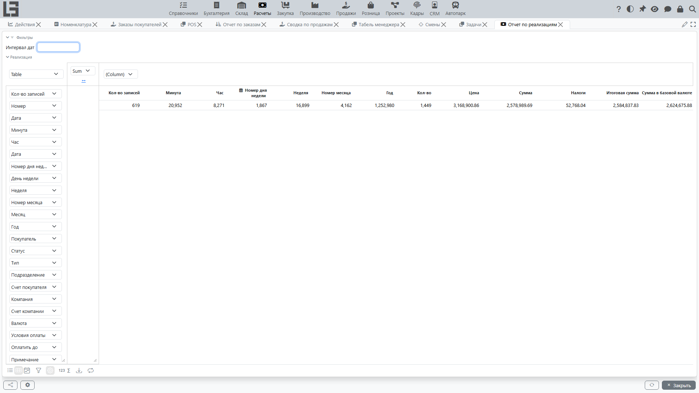
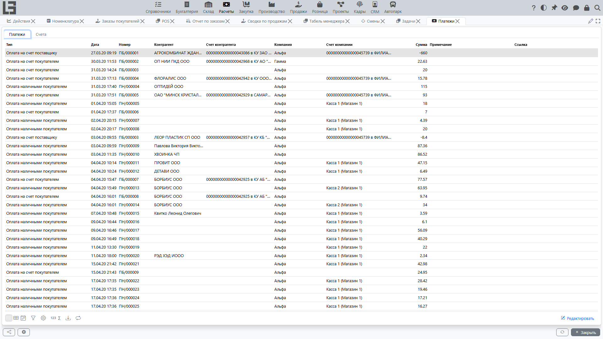

## Печать документов

В разделе «Расчёты» обычно доступны печатные формы:

- [поступление](bills.md);
- [реализация](invoices.md);
- [платёжные документы](payments.md).

Доступность печати зависит от настроек и шаблонов.

### Настройка шаблонов печати для «Реализации»

#### Что такое шаблон печати
Шаблон печати — это печатная форма, по которой система формирует документ при нажатии кнопки «Печать» в карточке «[Реализации](invoices.md)».

Для каждого **типа реализации** можно подключить один или несколько шаблонов. Если шаблонов несколько, пользователь выбирает нужный при печати (см. [Настройки и справочники](settings.md)).

Шаблон может быть:

- **предустановленным** (встроенный макет, поставляется вместе с системой);
- **пользовательским** (вы загружаете свой файл макета).

#### Когда доступна печать в «Реализации»
Кнопка «Печать» отображается в карточке «[Реализации](invoices.md)» только если для её типа включён хотя бы один шаблон печати.

#### Где выполняются настройки
Настройка печати состоит из двух шагов:

1) **Создать/настроить шаблон реализации** — задать его название и источник (встроенный макет или загруженный файл).

2) **Включить шаблон для нужного типа реализации** — привязать шаблон к типу, чтобы он появился в печати.

Обычно эти действия выполняются в разделе [«Настройки и справочники»](settings.md):

- список «Шаблоны реализации» (создание и редактирование);
- карточка «Тип реализации» (включение шаблонов для конкретного типа).

> Размещение пунктов меню может отличаться в зависимости от конфигурации, но логика одинаковая: шаблоны хранятся отдельно, а включение выполняется в типах реализации.

---

#### 1) Создание и настройка шаблона реализации
Откройте список «Шаблоны реализации» и создайте новый шаблон (или откройте существующий).

Поля и действия в карточке шаблона:

- **Название** — как форма будет называться в списке выбора при печати.
- **Имя файла шаблона** — используется для предустановленных макетов (когда файл не загружен).
- **Открыть** — позволяет открыть текущий шаблон для просмотра (предустановленный или загруженный).
- **Загрузить** — загрузить ваш файл макета (после загрузки будет использоваться именно он).
- **Сбросить** — удалить загруженный файл и вернуться к предустановленному макету (если он задан).
- **Формат** — определяет, как формируется результат печати.
- **Имя файла экспорта** — имя файла при сохранении результата (если для выбранного формата предусмотрено формирование файла).

Рекомендации:

- Если вы хотите **заменить стандартную форму** своей версией — используйте «Загрузить».
- Если нужно **вернуться к стандартной форме** — используйте «Сбросить».

---

#### 2) Включение шаблона для типа реализации
Откройте список «Типы реализации», выберите нужный тип и перейдите на вкладку с шаблонами.

Далее:

1. Найдите нужный шаблон в списке.
2. Включите его для текущего типа (обычно это отметка «Вкл.»).

Можно включить несколько шаблонов — тогда при печати система предложит выбрать нужный.

---

#### 3) Печать из карточки «Реализации»
Откройте нужную «[Реализацию](invoices.md)» и нажмите «Печать».

Далее возможны два варианта:

- **Включён один шаблон** — печать запускается сразу по нему.
- **Включено несколько шаблонов** — откроется окно выбора, где нужно указать шаблон.

Если для выбранного формата предусмотрено формирование файла, система предложит открыть/сохранить результат с учётом поля «Имя файла экспорта».

---

#### Типовые проблемы и как их исправить

**1) В реализации нет кнопки «Печать».**

Проверьте:

- у реализации выбран правильный тип;
- для этого типа включён хотя бы один шаблон;
- у шаблона задан предустановленный макет или загружен файл.

**2) Печатается не та форма.**

Проверьте:

- какой тип реализации указан в документе;
- не включено ли несколько шаблонов для этого типа (в этом случае при печати нужно выбрать нужный).

**3) Нужно восстановить стандартную печатную форму.**

Откройте шаблон и выполните «Сбросить» (если ранее был загружен файл).

---

#### Примеры предустановленных форм
В зависимости от поставки в системе могут быть доступны типовые печатные формы для «Реализации» (например, накладная, счет-фактура, универсальный передаточный документ, счет на оплату). Их можно использовать сразу или заменить собственными файлами через «Загрузить».

## Отчёты

В базовой поставке в **«Расчёты» → «Отчётность»** поставляются четыре формы:

**Отчёт по поступлениям** — суммы и строки [поступлений](bills.md) с разрезами по поставщику, типу, периоду, налогу.

**Отчёт по реализациям** — суммы и строки [реализаций](invoices.md) с разрезами по покупателю, типу, периоду, налогу.

**Платежи** — единое представление всех входящих и исходящих платежей с датой, контрагентом, счётом и суммой со знаком; в этой же форме на вкладке **«Счета»** показаны текущие остатки по счетам и (опционально) остаток на выбранную дату.

**[Календарь платежей](debt-and-calendar.md)** — старение задолженности и прогноз поступлений по контрагенту/договору.

Показатели по [задолженности](debt-and-calendar.md) также видны прямо на карточках **поступления** и **реализации** (привязанные платежи и остаток долга) и через выделенные представления **«Задолженность по контрагентам»** / **«Задолженность по договорам»**.

Рекомендации:

1. Используйте интервал дат.
2. Для анализа задолженности группируйте по [контрагенту](../masterdata/partners.md) и [договору](../masterdata/contracts.md).