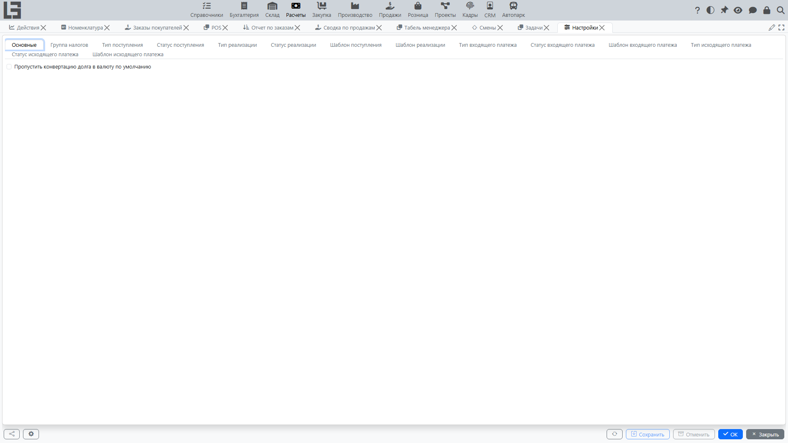
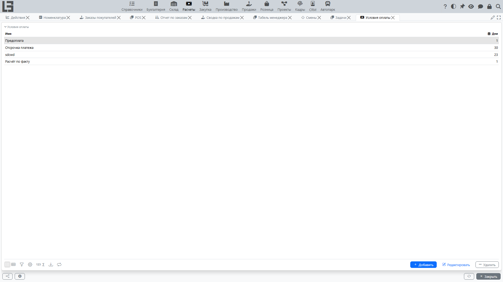

## Где находится

Откройте **«Расчёты» → «Настройка» → «Настройки»**.

## Что обычно настраивается

- типы документов — типы поступлений, реализаций, входящих и исходящих платежей — с нумераторами, валютой по умолчанию, режимом учёта налога (включён в цену или нет) и (для возвратных типов) признаком **«Возврат»** / «привязанный тип возврата», описанным в разделе [Возвраты и корректировки](refunds-and-corrections.md);
- нумераторы (привязка нумератора к типу документа);
- банковские счета и кассы (см. ниже «Банки и счета»);
- условия оплаты для продаж и закупок (см. [Задолженность и календарь платежей](debt-and-calendar.md));
- [налоги](taxes.md) и группы налогов;
- [базы распределения затрат](bill-cost.md) для услуг по поступлениям;
- шаблоны печати (см. [Печать и отчётность](reports-and-printing.md)).

## Банки и счета

В справочниках ведутся:

- банки;
- банковские счета;
- кассы;
- аналитические счета (если используются для разнесения платежей).

## Условия оплаты

Условия оплаты используются для:

- расчёта даты плановой оплаты;
- формирования [календаря платежей](debt-and-calendar.md);
- контроля просрочки.

