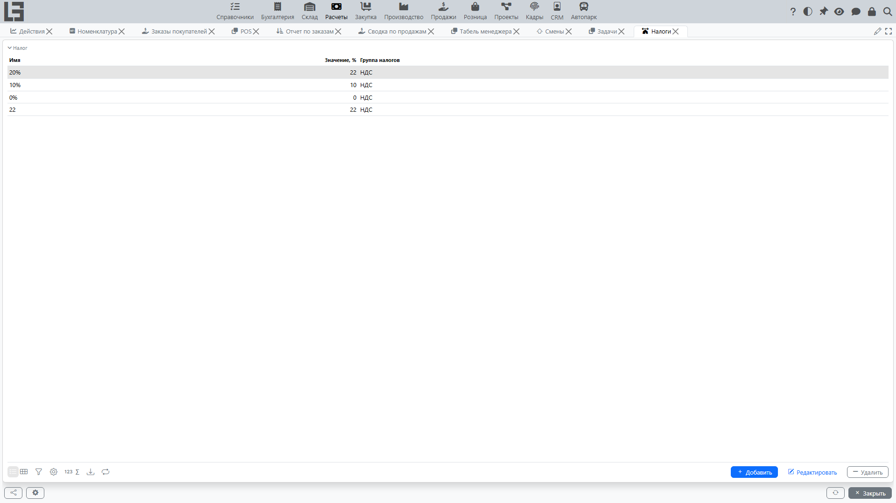

В разделе «Расчёты» налоги используются при расчёте суммы строк и итоговой суммы документа.

## Справочники

В конфигурации используются два справочника:

- **«Налоги»** — у каждого налога есть **наименование**, ставка в поле **«Значение, %»** и обязательная принадлежность к **группе налога**. Например: «НДС 20%» со значением 20 в группе «НДС».
- **Группы налогов** — налоги объединяются в группы так, что на одну строку документа можно одновременно применить **только один налог из группы**. Это стандартный способ описать взаимоисключающие варианты налога (например, группа «НДС» со ставками 0%, 5%, 10%, 20% — на строке выбирается только один). У группы налога есть наименование и короткий **идентификатор (ID)**, используемый как ключ при импорте.

## Налоги на товарах

У каждого [товара](../masterdata/items.md)/услуги ведётся **два** независимых набора налогов — налоги **на продажу** и налоги **на закупку**:

- когда строка товара добавляется в [реализацию](invoices.md), подставляются его налоги **на продажу**; в [поступлении](bills.md) — его налоги **на закупку**;
- наборы налогов товара по умолчанию наследуются от **категории** товара, поэтому указание категории предзаполняет налоги; затем их можно переопределить у конкретного товара;
- наборы налогов на продажу и на закупку можно массово загружать и выгружать через **«Импорт / экспорт налогов на продажу (закупку)»** на форме миграции данных.

## Расчёт

Суммы налогов рассчитываются системой автоматически по каждой строке — пользователь их не вводит. Режим определяется флагом **«Цена включает налоги»** на типе документа:

- **«Цена включает налоги» = выключено** (по умолчанию для B2B): **цена** строки — это цена без налога (нетто), **сумма** строки равна `цена × количество`, а налог добавляется сверху: `сумма налога = сумма × ставка / 100`.
- **«Цена включает налоги» = включено** (типично для розницы / кассовых продаж): **цена** строки — это цена с налогом (брутто), **сумма** строки равна брутто-итогу, а налог извлекается из неё: `сумма налога = сумма × ставка / (100 + ставка)`.

На уровне документа доступна **нетто-сумма** (Netto amount — итог минус налог), а сводная таблица по налогам разбивает документ в разрезе налогов (сумма без налога / сумма налога / сумма по каждому налогу).

## Применение в документах

Налог может задаваться:

- автоматически — по настройкам [товара](../masterdata/items.md) (на продажу / на закупку) или по типу документа;
- вручную в строке — отметкой нужного налога из соответствующей группы.

Из-за правила «один налог на группу» выбор другого налога той же группы автоматически снимает отметку с предыдущего для этой строки.

## Ограничения

- налог, который уже участвует в расчётах строк, защищён от удаления;
- налоги одной группы не могут одновременно стоять на одной строке.

## Что **не** реализовано в базовой поставке

Базовая конфигурация использует одно налоговое измерение (ставка × база). В ней **нет** выделенных НДС-деклараций/отчётов как отдельных форм — итоги по налогам видны в сводной таблице по налогам на каждом документе и как показатели внутри отчётов по [поступлениям](bills.md) и [реализациям](invoices.md).
