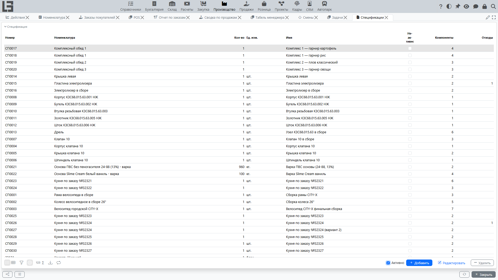
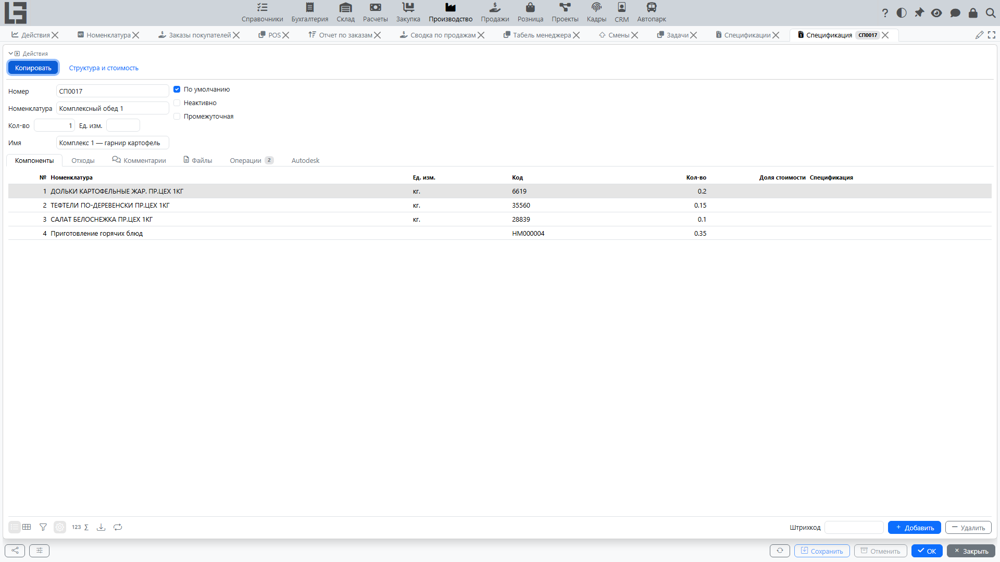

Спецификация описывает состав изделия: какие материалы и в каком количестве нужны для производства, а также какие отходы (побочные продукты) образуются.

В системе спецификация используется как источник плановых норм: по ней автоматически формируются строки материалов и выпуска в производственном заказе.

## Где находится

Список спецификаций доступен в **«Производство» → «Операции» → «Спецификации»**.

В списке отображаются **«Номер»**, **«Номенклатура»**, **«Кол-во»**, **«Ед. изм.»**, **«Имя»**, флаг **«Неактивно»** и счётчики строк **«Компоненты»** / **«Отходы»**. По умолчанию фильтр **«Активно»** скрывает неактивные (архивные) спецификации.

Справочник операций спецификаций — это отдельный пункт в **«Производство» → «Настройка» → «Операции»**.

## Для чего нужна спецификация

Спецификация используется для:

- автоматического заполнения строк материалов в производственном заказе;
- расчёта планового потребления и планового выпуска;
- формирования отходов (побочных продуктов) при производстве;
- задания шаблонов операций для производственных заданий (рабочий центр, время начала, продолжительность);
- разборки (разукомплектации) — как правило, по той же спецификации;
- анализа структуры изделия, плановых норм и стоимости.

## Карточка спецификации: основные поля

В карточке спецификации обычно задаются:

- **«Номер»** — идентификатор спецификации (обязателен, формируется нумератором);
- **«Номенклатура»** — изделие, для которого действует спецификация (обязательна);
- **«Кол-во»** и **«Ед. изм.»** — базовое количество, на которое заданы нормы (например, 1 шт, 10 шт, 100 кг);
- **«Имя»** — произвольное название/комментарий;
- **«По умолчанию»** — признак, что спецификация должна подставляться автоматически в производственный заказ для данной номенклатуры;
- **«Неактивно»** — признак, что спецификация больше не используется;
- **«Промежуточная»** — помечает спецификацию полуфабриката как промежуточную: при формировании родительского заказа такое изделие разворачивается в собственные компоненты, а не потребляется целиком (см. ниже «Вложенные спецификации»).

Важно:

- спецификация, отмеченная как **«По умолчанию»**, должна быть активной (не помеченной как **«Неактивно»**);
- если для номенклатуры явно не выбрана спецификация по умолчанию, в качестве спецификации по умолчанию используется последняя созданная активная спецификация для этой номенклатуры;
- в карточке также есть вкладки **«Комментарии»** и **«Файлы»**.

## Структура спецификации: вкладки

### Компоненты

Вкладка **«Компоненты»** содержит строки материалов (что потребляется при изготовлении).

В каждой строке задаются:

- **«№»** — номер строки;
- **«Номенклатура»** (материал/компонент) со справочными колонками **«Ед. изм.»**, **«Штрихкод»** и **«Код»**;
- **«Кол-во»** — норма расхода на базовое количество спецификации;
- **«Доля стоимости»** — коэффициент распределения стоимости, используется, когда спецификация применяется для разборки (см. ниже);
- **«Спецификация»** — вложенная спецификация компонента (см. ниже «Вложенные спецификации»); по умолчанию показывается спецификация компонента по умолчанию.

#### Как читать количество компонента

Количество компонента задано на базовое количество спецификации.

Пример:

- количество спецификации = 10 шт;
- компонент А = 2 кг.

Это означает: на выпуск 10 шт изделия нужно 2 кг компонента А.

Если производственный заказ будет на 25 шт, план по компоненту будет рассчитан пропорционально: 2 × 25 / 10.

### Отходы

Вкладка **«Отходы»** задаёт отходы (побочные продукты), которые образуются при производстве.

В каждой строке задаются:

- **«№»** — номер строки;
- **«Товар»** (что получается дополнительно) с колонками **«Ед. изм.»**, **«Штрихкод»** и **«Код»**;
- **«Кол-во»** — норма на базовое количество спецификации.

Как рассчитывается количество отходов в заказе — см. [Отходы и побочные продукты](by-products.md).

### Операции

Вкладка **«Операции»** задаёт плановые шаги производства, используемые для создания производственных заданий.

В каждой строке обычно задаются:

- **«Имя»** — название операции;
- **«Рабочий центр»** — где выполняется операция;
- **«Время начала»** — плановое время суток;
- **«Продолжительность»** — плановая продолжительность в часах.

Прямо на этой вкладке можно также скопировать операции из другой спецификации. Используйте действие **«Копировать существующие операции»**, выберите в диалоге одну или несколько строк и подтвердите выбор. Выбранные операции будут добавлены в текущую спецификацию.

## Вложенные спецификации

В строке компонента может быть указана его собственная **«Спецификация»** (по умолчанию — спецификация по умолчанию номенклатуры компонента; спецификация компонента должна соответствовать номенклатуре компонента).

Разворачивается ли вложенная спецификация, определяется её флагом **«Промежуточная»**:

- если вложенная спецификация помечена как **«Промежуточная»**, компонент трактуется как полуфабрикат, производимый «на лету»: при формировании строк заказа сам компонент **не** добавляется в материалы — вместо него добавляются его собственные компоненты (рекурсивно, с пересчётом количеств по всей цепочке вложенности);
- если флаг «Промежуточная» не установлен, компонент потребляется как обычный материал.

[Производственные задания](work-orders.md) также формируются по операциям вложенных промежуточных спецификаций, поэтому вся цепочка обработки планируется в одном заказе.

## Структура и стоимость

Действие **«Структура и стоимость»** в карточке открывает форму с полным (многоуровневым) деревом компонентов изделия:

- компоненты выводятся с отступом по уровню вложенности, с вложенной спецификацией и эффективным **«Кол-во»** на базовое количество;
- **«Стоимость товара»** — учётная стоимость количества компонента;
- **«Стоимость компонентов»** — суммарная стоимость нижележащих компонентов;
- у формы есть собственное действие **«Печать»**.

Это удобный способ оценить плановую стоимость изделия по текущим стоимостям компонентов ещё до начала производства.

## Использование спецификации в производственном заказе

### Автоподстановка спецификации

Если у изделия есть спецификация по умолчанию, система подставляет её автоматически при выборе изделия в производственном заказе.

### Проверка соответствия изделия

В производственном заказе действует контроль:

- номенклатура заказа должна совпадать с номенклатурой спецификации.

Если они не совпадают, сохранить заказ нельзя.

### Формирование строк по спецификации

В карточке производственного заказа есть действие формирования строк (**«Заполнить по спецификации»**, доступно в статусе «Черновик»).

При обычном производстве:

- компоненты спецификации формируют строки материалов (компоненты с вложенной промежуточной спецификацией разворачиваются в свои субкомпоненты);
- изделие заказа формирует строку выпуска;
- отходы спецификации добавляются в строки выпуска;
- производственные задания формируются по операциям спецификации, включая операции вложенных промежуточных спецификаций.

При разборке (разукомплектации):

- компоненты спецификации формируют строки выпуска;
- изделие заказа формирует строку материалов;
- отходы спецификации добавляются в строки материалов;
- производственные задания формируются по операциям спецификации, включая операции вложенных промежуточных спецификаций.

Важно: при формировании или пересчёте строк заказа производственные задания перестраиваются по текущим операциям спецификации, а созданные задания сохраняют ссылку на исходную спецификацию.

Подробно о разборке см. [Разборка (разукомплектация)](unbuild.md).

## Доля стоимости в спецификации

В строках компонентов спецификации может храниться **«Доля стоимости»** — коэффициент распределения стоимости.

Он используется для разборки:

- при формировании строк разборки коэффициенты из компонентов спецификации переносятся в строки выпуска;
- далее итоговая себестоимость разборки распределяется на строки выпуска по этим коэффициентам.

Подробно о распределении себестоимости см. [Себестоимость: как рассчитывается](costing.md).

## Версионирование и актуальность

Рекомендации:

1. Не изменяйте неактивные (архивные) спецификации.
2. При изменении состава изделия создавайте новую спецификацию (новый номер) и делайте её спецификацией по умолчанию.
3. Старую спецификацию помечайте как **«Неактивно»**, чтобы она не подставлялась в новые заказы.

## Копирование спецификации

При копировании спецификации (действие **«Копировать»**) система копирует:

- основные поля, включая флаг **«Промежуточная»**;
- компоненты (включая ссылки на вложенные спецификации и доли стоимости);
- отходы;
- операции (включая рабочий центр, время начала и продолжительность).

## Массовый ввод через таблицы (импорт/экспорт)

В системе предусмотрены действия для импорта и экспорта спецификаций и их строк в табличный файл (они находятся на форме миграции данных, а не в карточке спецификации).

Доступны отдельные операции:

- выгрузка/загрузка спецификаций;
- выгрузка/загрузка компонентов;
- выгрузка/загрузка отходов.

Практический сценарий:

1. Выгрузите шаблон.
2. Заполните строки в таблице.
3. Загрузите файл обратно.

Важно: при импорте система проверяет наличие номенклатуры и спецификаций по указанным кодам. Если указаны неизвестные коды, импорт будет отменён.

## Типовые ошибки

- **Спецификация не подставляется автоматически** — у номенклатуры нет ни одной активной спецификации (все помечены как «Неактивно»). Если подставляется не та спецификация — явно установите признак **«По умолчанию»** на нужной.
- **Заказ не сохраняется после выбора спецификации** — номенклатура заказа не совпадает с номенклатурой спецификации.
- **Нормы в заказе «не те»** — проверьте базовое количество спецификации (часто оно задано не на 1, а на 10/100 единиц).
- **Полуфабрикат попадает в материалы вместо своих компонентов** — вложенная спецификация компонента не помечена как **«Промежуточная»**.
