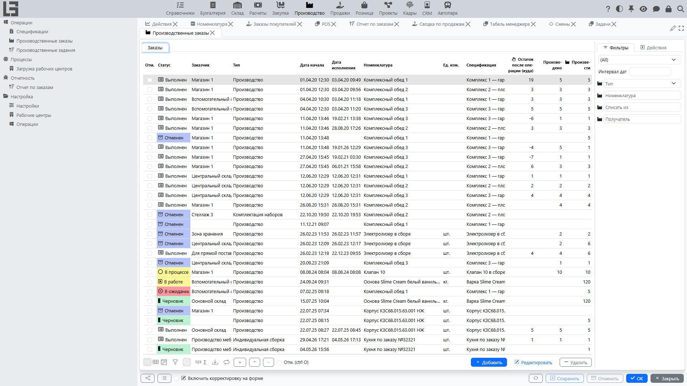

Документация описывает работу раздела **«Производство»**: ведение [спецификаций](bom.md), создание и выполнение [производственных заказов](orders.md), резервирование материалов, выпуск продукции, оформление **[списаний](scrap.md)**, печать и отчеты.

## Содержание

- [Быстрый старт](#быстрый-старт)
- [Навигация](#навигация)
- [Термины](#термины)

Связанные документы:

- [Спецификации](bom.md)
- [Производственные заказы: список и карточка](orders.md)
- [Создание производственных заказов из заказов покупателя](sales-orders.md)
- [Процесс и статусы производственного заказа](workflow.md)
- [Выпуск продукции и расход материалов](production-and-consumption.md)
- [Себестоимость: как рассчитывается](costing.md)
- [Разборка (разукомплектация)](unbuild.md)
- [Отходы (побочные продукты)](by-products.md)
- [Партии и печать](lots-and-printing.md)
- [Списание (брак)](scrap.md)
- [Рабочие центры и производственные задания](work-orders.md)
- [Отчеты](reports.md)
- [Настройки и справочники](settings.md)

Связанные интеграции:

- [Autodesk](../masterdata/autodesk/autodesk.md) — подключение 3D-моделей Autodesk Platform Services (APS) к спецификациям и производственным заказам.

## Быстрый старт

Ниже приведен типовой сценарий «от [спецификации](bom.md) до [выпуска и расхода](production-and-consumption.md)».

1. Проверьте, что для изделия создана **спецификация** (см. [Спецификации](bom.md)).
2. Создайте **[производственный заказ](orders.md)**:
   - выберите тип заказа;
   - укажите изделие, которое нужно произвести;
   - укажите плановую дату начала;
   - при необходимости выберите [спецификацию](bom.md).
3. Заполните плановые количества — выполните действие **«Заполнить по спецификации»** и введите количество к производству; строки материалов и продукции будут сформированы по спецификации.
4. Выполните действие **«В работу»**, затем проверьте наличие материалов и зарезервируйте их:
   - выполните действие **«Зарезервировать»**;
   - при успешной проверке заказ переходит в статус **«В работе»**.
5. Выполните действие **«Произвести»** (заказ переходит в статус **«В процессе»**) и зафиксируйте выпуск.
6. Выполните действие **«Провести»** и укажите поле **«Получатель»** (место хранения готовой продукции).

## Навигация

Раздел находится в дереве навигации как **«Производство»** и обычно содержит четыре группы:

- **«Операции»** — **«Спецификации»** ([список спецификаций](bom.md)), **«Производственные заказы»** ([заказы](orders.md)) и **«Производственные задания»** ([задания](work-orders.md)).
- **«Процессы»** — панели контроля, в частности доска **«Загрузка рабочих центров»** ([рабочие центры](work-orders.md)).
- **«Отчетность»** — **«Отчет по заказам»** ([отчеты по производству](reports.md)).
- **«Настройка»** — справочники и параметры: форма **«Настройки»** (с [типами заказов](settings.md) и флагами статусов), **«Операции»** ([операции спецификаций](bom.md)) и **«Рабочие центры»** ([рабочие центры](work-orders.md)).

## Термины

#### [Производственный заказ](orders.md)

Документ, в котором планируется и фиксируется изготовление изделия (или [разборка](unbuild.md), если выбран соответствующий тип).

#### [Спецификация](bom.md)

Описание состава изделия: какие материалы и в каких количествах требуются для изготовления.

#### Резервирование материалов

Процедура, при которой система фиксирует, что требуемое количество материалов будет использовано под конкретный производственный заказ.

#### [Выпуск и расход](production-and-consumption.md)

Выпуск — фиксация произведенного количества. Расход — фиксация фактически израсходованных материалов.
