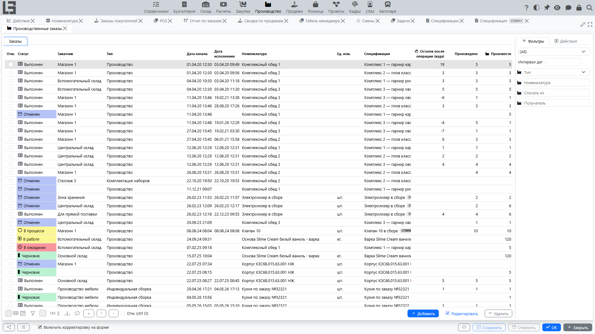
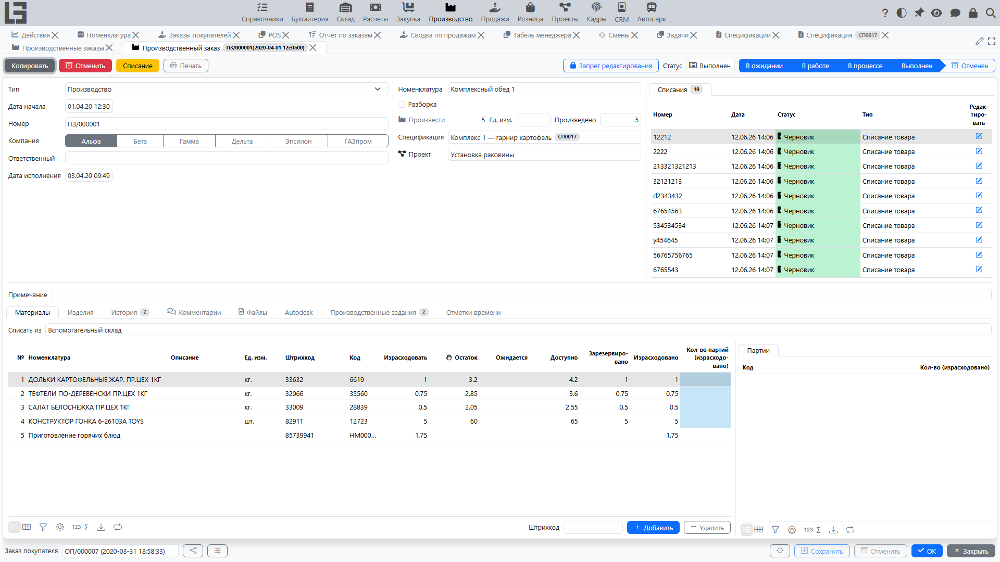

## Где находится

Откройте раздел **«Производство»** → **«Операции»** → **«Производственные заказы»**.

## Для чего нужен производственный заказ

Производственный заказ — основной документ производства. В нём:

- фиксируется, **что** нужно произвести (или [разобрать](unbuild.md));
- задается **плановое количество**;
- указывается **[спецификация](bom.md)** (состав изделия), по которой рассчитываются материалы;
- выполняется **проверка наличия** и резервирование материалов;
- фиксируется **фактический выпуск** и **фактический расход**;
- при проведении заказа указывается место хранения готовой продукции (поле **«Получатель»**);
- отслеживаются статусы [производственных заданий](work-orders.md) непосредственно из карточки заказа.

## Список производственных заказов

Список предназначен для контроля текущих заказов и быстрого перехода в карточку.

Обычно в списке доступны колонки:

- **«Номер»**;
- **«Дата начала»** (плановая) и **«Дата исполнения»** (заполняется, когда заказ переходит в статус **«Выполнен»**);
- **«Номенклатура»** — что производится;
- **«Тип»** и флаг **«Разборка»** (берется из [типа](settings.md));
- **«Компания»**;
- план и факт: **«Произвести»** (плановое количество) и **«Произведено»** (факт) вместе с **«Ед. изм.»**;
- **«Получатель»** и расчетная колонка **«Остаток после операции (куда)»** — ожидаемый остаток изделия у получателя после выполнения заказа;
- **«Спецификация»**;
- **«Списать из»**;
- счетчики строк: **«Строк материалов»** и **«Строк продукции»**;
- колонки себестоимости (см. [Себестоимость](costing.md)): **«Себестоимость»**, **«Дополнительная себестоимость»**, **«Общая себестоимость»**, а также **«Себестоимость труда»** и **«Себестоимость услуг»**, если используются соответствующие контуры;
- **«Заказ покупателя»** — ссылка на исходный заказ покупателя, если заказ создан [из заказа покупателя](sales-orders.md).

Фон строки отражает статус заказа (см. [статусы](workflow.md)).

### Фильтры

- группа фильтров по статусу: **«В ожидании»**, **«В работе»**, **«В процессе»**, **«Выполнен»** (плюс возможность показать все);
- фильтр по **интервалу дат** начала;
- фильтры в правой панели по **«Тип»**, **«Номенклатура»**, **«Списать из»** и **«Получатель»**.

### Выделение и вкладка «Итого»

Строки списка можно выделять флажками. Для выделенных заказов:

- доступны массовые действия по статусам: **«В работу»**, **«Зарезервировать»**, **«Произвести»**, **«Провести»**;
- появляется вкладка **«Итого»**: она агрегирует материалы всех выделенных заказов — по одной строке на номенклатуру с колонками **«Израсходовать»**, **«Израсходовано»** и **«Себестоимость»**, а для выбранной номенклатуры показываются исходные строки материалов с их заказами.

### Создать заказы (массовое создание)

Действие **«Создать заказы»** создает сразу несколько производственных заказов:

1. Выберите **«Тип»** в фильтре правой панели (иначе действие выведет сообщение «Не выбран тип производственного заказа»).
2. Откроется диалог **«Выбор продукции»** со всеми номенклатурами, у которых есть [спецификация](bom.md) по умолчанию.
3. Введите количество **«Произвести»** для нужных позиций; при необходимости измените **«Спецификация»** по позиции.
4. Если задан фильтр **«Получатель»**, в диалоге также показывается текущий **«Остаток»** в этом месте хранения, а действие **«Закрыть расход»** заполняет количества по позициям с отрицательным остатком.
5. При подтверждении на каждую позицию создается один производственный заказ с типом, спецификацией, местами хранения списания/получателя из фильтров и сформированными строками.

### Создать заказы поставщикам на материалы

Из списка производственных заказов можно также создать [заказы поставщикам](../purchase/orders.md) на материалы, требуемые для выбранных производственных заказов. Соответствующее действие (также с названием **«Создать заказы»**) появляется, когда выделен хотя бы один заказ.

1. В фильтрах задайте **«Списать из»** — будут обработаны только производственные заказы по этому месту хранения (иначе действие выведет сообщение «Не выбрано место хранения списания»).
2. Выделите производственные заказы, по которым нужно закупить материалы.
3. Выполните действие.

Система:

- агрегирует требуемые материалы (учитываются только строки расхода, еще не привязанные к заказу поставщику) по выбранным производственным заказам;
- группирует номенклатуру по основному [поставщику](../masterdata/partners.md) и создает по одному заказу поставщику на каждого поставщика;
- создает дополнительный заказ поставщику (без поставщика) для номенклатуры, у которой основной поставщик не задан;
- проставляет выбранное место хранения списания как место хранения каждого нового заказа поставщику;
- связывает каждую обработанную строку расхода с соответствующей строкой нового заказа поставщику, чтобы сохранить связь между производственным заказом и заказом поставщику;
- открывает каждый созданный заказ поставщику для просмотра.

### Производственная потребность в автозаказе поставщику

Когда включено автоматическое заполнение заказов поставщикам, производственная потребность учитывается в расчете **«Автозаказ»** в заказе поставщику.

В таблице номенклатуры заказа поставщику система показывает:

- **«Ожидает расхода»** — количества материалов из производственных заказов, ожидающих выполнения;
- **«Израсходовано»** — количества материалов из производственных заказов в статусе «Выполнен» за выбранный период заказа.

Эти количества увеличивают рекомендуемое значение **«Автозаказ»** вместе с потребностью по отгрузкам, чтобы заказ поставщику мог покрывать и потребности отгрузок продаж, и потребности производства в материалах.

## Карточка производственного заказа

Карточка производственного заказа используется для пошагового ведения процесса.

### Основные поля

- **«Тип»** — определяет поведение (например, [разборку](unbuild.md)) и значения по умолчанию; обязателен;
- **«Дата начала»** — плановые дата и время начала (по умолчанию — текущий момент);
- **«Номер»** — обязателен; генерируется нумератором типа;
- **«Компания»**;
- **«Ответственный»** — по умолчанию текущий пользователь;
- **«Дата исполнения»** — появляется, когда заказ переходит в статус **«Выполнен»**;
- **«Номенклатура»** — производимое изделие, рядом отображается доступный только для чтения флаг **«Разборка»** типа;
- **«Произвести»** — плановое количество вместе с **«Ед. изм.»**; когда заказ в процессе выполнения, рядом показывается фактическое количество **«Произведено»**;
- **«[Спецификация](bom.md)»** — состав изделия; спецификация изделия по умолчанию подставляется автоматически;
- **«Примечание»**.

Текущий статус показывается цепочкой этапов (В ожидании → В работе → В процессе → Выполнен, плюс «Отменен»); действия, переводящие заказ между статусами, описаны в [процессе](workflow.md).

### Вкладки

- **«Материалы»** — поле **«Списать из»** и строки материалов: **«№»**, **«Номенклатура»**, **«Описание»**, **«Ед. изм.»**, **«Штрихкод»**, **«Код»**, **«Израсходовать»**, а также колонки наличия **«Остаток»** / **«Ожидается»** / **«Доступно»** / **«Зарезервировано»** и, когда заказ в процессе выполнения, фактическое **«Израсходовано»**. Если используются [партии](lots-and-printing.md), по строке показывается панель партий.
- **«Изделия»** — поле **«Получатель»** и строки продукции: **«№»**, **«Номенклатура»**, **«Ед. изм.»**, **«Штрихкод»**, **«Код»**, **«Произвести»** (план), **«Доля стоимости»** и, когда заказ в процессе выполнения, фактическое **«Произведено»**. Для номенклатуры с партионным учетом по строке показывается панель партий.
- **«Производственные задания»** — [производственные задания](work-orders.md) заказа с их статусами.
- **«Комментарии»**, **«Файлы»** (вложения) и **«История»** статусов.

При использовании контура управления проектами в карточке дополнительно отображаются поле **«Проект»** и вкладка **«Отметки времени»** (трудозатраты по заказу — см. [Себестоимость](costing.md)).

В шапке также отображается блок связанных **«Списания»** (см. [Списание](scrap.md)), а в нижней части карточки — ссылка **«Заказ покупателя»**, если заказ создан [из заказа покупателя](sales-orders.md).

### Проверка соответствия номенклатуры спецификации

Если выбрана [спецификация](bom.md), система проверяет, что номенклатура в спецификации совпадает с номенклатурой заказа. Если номенклатура не совпадает, сохранить заказ нельзя.

### Заполнить по спецификации

В статусе **«Черновик»** основное действие **«Заполнить по спецификации»** формирует строки: оно запрашивает количество (по умолчанию — текущее плановое количество) и заполняет строки материалов и продукции по [спецификации](bom.md), включая компоненты вложенных промежуточных спецификаций. Одновременно по операциям спецификации формируются [производственные задания](work-orders.md), включая операции вложенных промежуточных спецификаций.

Примечание: повторный запуск действия удаляет существующие строки и формирует их заново.

### Копировать

Действие **«Копировать»** создает новый заказ в статусе **«Черновик»** с теми же типом, номенклатурой, спецификацией, компанией, местами хранения списания/получателя и строками (только плановые количества). Производственные задания также копируются.

### Печать

Действие **«Печать»** печатает простую печатную форму заказа (наряд на выпуск): номер заказа, дата начала, изделие и количество, а также список материалов с количествами и местом хранения списания.

## Типовые сценарии

### Создать заказ и подготовить к запуску

1. Создайте новый производственный заказ.
2. Заполните тип, номенклатуру и дату начала.
3. Выберите [спецификацию](bom.md) (обычно подставляется автоматически).
4. Выполните **«Заполнить по спецификации»**, чтобы сформировать строки материалов и продукции (одновременно формируются производственные задания).
5. Выполните **«В работу»**, затем **«Зарезервировать»**, чтобы зарезервировать материалы.

### Произвести и провести

1. Выполните **«Произвести»** и введите произведенное количество (система распределит выпуск и расход пропорционально).
2. Управляйте выполнением производственных заданий (опционально): на вкладке **«Производственные задания»** используйте действия **«Старт»** и **«Провести»** для отслеживания прогресса операций.
3. При необходимости скорректируйте фактические **«Произведено»** / **«Израсходовано»** по строкам.
4. Выполните **«Провести»** и укажите **«Получатель»**.
