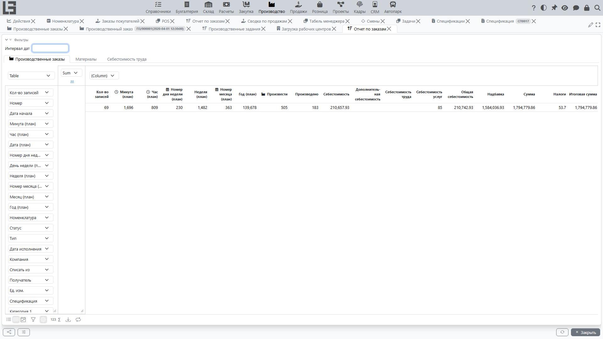

Раздел отчётности предназначен для анализа [производственных заказов](orders.md). Откройте **«Производство» → «Отчетность» → «Отчет по заказам»**.

## Что показывает отчёт

Отчёт — это сводное (pivot) представление со следующими вкладками:

- **«Производственные заказы»** — строка на заказ: номер, даты (начала/исполнения), номенклатура, статус, тип, компания, места хранения, спецификация; показатели: план и факт выпуска (**«Произвести»** / **«Произведено»**) и колонки себестоимости (**«Себестоимость»**, **«Дополнительная себестоимость»**, **«Общая себестоимость»**, а также **«Себестоимость труда»** и **«Себестоимость услуг»**, если используются соответствующие контуры). Для заказов, созданных [из заказов покупателя](sales-orders.md), доступны также суммовые показатели продаж (**«Сумма»**, **«Налоги»**, **«Итоговая сумма»**, **«Надбавка»**);
- **«Материалы»** — строка на строку материала: **«Материал»** и атрибуты его заказа; показатели **«Израсходовать»**, **«Зарезервировано»**, **«Израсходовано»** и **«Себестоимость»**;
- **«Себестоимость труда»** — строка на отметку времени: **«Сотрудник»**, **«Проект»**; показатели: отработанные часы (**«Часов»**), ставка и сумма оплаты труда. Вкладка доступна при использовании контура управления проектами.

## Фильтры и группировка

- панель **«Фильтры»** вверху задаёт интервал дат по дате начала заказа;
- строки можно группировать по любым колонкам-измерениям: номенклатуре, категориям номенклатуры (**«Категория 1»**–**«Категория 4»**, **«Категория полная»**), атрибутам номенклатуры, статусу, типу, компании, местам хранения;
- дату начала можно агрегировать по стандартным периодам (год/квартал/месяц/…) для анализа динамики.

## Что обычно анализируют

- количество заказов за период;
- план и факт выпуска;
- обеспеченность материалами и потребление;
- себестоимость произведённой продукции;
- заказы в статусах **«Выполнен»** и **«Отменен»**.

## Рекомендации по использованию

1. Задайте интервал дат.
2. Группируйте по номенклатуре или категории, чтобы увидеть структуру производства.
3. Сравнивайте плановые и фактические количества для анализа отклонений.