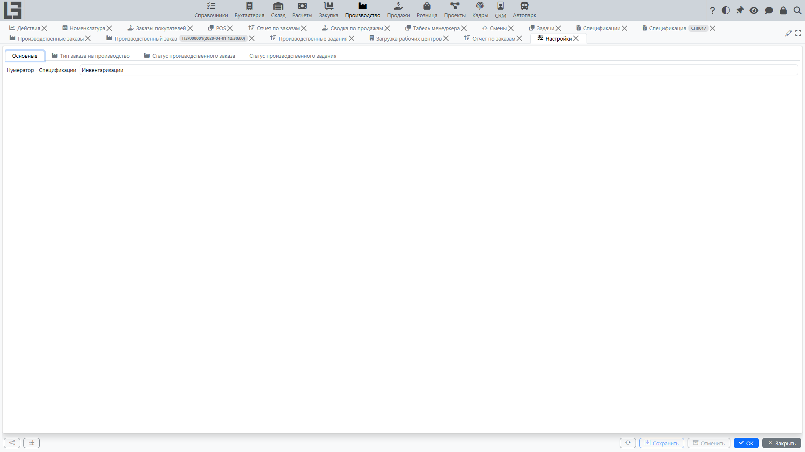

## Где находится

Откройте **«Производство»** → **«Настройка»** → **«Настройки»**.

Форма организована по вкладкам:

- **«Основные»** — общие параметры, в частности **«Нумератор - Спецификации»** (формирование номеров [спецификаций](bom.md));
- **«Тип заказа на производство»** — справочник типов заказов (см. ниже);
- **«Статус производственного заказа»** и **«Статус производственного задания»** — списки статусов с признаком **«Запрет редактирования»** (см. ниже).

## Типы производственных заказов

Вкладка **«Тип заказа на производство»** содержит справочник типов производственных заказов. В карточке типа задаются:

- **«Имя»**, **«Код»** и **«Нумератор»** (формирование номеров);
- в блоке **«По умолчанию»** — **«Списать из»** (место хранения материалов по умолчанию, подставляется в новые заказы этого типа);
- в блоке **«Прочая информация»** — флаг **«Разборка»**: заказы этого типа выполняют [разборку](unbuild.md) вместо производства;
- в блоке **«Списание»** — **«Тип списания»**: тип документа [списания](scrap.md), создаваемого из заказа этого типа.

Если существует ровно один тип, он подставляется в новые заказы по умолчанию.

Если используется [создание из заказов на продажу](sales-orders.md), тип производственного заказа также указывается в типе заказа на продажу (блок **«Производство»** с полем **«Тип заказа на производство»** и флагом **«Автоматически создавать производственный заказ»**).

## Статусы и признак «Запрет редактирования»

Набор статусов производственного заказа фиксирован — «Черновик», «В ожидании», «В работе», «В процессе», «Выполнен», «Отменен» (см. [последовательность действий](workflow.md)) — добавить новые нельзя. Однако вкладка **«Статус производственного заказа»** показывает список статусов, и у каждого статуса есть редактируемый признак **«Запрет редактирования»**: когда он включён, любой заказ в этом статусе становится нередактируемым (шапка и строки заблокированы). Так администраторы обычно блокируют, например, заказы в статусах «Выполнен» и «Отменен».

Вкладка **«Статус производственного задания»** содержит такие же признаки **«Запрет редактирования»** для статусов [производственных заданий](work-orders.md) («В работе», «В процессе», «Выполнен»).

Кроме того, у каждого отдельного производственного заказа есть собственный признак **«Запрет редактирования»**, который блокирует именно этот документ независимо от его статуса.

## Прочие справочники в группе «Настройка»

Группа **«Настройка»** также содержит:

- **«Операции»** — справочник [операций спецификаций](bom.md) (имя, спецификация, рабочий центр, время начала, продолжительность), на которые ссылаются спецификации;
- **[«Рабочие центры»](work-orders.md)** — справочник рабочих центров (имя, код, описание), используемых производственными заданиями и операциями спецификаций.

## Рекомендованный порядок настройки

1. Создайте типы производственных заказов, настройте их нумераторы и места хранения материалов.
2. Если используется [разборка](unbuild.md), создайте тип с флагом **«Разборка»**.
3. Если ведётся [списание](scrap.md), укажите **«Тип списания»** в нужных типах заказов.
4. Если используются [производственные задания](work-orders.md), создайте рабочие центры (операции обычно вводятся прямо в спецификациях).
5. Если заказы должны блокироваться после завершения, включите признак **«Запрет редактирования»** для статусов «Выполнен» и «Отменен».
