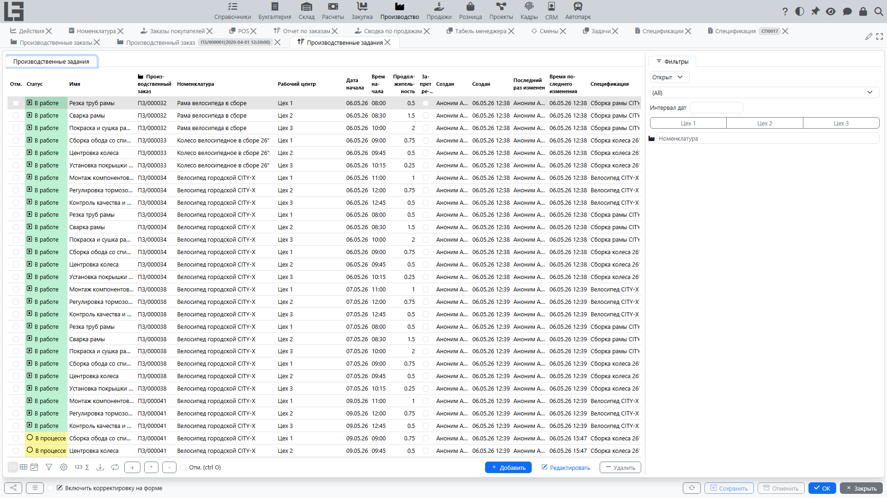
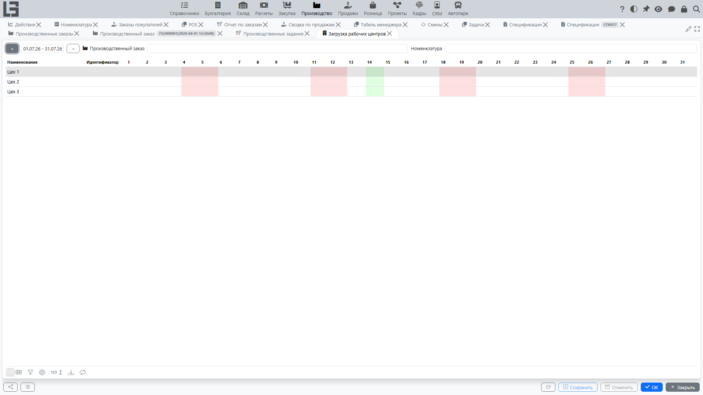

Этот раздел описывает, как использовать **рабочие центры** и **производственные задания** для планирования производственных операций и управления ими.

## Рабочие центры

**Рабочий центр** — это производственная единица (станок, группа станков или отдельный участок), где выполняются производственные операции.

### Управление рабочими центрами

Для управления рабочими центрами перейдите в **«Производство»** → **«Настройка»** → **«Рабочие центры»**.

Для каждого рабочего центра можно указать:
- **«Имя»** — описательное название (например, «Линия сборки А», «Станок ЧПУ 1»).
- **«Код»** — уникальный внутренний код рабочего центра.
- **«Описание»** — подробная информация о возможностях или расположении центра.

### Практическое использование
Рабочие центры используются для группировки производственных заданий и анализа общей производственной загрузки. Выделив отдельные рабочие центры, вы сможете находить «узкие места» и балансировать нагрузку на предприятии.

---

## Производственные задания

**Производственное задание** — это конкретная операция или задача, выполняемая в рабочем центре в рамках [производственного заказа](orders.md). Если производственный заказ определяет, *что* производится, то производственные задания определяют, *как* и *где* выполняется работа.

### Создание производственных заданий

Производственные задания можно вводить вручную, но они также автоматически формируются по операциям спецификации при формировании или пересчёте строк производственного заказа. При этом учитываются и операции вложенных промежуточных спецификаций, а каждое сформированное задание сохраняет ссылку на спецификацию, из которой оно создано.

Производственные задания обычно создаются в контексте **производственного заказа**. Один производственный процесс можно разбить на несколько последовательных или параллельных операций.

#### Шаги по добавлению производственного задания:
1. Откройте карточку **производственного заказа**.
2. Перейдите на вкладку производственных заданий.
3. Нажмите **«Добавить»**, чтобы создать новую строку.
4. Заполните следующие данные:
   - **«Имя»** — название операции (например, «Резка», «Сварка»).
   - **«Рабочий центр»** — выберите подразделение, где будет выполняться операция (обязательно).
   - **«Дата начала»** — день, на который запланировано начало операции (по умолчанию — плановая дата производственного заказа).
   - **«Время начала»** — конкретное время суток, когда должна начаться операция.
   - **«Продолжительность»** — расчётное время, необходимое для выполнения операции (в часах).

Автоматически сформированные задания дополнительно хранят внутреннюю ссылку на исходную операцию спецификации, а колонка **«Спецификация»** в списке производственных заданий показывает, откуда взята операция.

### Управление всеми производственными заданиями

Чтобы увидеть общий список всех производственных задач, перейдите в **«Производство»** → **«Операции»** → **«Производственные задания»**.

Этот список позволяет руководителям:
- Отслеживать ход операций по разным производственным заказам.
- Фильтровать задачи по рабочему центру, дате начала или номенклатуре (из производственного заказа).
- Массово обновлять производственные задания с помощью мультивыделения: выделите несколько строк и используйте действия **«Старт»** или **«Провести»**.
- Редактировать детали операций, не открывая отдельные производственные заказы.

### Статусы производственных заданий

Каждое производственное задание проходит определённый жизненный цикл для отслеживания прогресса:
- **«В работе»**: начальное состояние новых производственных заданий.
- **«В процессе»**: активное состояние, когда работа начата (подсвечивается жёлтым фоном).
- **«Выполнен»**: конечное состояние после завершения операции.

#### Действия:
- **«Старт»**: переводит производственное задание из состояния *«В работе»* в *«В процессе»*.
- **«Провести»**: переводит производственное задание из состояния *«В процессе»* в *«Выполнен»*.

Эти действия доступны как в форме производственного задания, так и в общем списке производственных заданий.

Примечание: если производимая номенклатура ведётся по партиям, в карточке производственного задания также отображаются (только для чтения) [партии](lots-and-printing.md), которые должны быть произведены его производственным заказом.

### Фильтрация и выделение

Список **«Производственные задания»** включает расширенную фильтрацию:
- **«Открыт»**: показывает производственные задания в статусах *«В работе»* и *«В процессе»*.
- **«Закрыта»**: показывает производственные задания в статусе *«Выполнен»*.
- **Фильтры по дате, рабочему центру и номенклатуре**: используйте панель фильтров для уточнения списка операций.

В списке поддерживается **мультивыделение**, что позволяет выполнять массовые операции сразу над несколькими производственными заданиями.

### Синхронизация и поведение при копировании

- При формировании/пересчёте строк производственного заказа существующие производственные задания в этом заказе перестраиваются по операциям спецификации, включая операции вложенных промежуточных спецификаций.
- При копировании производственного заказа копируются и его производственные задания, включая ссылку на операцию, ссылку на спецификацию-источник, дату/время начала и продолжительность.

---

## Панель загрузки рабочих центров

Панель **«Загрузка рабочих центров»** — мощный инструмент визуального планирования и управления мощностями.

### Доступ к панели
Перейдите в **«Производство»** → **«Процессы»** → **«Загрузка рабочих центров»**.

### Обзор интерфейса

Панель представляет собой матрицу:
- **Строки**: список всех настроенных **рабочих центров**.
- **Столбцы**: дни выбранного месяца.
- **Шапка**: содержит элементы управления навигацией и фильтрацией.

#### Элементы навигации
- Поле интервала показывает текущий диапазон дат.
- Кнопки `<` и `>` перемещают между месяцами.

#### Визуальные индикаторы
Сетка использует цветовую кодировку для быстрого восприятия информации:
- **Зелёный фон**: текущая дата.
- **Розовый фон**: выходные дни (суббота и воскресенье).
- **Синий фон**: подсвечивает работы, запланированные по **производственному заказу**, выбранному в данный момент в шапке панели.
- **Жирные цифры**: продолжительность работ по выбранному производственному заказу.
- **Маленькие цифры в скобках**: суммарная продолжительность *всех* производственных заданий этого рабочего центра в этот день.

### Планирование и редактирование с панели

Панель интерактивна и позволяет быстро вносить корректировки:

#### Сценарий А: планирование конкретного производственного заказа
1. Выберите **производственный заказ** в шапке панели.
2. Найдите пересечение нужного **рабочего центра** и **даты**.
3. **Кликните по ячейке**:
   - Введите числовое значение, чтобы задать или обновить **«Продолжительность»**.
   - Если в этой ячейке ещё не было производственного задания для этого производственного заказа, оно будет создано автоматически.
   - Чтобы **удалить** производственное задание, введите `0` или очистите значение.

#### Сценарий Б: общее управление загрузкой
1. Убедитесь, что в шапке **не выбран производственный заказ**.
2. **Кликните по ячейке**, чтобы открыть всплывающее окно со всеми производственными заданиями этого центра/дня.
3. В этом окне можно просматривать, редактировать и удалять существующие производственные задания, а также создавать новые для любого производственного заказа.

### Ограничения и проверки
- **Закрытые заказы**: нельзя создавать или изменять производственные задания для уже закрытого производственного заказа. Система выведет сообщение: *«Заказ на производство уже закрыт»*.
- **Обязательный рабочий центр**: каждое производственное задание должно быть привязано к рабочему центру.
