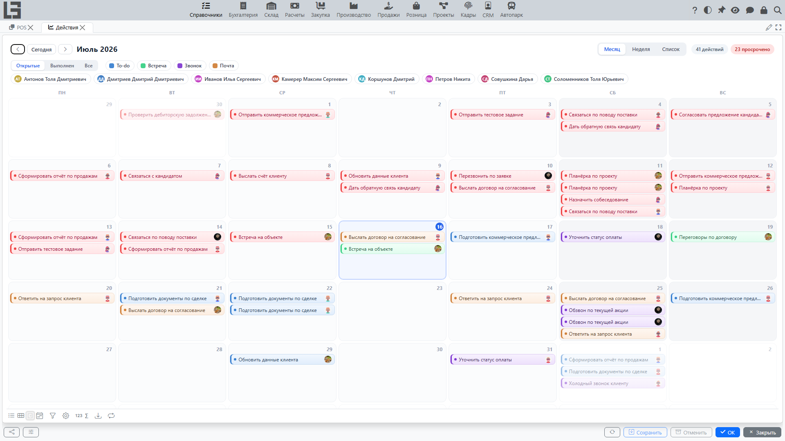

Раздел **«Действия»** предназначен для планирования и отслеживания задач, встреч, звонков и других действий.

## Действия и их типы

У действия может быть указан **Тип** (например: Звонок, Встреча, Задача). Тип определяет, какие поля времени показываются: только дата, дата и **Время** начала или дата с полями **Время** и **По**.

Типы действий настраиваются в форме **«Настройки»**, на вкладке **«Типы действий»**.

## Создание действия

Чтобы создать новое действие:
1. Откройте раздел **Действия**.
2. Наведите курсор на нужный день в календаре и нажмите кнопку **+** (*Новое действие на этот день*) — выбранная дата станет сроком исполнения.
3. В окне действия заполните детали:
   - **Тип**: Вид действия (например: Звонок, Встреча, Задача).
   - **Имя**: Краткое описание или заголовок действия.
   - **Срок исполнения**: Планируемая дата выполнения. При создании из календаря — выбранный день; для действий, созданных другими способами, по умолчанию устанавливается на 7 дней вперед от текущей даты.
   - **Время** и **По**: Время начала и окончания (если включено для выбранного типа).
   - **Назначена на**: Сотрудник, ответственный за выполнение действия. По умолчанию — текущий пользователь (если он является сотрудником).
   - **Участники**: Партнеры, участвующие в действии (только для просмотра).
   - **Объект**: Ссылка на связанный документ или запись (например, конкретный Лид или Заказ).
   - **Описание**: Подробная информация о том, что необходимо сделать.

## Работа со списком действий

Форма **Действия** предоставляет удобный вид для всех задач:
- **Представления**: календарь на **Месяц** и **Неделю**, а также **Список** — хронологический перечень действий.
- **Фильтры**: По умолчанию отображаются только **Открытые** действия; можно переключиться на выполненные или все. Также можно фильтровать по **типу** и по исполнителю с помощью цветных кнопок над календарём.
- **Навигация**: Наведите курсор на действие — появится всплывающая карточка; из неё можно открыть форму редактирования, перейти к связанному **Объекту**, отметить действие выполненным или переназначить его (на выбор предлагаются активные сотрудники, у которых уже есть открытые действия). Двойной клик открывает форму редактирования сразу; перетаскивание действия на другой день меняет срок исполнения.

## Завершение действия

Когда вы закончили работу над задачей:
1. Нажмите кнопку **Выполнен**.
2. В окне обратной связи введите результаты выполнения (**Обратная связь**).
3. Действие будет отмечено как выполненное.

Завершенные действия подсвечиваются в списке и скрываются, если активен фильтр «Открытые».

## Действия в других записях

Действиями можно управлять напрямую из карточек других объектов (например, лидов, задач или заказов):
- Новые действия создаются кнопками с названиями типов действий в верхней части вкладки.
- На соответствующей вкладке отображаются связанные действия, которые ещё не завершены; уже выполненные можно посмотреть в общей форме **Действия** или в истории комментариев записи (если она включена).
- В списке отображается тип, срок исполнения, статус и количество дней, оставшихся до завершения задачи.
- На вкладке отображается индикатор с количеством текущих (незавершенных) действий.
- При завершении действия комментарий с описанием и обратной связью может быть автоматически добавлен в историю записи.
