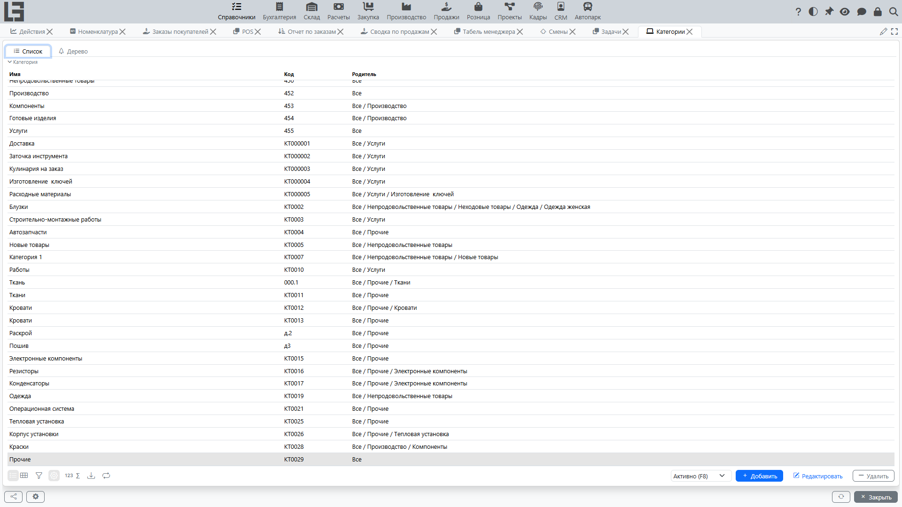

Справочник **«Категории»** используется для группировки номенклатуры. Категории могут быть иерархическими (дерево): у категории может быть родительская категория.

## Список и дерево

Обычно доступны два представления:

- **Список** — плоский перечень категорий;
- **Дерево** — иерархия категорий.

## Карточка категории

Типовые реквизиты:

- **Наименование**;
- **Код** (может формироваться автоматически);
- **Родитель** (если используется иерархия);
- **Архивирован**.

В карточке есть поле **«Префикс»** наименования и вкладка **«Значения по умолчанию»** с **единицей измерения** по умолчанию — и то и другое наследуется позициями этой категории.

## Создание подкатегории

Чтобы создать подкатегорию, выберите родительскую категорию и создайте новую запись, указав родителя.

## Ограничения

Если категория используется в других категориях (как родитель) или в номенклатуре, её удаление может быть запрещено. В таком случае используйте архивирование.