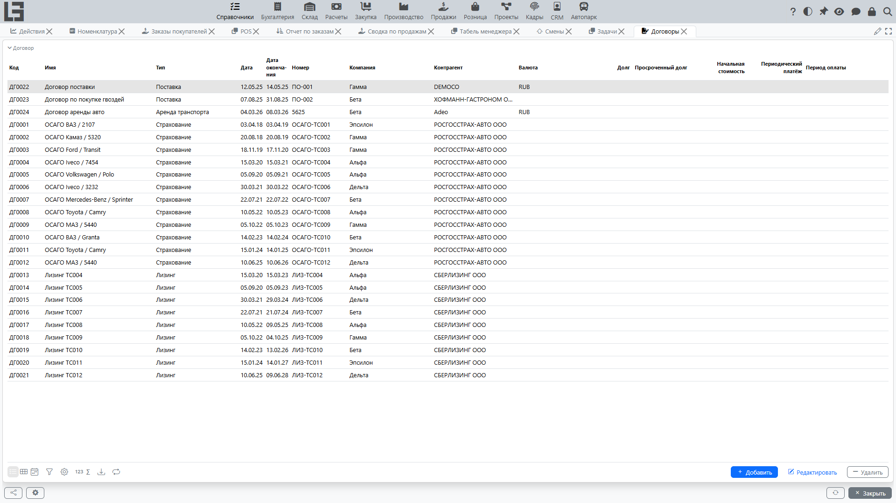

Справочник **«Договоры»** используется для фиксации договоров с контрагентами и дальнейшего выбора договора в документах (если это предусмотрено процессами).

## Карточка договора

Типовые реквизиты:

- **Код** (может формироваться автоматически);
- **Номер**;
- **Дата**;
- **Дата окончания** (если применимо);
- **Наименование** (если используется);
- **Тип договора** (если используется);
- **Компания**;
- **Контрагент**.

Если у типа договора включён признак **«Себестоимость»**, в карточке также отображается блок **«Себестоимость»** с полями **«Начальная стоимость»**, **«Периодический платёж»** и **«Период оплаты»**.

## Проверки согласованности

Если в документах выбирается договор, система может проверять, что:

- **компания** документа совпадает с компанией договора;
- **контрагент** документа совпадает с контрагентом договора.

Если после смены компании/контрагента выбранный договор сбрасывается — это ожидаемое поведение, помогающее избежать ошибок.