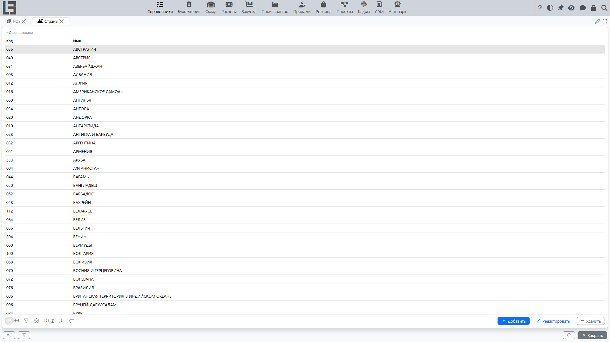

Справочник **«Страны»** используется для адресов контрагентов и других объектов, где требуется указание страны.

## Карточка страны

Типовые реквизиты:

- **Код**;
- **Имя** (наименование);
- при необходимости — коды **Альфа-2** (двухбуквенный) и **Альфа-3** (трёхбуквенный).

## Рекомендации

- Используйте единый справочник стран для всей системы, чтобы избежать дублей.