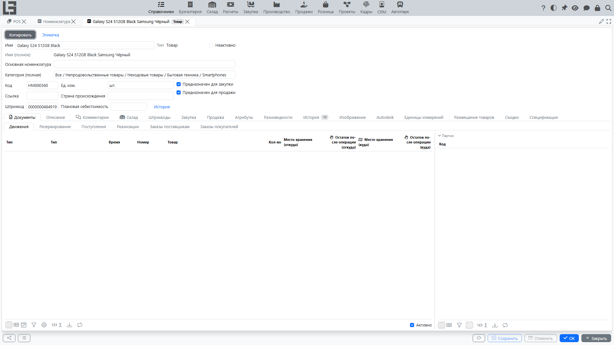

Справочник **«Номенклатура»** содержит товары и услуги, которые используются в строках документов (заказы, отгрузки, реализации, поступления и т. п.).

## Товары и услуги — в чём разница

Номенклатура делится на два основных типа:

- **Товары** — материальные позиции, которые обычно участвуют в складском учёте.
- **Услуги** — работы и сервисы, которые не требуют хранения и не образуют складских остатков.

Разделение нужно, чтобы:

- корректно оформлять складские операции (если складской контур включён);
- хранить специфичные свойства товаров (например, вес, объём, страна происхождения — если используется);
- упростить подбор в документах и анализ.

#### Когда создавать «товар»

Создавайте **товар**, если позиция:

- поступает в место хранения и/или отгружается из места хранения;
- требует контроля остатков, резервирования, партий/серий (если они используются);
- имеет физические характеристики, важные для логистики (вес/объём).

Примеры: сырьё, комплектующие, готовая продукция, расходные материалы.

#### Когда создавать «услугу»

Создавайте **услугу**, если позиция:

- является работой/сервисом и не хранится в месте хранения;
- не должна создавать складские движения;
- учитывается в документах как услуга (объём — «час», «услуга», «работа», «смена» и т. п.).

Примеры: доставка, монтаж, ремонт, консультации, аренда.

## Перед созданием номенклатуры

Рекомендуется заранее заполнить:

- **Единицы измерений** (как минимум базовые);
- **Категории** — категория обязательна для каждой позиции, поэтому убедитесь, что существует хотя бы корневая категория; категории также используются для группировки номенклатуры.

## Импорт товаров из файла с помощью OpenAI

Если настроен промпт импорта товаров, в списке номенклатуры на панели инструментов дерева категорий появляется действие **Импорт (GPT)**. Оно предназначено для первичного заполнения или расширения каталога товаров из файла поставщика, таблицы, PDF, изображения или другого вложенного файла, который OpenAI может прочитать.

#### Что нужно подготовить

- заполнить API-ключ OpenAI и при необходимости создать конфигурации GPT для модели, рассуждения и дополнительного промпта в общих настройках интеграции;
- открыть **Справочники → Настройки** и на вкладке **Номенклатура** заполнить блок **Импорт (GPT) → Промпт**. Используйте кнопку **По умолчанию**, чтобы загрузить стандартный промпт, а затем при необходимости адаптируйте его под свои каталоги;
- проверить, что у единиц измерения есть стабильные коды, потому что импорт не создает новые единицы измерения;
- проверить существующие категории и товары в выбранной ветке: они отправляются в OpenAI как справочные данные, чтобы можно было исключить дубликаты.

#### Как использовать

1. Откройте **Справочники → Номенклатура**.
2. Выберите категорию, ветка которой должна использоваться как справочная область для проверки дубликатов.
3. Нажмите **Импорт (GPT)** и выберите исходный файл. Если настроено несколько конфигураций GPT, выберите нужную.
4. В окне предварительного просмотра проверьте новые категории и товары, которые распознал OpenAI. Можно исправить поля и удалить строки, которые не нужно создавать.
5. Подтвердите/сохраните предварительный просмотр, чтобы создать оставшиеся категории и товары, или закройте/отмените его, чтобы отбросить результат.

#### Что создается

- категории с наименованием и родительской категорией;
- товары с наименованием, категорией, артикулом/референсом и единицей измерения.

Коды новых категорий и товаров система формирует автоматически.

#### Ограничения и особенности

- Действие скрыто, пока промпт не заполнен.
- Существующие категории и товары не обновляются; сценарий создает только записи, которые вернул OpenAI. Система сама не сверяет возвращённые строки с существующими данными — защита от дублей опирается на промпт и справочные данные, отправляемые в OpenAI, поэтому всегда проверяйте предварительный просмотр и удаляйте лишние строки.
- Новые единицы измерения автоматически не создаются. Если OpenAI не вернет код существующей единицы, единица измерения товара может остаться пустой.
- Для сопоставления категории используются коды существующих категорий или наименования категорий, создаваемых в том же предварительном просмотре. Если категорию не удалось сопоставить, система поместит строку в корневую категорию.
- Всегда проверяйте предварительный просмотр перед сохранением: распознавание OpenAI зависит от качества файла и настроенного промпта.
- Если не заполнен ключ доступа OpenAI или запрос завершился ошибкой, система покажет сообщение и ничего не импортирует.

## Список номенклатуры

В списке обычно отображаются:

- **имя (полное)**;
- **код**;
- **тип**;
- **категория**;
- **единица измерения**;
- **ссылка** (артикул).

Если доступно архивирование, используйте фильтр **«Активно»** / **«Неактивно»**.

## Карточка номенклатуры

Типовые реквизиты:

- **Имя** — редактируемое наименование позиции;
- **Имя (полное)** — формируется автоматически (префикс категории + имя + префиксы/суффиксы атрибутов); только для чтения;
- **Тип** — **Товар** или **Услуга**, определяется видом позиции; только для чтения;
- **Категория (полная)** — категория с полным иерархическим путём;
- **Ед. изм.** — единица измерения;
- **Код** — формируется автоматически;
- **Ссылка** — артикул/референс (если используется);
- **Плановая себестоимость** — значение, действующее на сегодня; ссылка **История** открывает список значений по датам, где можно добавить новое значение с даты начала действия;
- **Описание**;
- **Неактивно** — признак архивной записи.

### Складские настройки

В карточке товара (у услуг этих полей нет) есть вкладка **Склад** с дополнительными параметрами:

- **Вес единицы, кг** и **Объем единицы, м3**;
- **Длина единицы, см**, **Ширина единицы, см** и **Высота единицы, см**;
- при включённом складском контуре — **SKU** и **Коэффициент** (используются для автоматического пересчета и учета остатков текущего товара через другую базовую позицию). Подробнее см. раздел [Складские единицы учета](../inventory/product-sku.md).

Также для товаров могут быть настроены коэффициенты пересчета упаковок (на вкладке **Единицы измерения**), а на вкладках **Закупка** и **Продажа** — выбраны упаковки по умолчанию. Это позволяет использовать механизм учёта упаковок непосредственно в документах.

### Другие вкладки

В зависимости от включённых модулей и настроек позиции в карточке номенклатуры могут быть и другие вкладки — например, **Штрихкоды**, **Атрибуты**, **Изображение** и **Документы** (связанные документы). Вкладки **Закупка** и **Продажа** отображаются только при установленных признаках **«Предназначен для закупки»** / **«Предназначен для продажи»**; на вкладке **Продажа** также задаётся **Цена продажи**.

### Атрибуты

Справочник **«Атрибуты»** (**Справочники → Атрибуты**) описывает дополнительные свойства номенклатуры (например, бренд, цвет, размер). Для каждого атрибута задаются категории, к которым он применим, список допустимых значений и признак **«Обязателен для заполнения»**. Значения заполняются на вкладке **«Атрибуты»** карточки номенклатуры; обязательные атрибуты без значения подсвечиваются. Атрибут может участвовать в формировании полного имени: его значение (с необязательным префиксом/суффиксом) добавляется перед именем или после него согласно настройкам **«Перед названием»** и **«Последовательность»**.

### Разновидности

У позиции могут быть **разновидности** — отдельные позиции, представляющие один и тот же товар в разных исполнениях (например, цвет или размер). Разновидности создаются на вкладке **«Разновидности»** карточки основной позиции кнопкой **«Разновидность»**. У разновидности свой код и свои штрихкоды, а имя, категория, единица измерения, признак архива и значения атрибутов, заполненные у основной позиции, синхронизируются с ней и недоступны для изменения. В списке номенклатуры есть фильтры **«Основные»** (F10) / **«Разновидности»** (F9), а в карточке разновидности показывается поле **«Основная номенклатура»**.

### Рекомендации по заполнению для товаров

- Проверьте, что выбраны **категория** и **единица измерения** (например, «шт», «кг», «м»).
- Если в вашей конфигурации доступны поля **вес**, **объём**, **длина/ширина/высота**, **страна происхождения** — заполняйте их для товаров, когда эти данные используются в логистике, маркировке или отчётности.

### Рекомендации по заполнению для услуг

- Выбирайте единицу измерения, отражающую объём услуги (например, «час», «услуга», «работа»).
- В наименовании удобно указывать формат оказания/состав (например, «Доставка по городу», «Монтаж (1 час)»), чтобы услуга была однозначной при подборе в документах.

## Комментарии и история

Если в конфигурации включены комментарии/история, карточка может содержать вкладку с комментариями и/или историю изменений. Это удобно для фиксации договорённостей и причин корректировок.

## Практика ведения

- Для действующих позиций используйте единый стиль наименования.
- Если товар больше не продаётся/не закупается, переводите его в архив, чтобы он не попадал в подбор в новых документах.

## Типовые ошибки

#### Услугу завели как товар

В результате услуга может начать «вести себя как складская позиция» (например, появятся ожидания по остаткам или неверная логика в документах).

Рекомендация: заведите корректную позицию как **услугу**, переведите процессы на неё, а ошибочную позицию переведите в архив.

#### Товар завели как услугу

В результате может не хватать контроля остатков и складских операций.

Рекомендация: заведите корректную позицию как **товар** и используйте её в документах, где требуется складской учёт.
