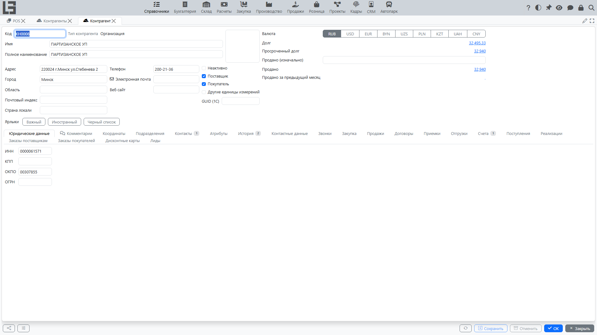

Справочник **«Контрагенты»** используется для ведения покупателей, поставщиков, прочих организаций и физических лиц (в зависимости от конфигурации). Контрагенты выбираются в документах продаж, закупок, расчётов, а также в договорах и подразделениях.

## Где используется

- документы продаж и закупок;
- реализации, поступления и платежи;
- договоры;
- подразделения (филиалы/точки) контрагентов.

## Список контрагентов

В списке обычно отображаются основные данные: **наименование**, **код**, **тип**, **адрес**, **телефон**, **электронная почта**.

Если используется архивирование, в списке доступен переключатель:

- **Активно** — рабочие записи;
- **Неактивно** — записи, скрытые из повседневного выбора.

## Типы контрагентов: организация, компания, физическое лицо

В системе один и тот же «контрагент» может быть разного типа. Это важно, потому что **для разных типов хранится разный набор данных**, а также они **по‑разному используются в процессах**.

#### Организация (юридическое лицо)

Используйте тип **«Организация»** для внешних контрагентов‑юридических лиц:

- покупатели и поставщики;
- подрядчики;
- перевозчики;
- банки и прочие организации.

Типовые данные:

- **наименование** и при необходимости **полное наименование**;
- контактные данные и адрес;
- при необходимости — **веб‑сайт**;
- вкладка **«Юридические данные»** (если включена в вашей конфигурации).

Дополнительно для организаций может вестись список **контактных лиц** (см. «Физическое лицо» ниже).

#### Компания (наша компания)

Тип **«Компания»** предназначен для **ваших собственных юридических лиц**, от имени которых оформляются документы.

Когда это нужно:

- вы ведёте учёт по **нескольким своим компаниям** в одной базе;
- в документах важно выбирать, **какая компания** продаёт/покупает, принимает оплату, является стороной договора.

Практическая особенность: если в системе заведена **ровно одна компания**, она часто **подставляется по умолчанию** в документы (это зависит от настроек и конкретного процесса).

#### Физическое лицо

Тип **«Физическое лицо»** используйте, когда нужно хранить данные о конкретном человеке:

- контактное лицо внешней организации (например, менеджер поставщика, бухгалтер покупателя);
- частный клиент.

Типовые данные:

- **фамилия, имя, отчество**;
- **организация/компания**, которую представляет человек;
- **должность** (если используется);
- телефон и электронная почта.

Сотрудники вашей собственной компании — особый вид физических лиц, см. раздел [Сотрудники](#сотрудники) ниже.

## Карточка контрагента

Типовые реквизиты:

- **Код** — может заполняться автоматически;
- **Имя** (наименование);
- **Тип контрагента** — вид контрагента (например, организация, компания, физическое лицо, сотрудник); определяется типом создаваемой записи и показывается только для чтения;
- **Адрес** (включая страну — если используется);
- **Телефон**, **электронная почта**;
- **Неактивно** — признак вывода из активного использования.

### Закупочные настройки поставщика

Если включена автоматизация закупок и контрагент отмечен как **Поставщик**, в карточке контрагента есть вкладка **Закупка** с полем **Период заказа**.

**Период заказа** — это количество дней, которое автоматическое заполнение заказа поставщику использует для формирования периода анализа спроса по умолчанию для этого поставщика. Если поле пустое, в заказах поставщикам используется 7 дней. Значение только заполняет поля **Дата с** и **Дата по** по умолчанию; пользователь всё равно может изменить период в заказе поставщику.

## Сотрудники

**Сотрудник** — это физическое лицо вашей компании, которое одновременно является пользователем системы. В отличие от обычных физических лиц, сотрудники ведутся в отдельном справочнике — **Справочники → Сотрудники** — и могут назначаться исполнителями действий и других работ.

В карточке сотрудника есть:

- **Логин**, действие смены пароля и признак блокировки — учётная запись пользователя;
- **Роли** — роли доступа пользователя;
- **Организация** — должна быть одной из ваших компаний (подставляется автоматически, если компания одна);
- **Подразделение**, **Должность**;
- ФИО, контакты, адрес, дата рождения;
- **Фото** и **Аватар** (аватар формируется из фото автоматически).

### Как понять, какой тип выбрать

Ориентируйтесь на простое правило:

- если вы описываете **сторону сделки как организацию** (клиент/поставщик/подрядчик) — создавайте **организацию**;
- если вы описываете **свою организацию** (от имени которой формируются документы) — создавайте **компанию**;
- если вам нужен **конкретный человек** — создавайте **физическое лицо**; для контактного лица укажите организацию, которую он представляет, а для частного клиента организацию можно не заполнять;
- если вам нужен **сотрудник вашей компании** (пользователь системы, исполнитель действий) — создавайте запись в **Справочники → Сотрудники** (см. [Сотрудники](#сотрудники)).

### Типовые ситуации и примеры

- **Покупатель — юридическое лицо** → заведите **организацию**.
- **Поставщик — юридическое лицо** → заведите **организацию**.
- **Покупатель — физическое лицо** (частный клиент) → заведите **физическое лицо**.
- **Контакт у поставщика** (например, «Иванов И.И., менеджер») → заведите **физическое лицо** и привяжите его к организации поставщика.
- **Учет по двум юрлицам** (например, «ООО Альфа» и «ООО Бета») → заведите две записи типа **«Компания»** и выбирайте нужную компанию в документах.

## Рекомендации по заполнению

- Заполняйте контактные данные и адрес сразу — это снижает ошибки в документах.
- Если контрагент больше не используется, переводите его в архив, а не удаляйте.

## Типовые ошибки и как их избежать

#### Дублирование контрагентов

Частая ситуация — один и тот же контрагент заведён несколько раз (например, с разным написанием названия).

Рекомендации:

- договоритесь о едином стандарте именования;
- «лишние» записи переводите в **архив**, чтобы их не выбирали в новых документах;
- перед созданием нового контрагента используйте поиск в списке.

#### Перепутали «организацию» и «компанию»

Если внешнего контрагента завели как «компанию» (или наоборот), это приводит к ошибкам выбора стороны договора и компании в документах.

Рекомендации:

- заведите корректную запись нужного типа;
- постепенно переведите процессы на правильную запись;
- ошибочную запись переведите в архив (удаление часто невозможно из‑за связей с документами).
