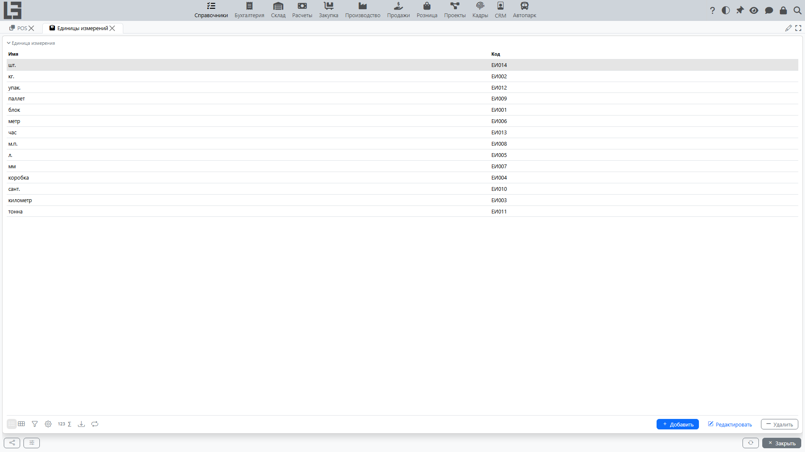

Справочник **«Единицы измерений»** хранит перечень единиц, которые используются в номенклатуре и строках документов (например, штуки, килограммы, метры).

## Список единиц измерений

В списке обычно отображаются:

- **имя** (наименование);
- **код** (может формироваться автоматически).

## Карточка единицы измерения

Типовые реквизиты:

- **Имя** (наименование);
- **Код**.

## Ограничения

Если единица измерения уже используется в номенклатуре, её удаление может быть запрещено. Рекомендуем не удалять такие записи, а поддерживать актуальность списка (например, не создавать дубликаты).