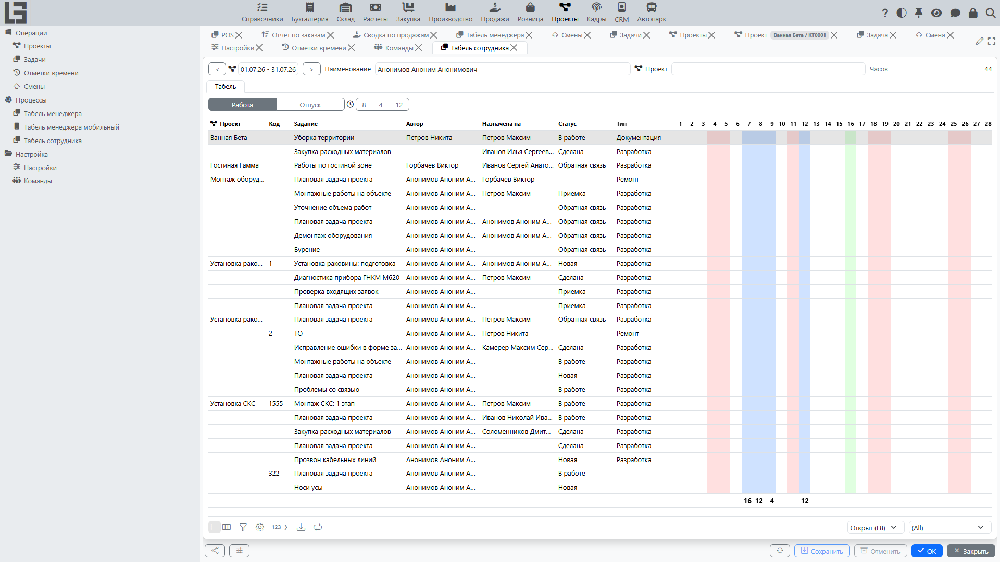

Документация описывает работу раздела **«Проекты»**: создание и ведение проектов, постановку и контроль задач, работу с **[командой и ролями](team-and-roles.md)**, учет трудозатрат через **[отметки времени](time-entries.md)**, а также базовые представления для контроля выполнения.

## Содержание

- [Быстрый старт](#быстрый-старт)
- [Навигация](#навигация)
- [Термины](#термины)

Разделы:

- [Проекты](projects.md)
- [Задачи](tasks.md)
- [Отметки времени](time-entries.md)
- [Смены](shifts.md)
- [Табель](timesheets.md)
- [Команда и роли на проекте](team-and-roles.md)
- [Отчётность](reports.md)
- [Настройка](settings.md)

Связанные интеграции:

- [Autodesk](../masterdata/autodesk/autodesk.md) — подключение 3D-моделей Autodesk Platform Services (APS) к проектам.

## Быстрый старт

Типовой сценарий «создать проект → поставить задачи → назначить исполнителей → учитывать время»:

1. Откройте **«Проекты» → «Операции» → «Проекты»**.
2. Создайте проект и заполните основные реквизиты:
   - тип;
   - наименование;
   - даты начала и окончания (если известны);
   - статус;
   - компанию и менеджера.
3. Перейдите к задачам проекта и создайте задачи для команды.
4. Назначьте исполнителей и сроки.
5. В процессе выполнения фиксируйте трудозатраты через **[отметки времени](time-entries.md)** (напрямую или через **[табель](timesheets.md)**).
6. Контролируйте выполнение по статусам задач, а при необходимости используйте **[доску задач](tasks.md#доска-задач)** и **[диаграмму Ганта](tasks.md#диаграмма-ганта)** — представления внутри списка задач.

## Типовые сценарии

#### «Запустить проект с нуля»

1. Создайте проект и заполните ключевые реквизиты (тип, наименование, сроки, компания, менеджер).
2. Подготовьте команду: добавьте участников и роли, либо назначьте команду на проект (если в организации используется работа с командами).
3. Создайте задачи и назначьте исполнителей и сроки.
4. Договоритесь о правилах работы со статусами (кто переводит, когда и по каким критериям).
5. Введите дисциплину учета трудозатрат: ежедневно или по окончании работ фиксируйте **[отметки времени](time-entries.md)**.

Подробности: см. страницы [Проекты](projects.md), [Задачи](tasks.md), [Команда и роли на проекте](team-and-roles.md), [Отметки времени](time-entries.md).

#### «Вести коммуникацию по проекту»

1. Фиксируйте договоренности и решения в комментариях проекта и задач.
2. При изменениях сроков и приоритетов оставляйте пояснение, чтобы участники понимали причину.
3. Для спорных ситуаций используйте историю изменений задачи.

## Навигация

Раздел **«Проекты»** обычно содержит группы:

- **Операции** — ежедневная работа (**[проекты](projects.md)**, **[задачи](tasks.md)**, **[отметки времени](time-entries.md)**, **[смены](shifts.md)**). **[Доска задач](tasks.md#доска-задач)** и **[диаграмма Ганта](tasks.md#диаграмма-ганта)** — это представления внутри списка задач, а не отдельные пункты меню. **[Назначения](team-and-roles.md#назначения)** ведутся в карточке проекта.
- **Процессы** — **[табели сотрудника и руководителя](timesheets.md)** для ввода и контроля трудозатрат по дням.
- **Отчётность** — точка расширения для отчётов по проектам. В базовой поставке папка обычно наполняется за счёт интеграций с соседними модулями (Продажи, Производство), а не отдельными отчётами модуля «Проекты».
- **Настройка** — справочники и правила: **[типы](settings.md#типы-проектов)** проектов и задач, **[статусы](settings.md#статусы-проектов)**, **[приоритеты](settings.md#приоритеты-и-ярлыки)**, **[ярлыки](settings.md#приоритеты-и-ярлыки)**, **[последовательность действий](settings.md#последовательность-действий)**, роли на проекте и команды.

Набор пунктов меню и доступность действий зависят от настроек и прав пользователя.

## Роли пользователей и права

Точный набор прав зависит от настроек вашей организации. Типовая логика распределения ответственности:

- **Менеджер проекта** — отвечает за сроки и статус проекта, состав команды, контроль выполнения задач.
- **Исполнитель** — работает с задачами: меняет статусы в рамках доступных переходов, оставляет комментарии, вносит **[отметки времени](time-entries.md)**.
- **Наблюдатель/согласующий** (если используется) — просматривает проект и задачи, участвует в обсуждениях, может подтверждать выполнение по внутренним правилам.

Если некоторые действия недоступны (например, смена статуса или создание **[отметки времени](time-entries.md)**), это обычно связано с ограничениями прав или правилами последовательности действий.

## Термины

#### Проект

**[Проект](projects.md)** — единица планирования работ: содержит сроки, статус, ответственного (менеджера) и объединяет связанные задачи, команду и трудозатраты.

#### Задача

**[Задача](tasks.md)** — рабочая единица внутри проекта: что нужно сделать, к какому сроку и в каком статусе находится выполнение.

#### Назначение

**[Назначение](team-and-roles.md#назначения)** — привязка участника (сотрудника или команды) к проекту с указанием роли на проекте и периода участия. У задачи нет отдельной записи назначения — она ссылается на единственного исполнителя через своё поле «Назначено».

#### Отметка времени

**[Отметка времени](time-entries.md)** — запись о фактически затраченном времени на работы (обычно по задаче/проекту) для контроля трудозатрат и отчётности.

#### Смена

**[Смена](shifts.md)** — запланированная рабочая смена сотрудника: дата, интервал времени, назначенный сотрудник и, при необходимости, проект.

#### Статус

Статус — состояние проекта или задачи. См. **[статусы проектов](settings.md#статусы-проектов)** и **[статусы задач](settings.md#статусы-задач)**.

#### Последовательность действий

**[Последовательность действий](settings.md#последовательность-действий)** — правила переходов между статусами задачи: какие изменения разрешены, в каком порядке и кому.