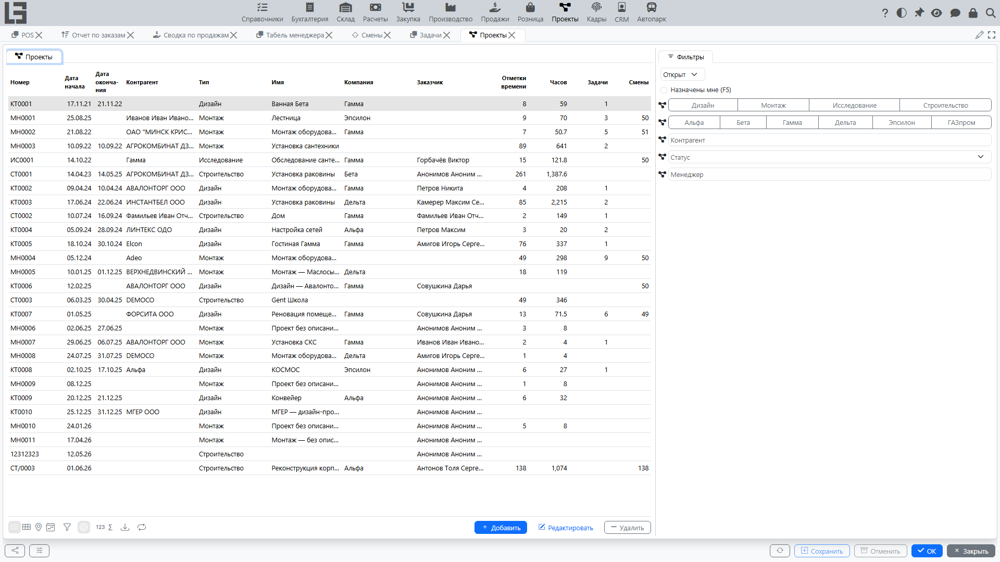
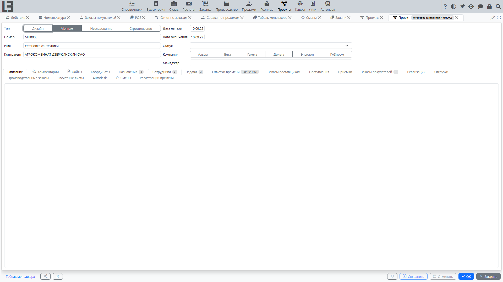

Страница описывает работу с проектами: как создать проект, какие сведения заполнять, как управлять состоянием проекта и как вести обсуждение.

Проект объединяет связанные **[задачи](tasks.md)**, **[команду и роли](team-and-roles.md)** и трудозатраты, учитываемые через **[отметки времени](time-entries.md)**. Рекомендуется вести проект как «контейнер работ»: фиксировать сроки, ответственного и ключевые решения.

## Список проектов

Откройте **«Проекты» → «Операции» → «Проекты»**.

В списке, как правило, отображаются:

- номер;
- статус;
- даты начала и окончания;
- тип и наименование;
- компания;
- контрагент (если используется);
- менеджер.

#### Зачем нужен список

Список проектов помогает:

- быстро найти проект по номеру или наименованию;
- отделить активные проекты от закрытых;
- увидеть ответственного (менеджера) и сроки;
- перейти в карточку проекта и связанные разделы.

Доступные действия зависят от прав пользователя:

- создать проект;
- открыть/редактировать карточку;
- удалить проект (обычно доступно, если нет связанных данных или это разрешено настройками).

### Фильтры

Чаще всего доступны фильтры:

- **«Открыт»** / **«Закрыта»** — в зависимости от статуса;
- **«Назначены мне»** — проекты, где текущий пользователь указан менеджером.

Используйте фильтры, чтобы быстро переключаться между текущими работами и завершенными проектами.

Если в списке много проектов, дополнительно используйте поиск по полям списка (например, по номеру, названию, контрагенту).

## Карточка проекта

В карточке проекта заполняются основные реквизиты:

- тип;
- номер;
- наименование;
- компания;
- контрагент;
- даты начала и окончания;
- статус;
- менеджер;
- описание;
- адресные поля (адрес, город, регион, индекс) — если ведётся геопривязка проектов.

#### Рекомендуемый порядок заполнения

1. Выберите **тип** проекта.
2. Укажите **наименование** — так, чтобы участники легко отличали проекты друг от друга.
3. Проверьте **компанию**.
4. Укажите **менеджера** (ответственного).
5. Заполните **дату начала** и при необходимости **дату окончания**.
6. Установите **статус** (например, «в работе»).
7. Если проект внешний, выберите **контрагента**.
8. В **описании** кратко зафиксируйте цели, объем, ограничения и важные ссылки.

> В некоторых организациях номер формируется автоматически. Если номер заполняется системой, не меняйте его вручную.

> При создании проекта система может автоматически заполнить ряд полей (например, дата начала — текущей датой, менеджер — текущим пользователем, если он сотрудник, компания — компанией по умолчанию). Проверьте эти значения перед сохранением.

#### Описание проекта

Поле описания удобно использовать как «паспорт проекта»:

- цель проекта;
- ключевые результаты;
- важные договоренности;
- критерии завершения;
- ссылки на внешние документы (если это принято в организации).

### Статус проекта

Статус отражает текущее состояние проекта. Обычно он влияет на то, какие действия доступны (например, для закрытого проекта могут быть ограничены изменения).

Рекомендуемый подход:

- используйте статус, чтобы однозначно понимать, проект активен или завершен;
- переводите проект в закрытый статус только после завершения основных работ и фиксации итогов.

### Завершение, архивирование и активное состояние

Проект может считаться:

- **закрытым** — если установлен статус с признаком «Закрыта»;
- **архивным** — если дата окончания уже прошла.

По умолчанию в списке проектов включён фильтр **«Открыт»**, который скрывает закрытые проекты (дата окончания на этот фильтр не влияет).

Если проект завершен фактически, но его задачи продолжают изменять, проверьте:

- правильно ли выбран статус проекта;
- не требуется ли продлить дату окончания;
- нет ли ограничений на изменения для закрытых проектов.

## Связанные разделы проекта

В карточке проекта, как правило, доступны связанные данные (набор зависит от конфигурации):

- **[задачи проекта](tasks.md)**;
- **[участники (команда) и роли](team-and-roles.md#назначения)** со списком сотрудников, активных на выбранную дату;
- **[отметки времени](time-entries.md)**;
- комментарии и вложенные файлы;
- вкладка **«Координаты»** — адрес проекта на карте (если ведётся геопривязка);
- связанные документы и операции (если ведется учет затрат/доходов по проектам).

Используйте проект как единый «разрез учета»: это упрощает отчетность и контроль.

## Комментарии

В проекте можно вести обсуждение через **комментарии**:

- видно, кто и когда оставил запись;
- текст может быть развернутым;
- обсуждение хранится в контексте проекта.

Рекомендуется использовать комментарии как журнал решений и договоренностей.

#### Рекомендации по ведению комментариев

- пишите коротко и по делу: что решили, кто делает, к какому сроку;
- при изменении сроков или приоритетов фиксируйте причину;
- если обсуждение относится к конкретной задаче — дублируйте ключевую информацию в комментарии задачи.

## Типовые ситуации и решения

#### Проект не отображается в списке

Проверьте:

- не закрыт ли проект по статусу (фильтр «Открыт» скрывает закрытые проекты);
- не включен ли фильтр, ограничивающий список (например, «Назначены мне»);
- есть ли у вас доступ к проекту — активное назначение на проект или признак «Доступ ко всем проектам» (см. **[доступ к проектам](team-and-roles.md#доступ-к-проектам)**).

#### Не удаётся изменить проект

Обычно причина в одном из вариантов:

- нет прав на изменение;
- проект находится в закрытом статусе и изменения запрещены правилами;
- есть ограничения по связанным данным (например, по документам/операциям).

## Практический пример

Сценарий «создать проект и начать работу»:

1. Создайте проект.
2. Заполните наименование, сроки, компанию, менеджера.
3. Добавьте участников проекта: либо сформируйте состав вручную, либо назначьте команду на проект (если в организации используется работа с командами).
4. Создайте несколько задач верхнего уровня и назначьте исполнителей.
5. Договоритесь о правилах статусов.
6. Начните фиксировать время по задачам.

Дальше см. [Задачи](tasks.md) и [Отметки времени](time-entries.md).