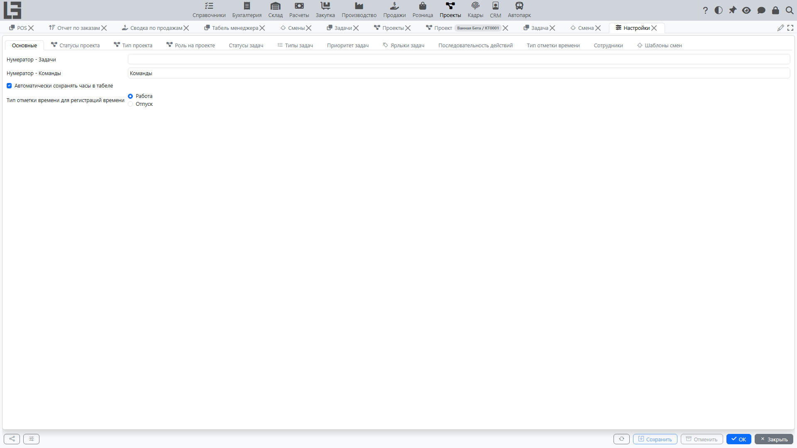

Страница описывает типовые настройки раздела **«Проекты»**. Конкретный набор справочников и параметров зависит от конфигурации и прав пользователя.

Откройте раздел **«Проекты» → «Настройка»**.

## Что обычно настраивается

#### Типы проектов

Тип проекта используется для классификации проектов и может влиять на:

- правила нумерации;
- доступные статусы;
- набор обязательных полей.

Рекомендация: держите список типов проектов коротким и понятным пользователям.

#### Статусы проектов

У каждого статуса проекта есть признак **«Закрыт»**, который помечает его как статус закрытия; проект в таком статусе считается закрытым.

Статусы проекта отражают жизненный цикл проекта. Обычно минимум включает:

- активные статусы (например, «в работе»);
- статус закрытия (с установленным признаком **«Закрыт»**).

Рекомендация: договоритесь, в каких случаях проект переводится в закрытый статус, и закрепите правило в регламенте.

#### Типы задач

Тип задачи позволяет разделять задачи по назначению (например, разработка, согласование, контроль). Часто тип влияет на доступные статусы и правила переходов.

#### Статусы задач

Статусы задач отражают этапы выполнения (например, «новая», «в работе», «выполнена»). У каждого статуса есть:

- **порядок сортировки** — задаёт порядок статусов в интерфейсе (в частности, определяет порядок колонок в **[доске задач](tasks.md#доска-задач)**);
- признак **«Закрыт»** — задачи в статусе с этим признаком считаются закрытыми.

Набор статусов выбирается исходя из процесса работы команды.

#### Последовательность действий

Последовательность действий настраивается для каждой пары **тип задачи × статус задачи** и определяет, кому разрешено переводить задачу в этот статус:

- **разрешить** — любому сотруднику с указанной ролью на проекте;
- **разрешить автору** — только автору задачи;
- **разрешить исполнителю** — только сотруднику, назначенному на задачу.

Правила последовательности действий отвечают на вопросы:

- какие переходы между статусами разрешены для данного типа задачи;
- в каком порядке проходит задача;
- кому доступен тот или иной переход.

Система не позволит сохранить задачу в статусе, недопустимом для её типа (выводится сообщение «Статус не разрешён для выбранного типа»); при смене типа статус может быть сброшен на первый допустимый статус нового типа.

Рекомендации:

- избегайте избыточных статусов;
- проверьте, что для каждого статуса есть понятный следующий шаг;
- ограничивайте «резкие» переходы (например, из «новая» сразу в «выполнена»), если это важно для контроля.

#### Приоритеты и ярлыки

Приоритеты помогают планировать загрузку, а ярлыки — удобно группировать задачи по темам.

Рекомендации:

- используйте 3–5 уровней приоритета, чтобы пользователи не путались;
- ярлыки вводите только под реальную потребность (иначе они перестают работать).

#### Нумерация

Нумерация проектов использует нумератор, привязанный к типу проекта — чтобы поменять формат или счётчик, изменяйте нумератор у типа. ID задач формируются автоматически при создании задачи.

Рекомендация: не меняйте правила нумерации без необходимости, чтобы сохранялась непрерывность и понятность истории.

#### Поведение табелей

Форма настроек также содержит параметры, влияющие на **[табели](timesheets.md)** — в частности, **автосохранение часов**. Если опция включена, изменения в ячейке дня в табеле руководителя записываются сразу; действия копирования и очистки в этом случае запрашивают подтверждение.

#### Шаблоны смен

**Шаблон смены** — это заранее заданный интервал времени, который используется для быстрого создания смен в представлении **«Расписание»** (см. **[Смены](shifts.md)**). На вкладке **«Шаблоны смен»** добавьте интервалы, которые использует ваша организация (например, утреннюю и вечернюю смены).

## Проверка после изменения настроек

После изменения справочников и правил рекомендуется:

1. Создать тестовый проект и тестовую задачу.
2. Проверить, что статусы и переходы работают ожидаемо.
3. Убедиться, что нужные действия доступны пользователям с разными ролями.